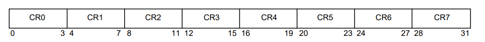

# PowerPc简介

PowerPC（后称Performance Optimization With Enhanced RISC – Performance Computing，有时缩写为PPC）是一种精简指令集计算机(RISC)指令集架构(ISA)，由 1991 年苹果-IBM-摩托罗拉联盟创建，称为AIM。PowerPC 作为一种不断发展的指令集，自 2006 年起被命名为Power ISA，而旧名称作为基于Power Architecture的处理器 的某些实现的商标继续存在。

## 数据类型

PowerPC支持的数据类型

|名称|字长(bits)|
|--|--|
|Quadwords|	128|
|Doublewords|64|
|Words|	32|
|Halfwords|	16|
|Bytes|	8|

## 寄存器

PowerPC中的寄存器有非常多，ABI规定的寄存器包括专用寄存器、易失性寄存器和非易失性寄存器。
易失性寄存器代表任何函数都可以自由对这些寄存器进行修改，并且不用恢复这些寄存器之前的值；而非易失性寄存器则代表函数可以使用这些寄存器，但需要在函数返回前将这些寄存器的值恢复。

### 通用寄存器

**GPR寄存器**

General Purpose Rgister(GPR)，通用寄存器，从GPR0到GPR31共32个。
事实上在gdb中所见就是r0~r31，其中：

| 寄存器 | 用途 |
| - | - |
| r0 | 发生系统调用时对应的系统调用号；在函数开始时使用 |
| r1 | 堆栈指针，相当于ia32架构中的esp寄存器，ida反汇编识别为sp|
| r2 | 内容表（toc）指针，IDA把这个寄存器反汇编标识为rtoc。系统调用时，它包含系统调用号 |
| r3 | 函数调用时的第一个参数和返回值 |
| r4-r10 | 函数或系统调用时参数传递 |
| r11 | 用在指针的调用和当作一些语言的环境指针 |
| r12 | 它用在异常处理和glink（动态连接器）代码 |
| r13 | 保留作为系统线程ID |
| r14-r31 | 作为本地变量，非易失性 |

### 专用寄存器

**FPR寄存器**

Floating-Point Register(FPR)，浮点寄存器，用于浮点运算，从FPR0-FPR31共32个。每个FPR寄存器都支持双精度浮点格式，在64位和32位处理器实现上，FPRs都是64位的。

**LR寄存器**

Link Register(LR)，链接寄存器，可以为条件转移链接寄存器指令提供转移目标地址，并在LK=1的转移指令之后保存返回地址。

LK即LINK bit，为0时不设置链接寄存器LR；为1时设置连接寄存器LR，转移指令后面的指令地址被放置在链接寄存器LR中

注意尽管两个最低有效位可以接受任何写入的值，但当LR被用作地址时，它们会被忽略。有些处理器可能会保存转移最近设置的LR值的堆栈。

**CR寄存器**

Condition Register(CR)，条件寄存器，它反映某些操作的结果，并提供一种测试（和转移）的机制

条件寄存器中的位被分组为8个4位字段，命名为CR字段0(CR0)，...，CR字段7(CR7)。CR字段可以通过一些指令进行设置，其中CR0可以是整数指令的隐式结果，CR1可以时浮点指令的隐式结果，指定的CR字段可以表示整数或浮点数比较指令的结果。



CR0字段含义如下:

| Bits | 描述 |
| - | - |
| 0 | Negative(LT) - 结果为负时设置该位，即小于 |
| 1 | Positive(GT) - 结果为正数（非零）时设置该位，即大于 |
| 2 | Zero(EQ) - 结果为0时设置该位，即等于 |
| 3 | Summary overflow(SO) - 这是XER[SO]指令完成时的最终状态的副本 |

需要注意当溢出发生时，CR0可能不能反应真实的结果

**CTR寄存器**

Count Register(CTR)，计数器，可以用来保存循环计数；还可以用来为转移条件计数寄存器指令提供转移目标地址。

**XER寄存器**

Fixed-Point Exception Register(XER)，特殊寄存器，是一个64位寄存器，用来记录溢出和进位标志

|Bits|	描述|
| - | - |
|0:31|	保留|
|32	|Summary Overflow(SO):每当指令(除mtspr)设置溢出位时，SO位被设置为1。一旦设置，SO位会保持设置知道被一个mtspr指令(指定XER)或一个mcrxr指令清除。它不会被compare指令修改，也不会被其他不能溢出的指令(除对XER的mtspr、mcrxr)改变|
|33|	Overflow(OV)：执行指令时发生溢出设置。OV位不会被compare指令改变，也不会被其他不能溢出的指令(除对XER的mtspr、mcrxr)改变|
|34|	Carry(CA)：在执行某些指令时，进位设置如下，加进位，减进位，加扩展，减扩展类型的指令，如果有M位的进位则设位1，否则设为0。执行右移代数指令时如果有任何1位移出了一个负操作数，设置其为1，否则设为0。CA位不会被compare指令改变，也不会被其他不能进位的指令（除代数右移、对XER的mtspr、mcrxr）改变|
|35:56|	保留|
|57:63|	该字段指定“加载字符串索引”或“存储字符串索引”指令传输的字节数|

**FPSCR寄存器**

Floating-Point Status and Control Register(FPSCR)，浮点状态和控制寄存器，控制浮点异常的处理，并记录浮点操作产生的状态，其中0:23位是状态位，24:31位是控制位。浮点异常包括浮点数溢出异常、下溢异常、除零异常、无效操作异常等

**MSR**
机器状态寄存器，MSR定义处理器的状态，用来配置微处理器的设定。

寄存器r1、r14-r31是非易失性的，这意味着它们的值在函数调用过程保持不变。寄存器r2也算非易失性，但是只有在调用函数在调用后必须恢复它的值时才被处理。

寄存器r0、r3-r12和特殊寄存器lr、ctr、xer、fpscr是易失性的，它们的值在函数调用过程中会发生变化。此外寄存器r0、r2、r11和r12可能会被交叉模块调用改变，所以函数在调用的时候不能采用它们的值。

条件代码寄存器字段cr0、cr1、cr5、cr6和cr7是易失性的。cr2、cr3和cr4是非易失性的，函数如果要改变它们必须保存并恢复这些字段。

## 常用指令

- 算数运算

一部分加法指令如下:

**加法**

```
add RT,RA,RB (OE=0 Rc=0)
add. RT,RA,RB (OE=0 Rc=1)
addo RT,RA,RB (OE=1 Rc=0)
addo. RT,RA,RB (OE=1 Rc=1)
```

`(RA)+(RB)`被放入寄存器RT中

其他加法指令与上述类似，指令中
`.`：表示将更新条件寄存器CR0
`c`：指令显式说明结果影响XER寄存器中的进位位[CA]
`e`：在指令中把XER[CA]中的数据作为一个操作数，并在XER[CA]位记录进位位
`o`：溢出标志。对于整数，在XER[OA]位记录溢出和在CR0[SO]记录溢出位

```
addi RD,RA,SIMM 
```

`(RA|0)+SIMM`，结果存储到RD寄存器，`(RA|0)`表示当RA值为1~31时，RA代表寄存器RA的内容；
当RA值为0时表示0，用来与立即数做加法。

减法就是sub，其他与加法类似

**乘法**

```
mullw RT,RA,RB (OE=0 Rc=0)
mullw. RT,RA,RB (OE=0 Rc=1)
mullwo RT,RA,RB (OE=1 Rc=0)
mullwo. RT,RA,RB (OE=1 Rc=1)
mulhw RT,RA,RB (Rc=0)
mulhw. RT,RA,RB (Rc=1)
```

`mullw`为multiply low word，乘积的低32位结果存入RT。
`mulhw`为multiply high word，乘积的高32位结果存入RT。
64位下还有mulld为multiply Low Doubleword，即保留乘积的低64位，同理还有mulhd。

**除法**

```
divw RT,RA,RB (OE=0 Rc=0)
divw. RT,RA,RB (OE=0 Rc=1)
divwo RT,RA,RB (OE=1 Rc=0)
divwo. RT,RA,RB (OE=1 Rc=1)
```

被除数是RA的值，除数是RB的值，商存放在RD中，但在这里余数不会被记录下来。类似的64位下有divd。

- 数据传送

**加载数据**

```
lbz RT,D(RA)
lhz RT,D(RA)
lha RT,D(RA)
lwz RT,D(RA)
lwa RT,DS(RA)
ld RT,DS(RA)
```

上述指令均表示以`(EA)=(RA|0)+D/DS`为有效地址加载字节到RT中，以偏移地址寻址。b，h，w，d分别代表字节、半字、字、双字，指加载的位数。
z表示其他位清零，a表示其他位将被加载的数据的位0复制填充。

指令最后加一个x表示寄存器寻址，例如lbzx RT,RA,RB表示以(RA|0)+(RB)为有效地址加载字节到RT中。

**存储数据**

```
stb RS,D(RA)
sth RS,D(RA)
stw RS,D(RA)
std RS,DS(RA)
```

都是类似加载指令的，同理上述指令均以偏移地址寻址，将RS的值存储到(RA|0)+D/DS地址中。如果最后加一个x则表示寄存器寻址。

- 逻辑运算

**与**

```
and RA,RS,RB (Rc=0)
and. RA,RS,RB (Rc=1)
```

RB的内容和RS的内容相与，结果存入RA中

**或**

```
or RA,RS,RB (Rc = 0)
or. RA,RS,RB (Rc = 1)
```

RB的内容和RS的内容做或运算，结果存入RA中

**非**

```
nor RA,RS,RB (Rc = 0)
nor. RA,RS,RB (Rc = 1)
```

RB的内容和RS的内容做或运算，结果存入RA中

**异或**

```
xor RA,RS,RB (Rc=0)
xor. RA,RS,RB (Rc=1)
```

RB的内容和RS的内容异或，结果存入RA中

上述的与、或指令可以在最后加上字母i表示与立即数做运算。

除了以上几个常见的逻辑运算之外，PowerPC还提供了其他一些指令用于逻辑运算，如nand与非，nor或非，neg按位取反后再+1得到补码下对应的负数，orc取补后再或，eqv判断是否相等，等等

- 移位

**左移**

```
slw RA,RS,RB (Rc = 0)
slw. RA,RS,RB (Rc = 1)
sld RA,RS,RB (Rc = 0)
sld. RA,RS,RB (Rc = 1)
```

shift left word，RS的内容左移RB指定的位数，移出的位丢失，右侧空出来的位置补0。64位下才有后缀d的指令，代表双字。

**右移**

```
srw RA,RS,RB (Rc = 0)
srw. RA,RS,RB (Rc = 1)
srd RA,RS,RB (Rc=0)
srd. RA,RS,RB (Rc=1)
```

shift right word，RS的内容右移RB指定的位数，移出的位丢失，左侧空出来的位置补0

- 控制转移

**无条件转移**

```
b target_addr (AA = 0 LK = 0)
ba target_addr (AA = 1 LK = 0)
bl target_addr (AA = 0 LK = 1)
bla target_addr (AA = 1 LK = 1)
```

target_addr指定转移目标地址，如果AA=0，那么转移目标地址是`LI||0b00`经符号符号拓展后加上指令地址；如果AA=1，那么转移目标地址为`LI||0b00`经符号拓展后的值。
如果LK=1，则转移指令的下一条指令的有效地址会被放置到链接寄存器LR中。
`B-Form`指令长度32位(0-31)，AA是30位，LK是31位

**条件转移**

```
bc BO,BI,target_addr (AA = 0 LK = 0)
bca BO,BI,target_addr (AA = 1 LK = 0)
bcl BO,BI,target_addr (AA = 0 LK = 1)
bcla BO,BI,target_addr (AA = 1 LK = 1)
```

BI字段表示作为转移条件的CR位，BO字段操作码对应具体如何进行转移

一些常见的转移条件

```
lt <=> less than
le <=> less than or equal
eq <=> equal
ge <=> greater than or equal
gt <=> greater than
nl <=> not less than
```

- 系统调用

```
sc
```

r0作为系统调用号

- 数据比较cmpx

```
cmp BF,L,RA,RB
```

RA的内容和RB的内容进行比较，将操作数视为有符号整数，比较结果放入CR寄存器的字段BF中。L位对32位操作没有影响

- 常见助记符

```
li rD, value    <=> addi rD, 0, value <=> Load Immediate
la rD, disp(rA) <=> addi rD, rA, disp <=> Load Address
mr rA,rS        <=> or rA,rS,rS       <=> move register
mtcr rS         <=> mtcrf 0xFF, rS    <=> move to condition register
cmpd rA, rB     <=> cmp 0,1,rA,rB
nop             <=> ori 0,0,0
```