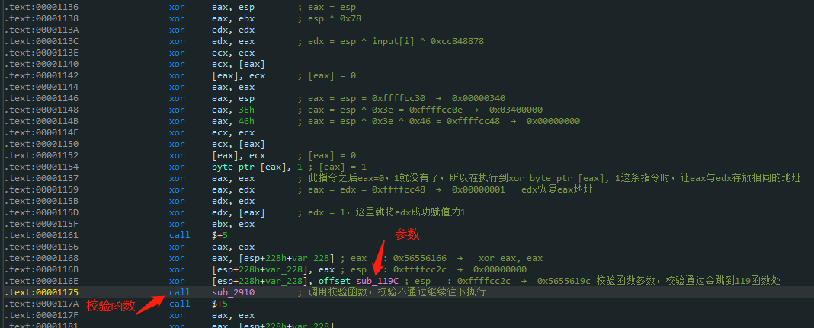
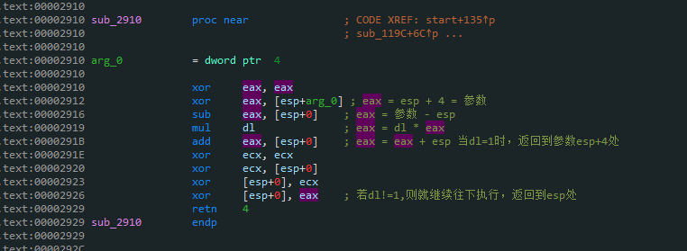
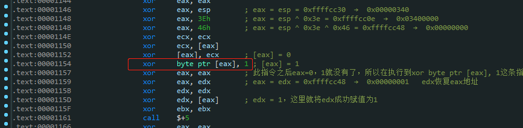

# 前言
这道题目是某行线上比赛的一道re题目，题目ida反编译的结果很怪，没有逻辑可言，然后看汇编发现代码有很多xor的操作，应该是做了混淆使ida识别出错。经过艰难且痛苦的分析调试后才理清楚了程序的检验函数的逻辑，为了混淆出题人可谓煞费苦心，将flag检验函数隐藏的如此隐晦，猜测出题思路是是用xor命令去替换mov、add、sub等指令，使ida分析错误,所以这道题目还是得分析调试程序，理解汇编。
# 分析
以下是ida反编译的结果：
```c
int start()
{
  _DWORD *v0; // eax
  _BYTE v2[260]; // [esp+8h] [ebp-224h] BYREF
  int v3; // [esp+110h] [ebp-11Ch] BYREF
  int v4; // [esp+114h] [ebp-118h] BYREF
  char v5[276]; // [esp+118h] [ebp-114h] BYREF

  strcpy(v5, "Sign The Petition: ");
  printf(v5);
  v3 = 1932736037;
  scanf((const char *)&v3, &v4);
  *(_DWORD *)(v2[256] ^ 0x1E ^ (unsigned int)v2) = 0;
  v0 = (_DWORD *)((unsigned int)v2 ^ 0x78);
  *v0 ^= *(_DWORD *)((unsigned int)v2 ^ 0x78);
  *(_BYTE *)v0 ^= 1u;
  sub_2910(sub_119C);
  return 4492;
}
```
ida虽然识别出了输入输出函数，但对于程序主要的代码反编译出现异常，所以看一下汇编：
```bash
text:00001040                 xor     ebp, ebp
.text:00001042                 xor     ebp, esp
.text:00001044                 sub     esp, 100h
.text:0000104A                 xor     edi, edi
.text:0000104C                 xor     edi, esp
.text:0000104E                 call    $+5
.text:00001053                 xor     eax, eax
.text:00001055                 xor     eax, dword ptr [esp+104h+var_114+10h]
.text:00001058                 xor     dword ptr [esp+104h+var_114+10h], eax
.text:0000105B                 xor     dword ptr [esp+104h+var_114+10h], 203A6Eh
.text:00001062                 call    $+5
.text:00001067                 xor     eax, eax
.text:00001069                 xor     eax, dword ptr [esp+108h+var_114+0Ch]
.text:0000106C                 xor     dword ptr [esp+108h+var_114+0Ch], eax
.text:0000106F                 xor     dword ptr [esp+108h+var_114+0Ch], 6F697469h
.text:00001076                 call    $+5
.text:0000107B                 xor     eax, eax
.text:0000107D                 xor     eax, dword ptr [esp+10Ch+var_114+8]
.text:00001080                 xor     dword ptr [esp+10Ch+var_114+8], eax
.text:00001083                 xor     dword ptr [esp+10Ch+var_114+8], 74655020h
.text:0000108A                 call    $+5
.text:0000108F                 xor     eax, eax
.text:00001091                 xor     eax, dword ptr [esp+110h+var_114+4]
.text:00001094                 xor     dword ptr [esp+110h+var_114+4], eax
.text:00001097                 xor     dword ptr [esp+110h+var_114+4], 65685420h
.text:0000109E                 call    $+5
.text:000010A3                 xor     eax, eax
.text:000010A5                 xor     eax, dword ptr [esp+114h+var_114]
.text:000010A8                 xor     dword ptr [esp+114h+var_114], eax
.text:000010AB                 xor     dword ptr [esp+114h+var_114], 6E676953h
.text:000010B2                 xor     eax, eax
.text:000010B4                 xor     eax, esp
.text:000010B6                 call    $+5
.text:000010BB                 xor     ebx, ebx
.text:000010BD                 xor     ebx, [esp+118h+var_118]
.text:000010C0                 xor     [esp+118h+var_118], ebx
.text:000010C3                 xor     [esp+118h+var_118], eax
.text:000010C6                 call    printf
.text:000010CB                 xor     esp, esp
.text:000010CD                 xor     esp, edi
.text:000010CF                 xor     edi, edi
.text:000010D1                 xor     edi, esp
.text:000010D3                 call    $+5
.text:000010D8                 xor     eax, eax
.text:000010DA                 xor     eax, [esp+11Ch+var_11C]
.text:000010DD                 xor     [esp+11Ch+var_11C], eax
```
发现一大堆xor，但是还是可以看到一些踪迹，汇编用xor实现了字符串的拼接，实现打印信息，再往下scanf输入函数：
```bash
.text:000010FB                 call    $+5
.text:00001100                 xor     ebx, ebx
.text:00001102                 xor     ebx, [esp+124h+var_124]
.text:00001105                 xor     [esp+124h+var_124], ebx
.text:00001108                 xor     [esp+124h+var_124], eax
.text:0000110B                 call    scanf           ; input = flagggggggggggggggggg
.text:00001110                 xor     esp, esp
.text:00001112                 xor     esp, edi        ; edi = input
```
输入完之后，开始程序主要处理逻辑：
```bash
.text:0000110B                 call    scanf           ; input = flagggggggggggggggggg
.text:00001110                 xor     esp, esp
.text:00001112                 xor     esp, edi        ; edi = input
.text:00001114                 xor     esi, esi
.text:00001116                 xor     esi, esp        ; esi = input
.text:00001118                 xor     edi, edi
.text:0000111A                 xor     edi, esi        ; edi = input
.text:0000111C                 sub     esp, 100h
.text:00001122                 xor     ebx, ebx
.text:00001124                 xor     bl, [esi]       ; input byte
.text:00001126                 xor     ebx, 0CC84881Eh ; ebx = 'f' ^ 0xcc84881e = 0xcc848878         ebx = input ^ 0xcc848878
.text:0000112C                 xor     ecx, ecx
.text:0000112E                 xor     cl, bl          ; cl = 0x78
.text:00001130                 xor     ebx, ebx
.text:00001132                 xor     bl, cl          ; bl = 0x78
.text:00001134                 xor     eax, eax
.text:00001136                 xor     eax, esp        ; eax = esp
.text:00001138                 xor     eax, ebx        ; esp ^ 0x78
.text:0000113A                 xor     edx, edx
.text:0000113C                 xor     edx, eax        ; edx = esp ^ input[i] ^ 0xcc84881e
.text:0000113E                 xor     ecx, ecx
.text:00001140                 xor     ecx, [eax]
.text:00001142                 xor     [eax], ecx      ; [eax] = 0
.text:00001144                 xor     eax, eax
.text:00001146                 xor     eax, esp        ; eax = esp = 0xffffcc30  →  0x00000340
.text:00001148                 xor     eax, 3Eh        ; eax = esp ^ 0x3e = 0xffffcc0e  →  0x03400000
.text:0000114B                 xor     eax, 46h        ; eax = esp ^ 0x3e ^ 0x46 = 0xffffcc48  →  0x00000000
.text:0000114E                 xor     ecx, ecx
.text:00001150                 xor     ecx, [eax]
.text:00001152                 xor     [eax], ecx      ; [eax] = 0
.text:00001154                 xor     byte ptr [eax], 1 ; [eax] = 1
.text:00001157                 xor     eax, eax        ; 此指令之后eax=0，1就没有了，所以在执行到xor byte ptr [eax], 1这条指令时，让eax与edx存放相同的地址
.text:00001159                 xor     eax, edx        ; eax = edx = 0xffffcc48  →  0x00000001   edx恢复eax地址
.text:0000115B                 xor     edx, edx
.text:0000115D                 xor     edx, [eax]      ; edx = 1，这里就将edx成功赋值为1
.text:0000115F                 xor     ebx, ebx
.text:00001161                 call    $+5
.text:00001166                 xor     eax, eax
.text:00001168                 xor     eax, [esp+228h+var_228] ; eax   : 0x56556166  →   xor eax, eax
.text:0000116B                 xor     [esp+228h+var_228], eax ; esp   : 0xffffcc2c  →  0x00000000
.text:0000116E                 xor     [esp+228h+var_228], offset sub_119C ; esp   : 0xffffcc2c  →  0x5655619c 校验函数参数，校验通过会跳到119函数处
.text:00001175                 call    sub_2910        ; 调用校验函数，校验不通过继续往下执行
.text:0000117A                 call    $+5
.text:0000117F                 xor     eax, eax
```
看到调用校验函数和他的参数的地方



校验函数逻辑为，将传入参数与call指令下一个位置的地址相减，然后与dl相乘，再加回减去的地址，然后跳转到计算后的地址中



那么如果当dl为1的时候，传入参数即可作为地址被调用成功。之后会跳入下一个字符的验证
```bash
.text:0000119C                 xor     eax, eax
.text:0000119E                 xor     eax, 1          ; eax = 1
.text:000011A1
.text:000011A1 loc_11A1:                               ; CODE XREF: sub_119C+13↓j
.text:000011A1                 xor     ecx, ecx
.text:000011A3                 xor     ecx, eax        ; ecx = 1
.text:000011A5                 and     eax, esi        ; eax = 0
.text:000011A7                 test    eax, eax
.text:000011A9                 jz      short loc_11B1  ; 接着验证下一字符
.text:000011AB                 xor     esi, eax
.text:000011AD                 shl     eax, 1
.text:000011AF                 jmp     short loc_11A1
```
看到整个程序只有一处把1写入内存的操作，如下：
 


但是写入的是eax，要想让edx的值在校验之前赋值为1，那么在`xor     byte ptr [eax], 1 `指令之前eax存的地址应该等于edx地址，知道了校验成功的条件后在往上就是寻找什么条件可以使eax=edx
经过分析可以得到如下条件成立：
```bash
.text:0000110B                 call    scanf           ; input = flagggggggggggggggggg
.text:00001110                 xor     esp, esp
.text:00001112                 xor     esp, edi        ; edi = input
.text:00001114                 xor     esi, esi
.text:00001116                 xor     esi, esp        ; esi = input
.text:00001118                 xor     edi, edi
.text:0000111A                 xor     edi, esi        ; edi = input
.text:0000111C                 sub     esp, 100h
.text:00001122                 xor     ebx, ebx
.text:00001124                 xor     bl, [esi]       ; input byte
.text:00001126                 xor     ebx, 0CC84881Eh ; ebx = 'f' ^ 0xcc84881e = 0xcc848878         ebx = input ^ 0xcc848878
.text:0000112C                 xor     ecx, ecx
.text:0000112E                 xor     cl, bl          ; cl = 0x78
.text:00001130                 xor     ebx, ebx
.text:00001132                 xor     bl, cl          ; bl = 0x78
.text:00001134                 xor     eax, eax
.text:00001136                 xor     eax, esp        ; eax = esp
.text:00001138                 xor     eax, ebx        ; esp ^ 0x78
.text:0000113A                 xor     edx, edx
.text:0000113C                 xor     edx, eax        ; edx = esp ^ input[i] ^ 0xcc84881e
.text:0000113E                 xor     ecx, ecx
.text:00001140                 xor     ecx, [eax]
.text:00001142                 xor     [eax], ecx      ; [eax] = 0
.text:00001144                 xor     eax, eax
.text:00001146                 xor     eax, esp        ; eax = esp = 0xffffcc30  →  0x00000340
.text:00001148                 xor     eax, 3Eh        ; eax = esp ^ 0x3e = 0xffffcc0e  →  0x03400000
.text:0000114B                 xor     eax, 46h        ; eax = esp ^ 0x3e ^ 0x46 = 0xffffcc48  →  0x00000000
.text:0000114E                 xor     ecx, ecx
```
`eax = edx` 即 `esp ^ input[i] ^ 0xcc84881e = esp ^ 0x3e ^ 0x46`,所以 `input[i] = 0x3E ^ 0x46 ^ 0x1E`,这只是flag的一位，接下来分别提取例如本例：(0x0CC84881E, 0x3E, 0x46)
然后做亦或处理即可得到flag，使用IDAPython，编写特征匹配脚本，自动搜索并解密字符串，解密脚本如下：
```python
import idc
# idc.print_insn_mnem(cur_addr) 获取助记符
# idc.print_operand(cur_addr,0) 第一个操作数
# idc.print_operand(cur_addr,1) 第二个操作数
start = 0x1040
end = 0x289B
cur_addr = start
while cur_addr <= end:
	if idc.print_insn_mnem(cur_addr) == "xor" and idc.print_operand(cur_addr, 0) == "bl" and idc.print_operand(cur_addr, 1) == "[esi]":
		cur_addr = idc.next_head(cur_addr, end)
		r1 = int(idc.print_operand(cur_addr, 1)[:-1], 16) & 0xFF  # 0x1e......etc
		for i in range(15):
			cur_addr = idc.next_head(cur_addr, end)
		r2 = int(idc.print_operand(cur_addr, 1)[:-1], 16) & 0xFF  # 0x3e
		cur_addr = idc.next_head(cur_addr, end)
		r3 = int(idc.print_operand(cur_addr, 1)[:-1], 16) & 0xFF  # 0x46
		print(chr(r1 ^ r2 ^ r3), end='')
	cur_addr = idc.next_head(cur_addr, end)
```
得到flag为`flag{96c69646-8184-4363-8de9-73f7398066c1}`
# 非预期

命令：`python3 pinCTF.py -f Petition -i -l $(pwd)/obj-ia32 -sl 42 -r abcdefghijklmnopqrstuvwxyz-{}0123456789 `
此题看汇编理清程序逻辑有一定难度，但这道题符合pin爆破题目的条件，逐个字符验证是否正确，符合测信道求解，可以使用pintools求解。但是本人在是用pintools爆破的时候出现了异常求解，flag并不正确，关键的几位没跑正确,cout并不是非常稳定，可能和pintools工具判断count的逻辑有关系，导致判断有偏差，结果有一些是不正确的。
